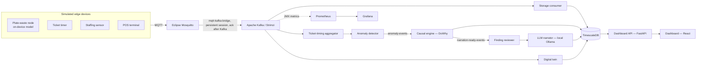

# Restaurant Operations Digital Twin Platform

A simulated IoT-to-AI data platform for restaurant operations: edge sensors feed a Kafka backbone into a causal-inference and anomaly-detection engine, whose findings are narrated by a local LLM behind a database-enforced read boundary and a post-generation check on every sentence. Deployed two ways — a full Kubernetes/Strimzi stack showing real operational depth, and a Docker Compose path that runs anywhere with one command.

This is a personal portfolio project. Every component is free/open-source; no paid APIs or licensed vendor tools were used anywhere in the stack.

## Run it

```bash
cd restaurant-platform-phase1/restaurant-platform
docker compose up --build
```

No Kubernetes, no GPU required — see [QUICKSTART.md](restaurant-platform-phase1/restaurant-platform/QUICKSTART.md) for what to look at once it's running, and how this compares to the Kubernetes deployment described below.

## What it demonstrates

Six areas, in priority order: **meaningful AI integration → data engineering/analytics → IoT → AIoT → Kubernetes → digital twin.** The goal was defensible depth in each, not shallow coverage of all six.

- **AI integration with guardrails, not a chatbot bolted on.** The LLM narrator (a local Ollama model) never receives raw data — only a structured finding object the causal engine already computed and statistically validated. It's connected to Postgres as a database role with `SELECT`-only access to the findings table and nothing else, so it is *structurally* incapable of inventing a claim from data it can't see, not just prompted not to. That boundary stops it seeing other data but not a small model inventing detail from within the finding, so every generated sentence is also checked before it is stored: each number must trace to the finding, the direction must match the sign of the effect, and unsupported claims ("statistically significant", confidence intervals) and raw column names are rejected. A sentence that can't be verified is regenerated, then replaced by a deterministic template, and the stored row records which one it is. The checks are mechanical, so they narrow what a model can get wrong rather than prove the prose faithful.
- **Real causal inference, not correlation dressed up.** Uses Microsoft's `DoWhy` with explicit confounder modeling and placebo-treatment refutation testing — deliberately replacing a causally weak idea from the original project pitch (camera-detected plate waste implying dissatisfaction, which ignores portion size, doggy-bag intent, and dietary restrictions as confounders).
- **Edge intelligence (AIoT), simulated honestly.** The plate-waste node runs a small int8 model *on the node itself*: it reads four raw simulated sensor channels, estimates the waste in grams (7.1 g error, against 20.8 g for the best single channel), and publishes only the estimate plus its own assessment of how far to trust it. The model carries a SHA-256 and the node refuses to start if it has been altered; it is held to size and latency budgets by tests; and the node watches its own inputs for out-of-distribution readings and slow drift (a fouling lens). The platform acts on that self-assessment: estimates the node distrusted are left out of causal analysis, and the dashboard shows each node's health. The sensors are a simulation the author designed, so this demonstrates the pipeline and the engineering, **not performance on real hardware, and it is not embedded firmware.** The measured weaknesses are published in the [model card](restaurant-platform-phase1/restaurant-platform/edge-simulators/MODEL_CARD.md) (for example, the drift monitor misses about 40% of subtle faults).
- **A real Kubernetes deployment**, not a docker-compose file relabeled — Strimzi-managed Kafka, Helm charts per service, hand-rolled Prometheus/Grafana with a real JMX-to-Prometheus metrics pipeline, and a second, deliberately simpler Compose path for portability.
- **Contract-first architecture.** Every event schema is a committed JSON Schema file, written before any producer or consumer code. Every simulated data source carries a `source_kind: "simulated" | "vendor_integration"` field for exactly one reason: swapping a simulated producer for a real vendor integration later should never require touching a downstream consumer.

## Proof it actually works

Two real, end-to-end verified results, not aspirational claims:

- **A deliberately injected 10-minute staffing shortage** (removing `station-grill`) produced 26 organic anomalies, all correctly localized to the three stations that absorbed the load and zero at the removed station — picked up automatically by the live anomaly-detection stream, no manual intervention. A separate targeted analysis found the actual cause: a **+73,851ms (~74 second) increase in pickup delay**, controlling for station, refutation test passed. **Caveat, and what changed:** that 74-second figure comes from the original refutation gate (which passed most pure-noise findings) on the Kubernetes path, and has not been reproduced. Once the gate was repaired, the same kind of finding was **refuted** on the Compose stack (effect p = 0.95), because the simulated world did not actually contain a staffing effect: the injected shortage slowed the kitchen directly and never changed the staff-shift events the analysis uses. That was fixed on 2026-10-04 by making staffing a real driver in the simulation (the kitchen's capacity depends on the staff clocked in, and the shortage clocks staff out). Re-run on the Compose stack, the finding now **passes the repaired gate** in two independent runs (about -2.1 to -2.4 seconds of pickup delay per additional staff member, p = 5e-4 and 5e-6) and is promoted to narration. The effect is one the simulation was designed to contain, so this shows the pipeline recovers a real effect, not that a real kitchen has this one.
- **A real narrated finding**, generated by the 3B model on the Kubernetes path from a live `causal_findings` row, with no detail beyond the finding (this run predates the verification step above): *"...the to-go container used finding shows that, on average, estimated waste grams decreased by 90.2 grams."* — matching a real, refutation-tested effect (a full run found -93.26g, controlling for portion size and dietary restriction).

## How it is tested

Eight layers, each simulating one thing production does to a system: static checks of every config file, unit tests, integration tests against a real TimescaleDB built from the real migrations, statistical validation of the causal engine against data with a known answer, end-to-end and acceptance tests on the real stack, chaos tests that kill the consumer, database, Kafka and MQTT, load and memory tests, and a dependency-vulnerability audit. Fast layers run on every push and heavy ones nightly, both on GitHub (the latest six full nightly runs passed); operational changes to the live cluster (the broker cutover, a master-key rotation) are rehearsed on a throwaway copy first.

A full set of quality documents (requirements, test plan, traceability matrix, SQA plan, risk register, a defect log of every failure and difficulty, results, lessons and release readiness) is in [docs/quality](restaurant-platform-phase1/restaurant-platform/docs/quality/README.md). Every one of the tests is catalogued — what it is, what it does, why it exists, why it matters — in [TESTING.md](restaurant-platform-phase1/restaurant-platform/TESTING.md), and that catalogue is itself tested so it cannot drift. Building the regime found real defects (a container running as root, unbounded batch jobs, a vulnerable dependency, and two ways the storage consumer could silently lose or stop storing data), which were fixed. It also exposed that the causal engine's refutation gate passed 78% to 87% of pure-noise findings and gave unreproducible verdicts; the gate was then rebuilt on a measurement (it now passes 0 of 60 noise datasets while still passing genuine effects, and is deterministic). It certifies statistical significance, not causation. The test suite is the evidence for the claims on this page.

## Architecture



Seven layers: simulated edge devices → MQTT/Kafka message backbone → TimescaleDB storage → anomaly detection + causal inference → digital twin (live restaurant state) → LLM narrator (guardrailed) → dashboard + observability. Full design rationale: [restaurant-platform-project-notes.md](restaurant-platform-phase1/restaurant-platform/restaurant-platform-project-notes.md).

## Two deployment paths

| | Kubernetes (`k8s/`) | Docker Compose (`docker-compose.yml`) |
|---|---|---|
| Kafka | Strimzi-managed, Helm charts | Plain Kafka (KRaft mode) |
| LLM narrator | `qwen2.5:3b-instruct`, GPU-accelerated | `qwen2.5:0.5b-instruct`, CPU-only. In testing this model rarely produced text that passed verification, so most narrations are the deterministic template (labelled `template-fallback`) |
| Observability | Prometheus + Grafana, real JMX metrics + consumer-lag panel | Not included |
| Purpose | Demonstrates real Kubernetes/Strimzi operational depth | Demonstrates the same pipeline, runnable anywhere |

## Tech stack

Python, Apache Kafka (KRaft), Strimzi, Eclipse Mosquitto (MQTT, persistent), a small Python MQTT-to-Kafka bridge (at-least-once, no event lost to a restart), PostgreSQL + TimescaleDB, scikit-learn (isolation forest), Microsoft DoWhy + statsmodels, Ollama (Qwen 2.5, Apache-2.0), FastAPI, React + Vite, Prometheus + Grafana, Kubernetes (k3s) + Helm, Docker Compose.

## Build phases

A seven-phase build sequence, all complete, plus a later portability initiative. Full status, verification evidence, and every bug found and fixed along the way: [restaurant-platform-implementation-status.md](restaurant-platform-phase1/restaurant-platform/restaurant-platform-implementation-status.md).

1. Scaffold cluster + repo, commit event schemas
2. Message backbone (Mosquitto + Strimzi Kafka + MQTT-Kafka bridge)
3. Edge simulators
4. Storage layer (TimescaleDB)
5. Causal/anomaly engine
6. Digital twin + LLM narrator
7. Dashboard + observability
8. *(added later)* Portability — a parallel Docker Compose deployment path

## Production considerations

This is a simulation standing in for real sensors, POS integrations, and vendor analytics that don't exist yet — every stand-in is built against a fixed schema specifically so it can be swapped for a real integration without touching downstream code. Two things worth naming for realism, not because the simulation needs to solve them: employee/customer camera surveillance (relevant to any real plate-waste-camera deployment) carries real legal exposure under state biometric statutes and labor-law notice requirements; and computer-vision plate-waste detection is already a solved, commercially sold problem (Winnow, Metafoodx, Clean Plate Innovations) — this project deliberately doesn't compete with that, focusing instead on the causal-inference layer on top of structured POS/scheduling data.

## Roadmap

A "version 2" interactive mode — a real person plays through restaurant scenarios (working a station, ordering as a guest), driving the same event schemas and the same anomaly-detection/causal-inference/narration pipeline the simulated version uses, framed as a small game with a stretch goal of itch.io or Steam distribution. The groundwork is built — an HTTP-to-Kafka `game-bridge` service, a `player` source type in the event schemas, and a working Godot prototype (`game/`) where you work a shift as a line cook, expo or server while a crew covers whatever role nobody is playing, or sit down as a guest, order from the menu and pay once it arrives, all verified end-to-end with no downstream changes (game data is quarantined from the simulators' own anomaly baseline and compared against it instead). It's a prototype, not a polished game; see the "Version 2 and Steam distribution" section of [restaurant-platform-project-notes.md](restaurant-platform-phase1/restaurant-platform/restaurant-platform-project-notes.md) for the engine choice (Godot) and a documented Steam licensing/cost conflict with alternatives.

## License

[MIT](LICENSE) for this project's own code. Third-party pieces this project runs as separate containers/services rather than distributes (MinIO's server, notably AGPLv3) keep their own licenses -- see each service's own chart or Dockerfile for what image it pulls.
