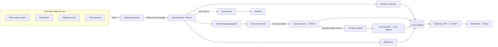

# Restaurant Operations Digital Twin Platform

A simulated IoT-to-AI data platform for restaurant operations: edge sensors feed a Kafka backbone into a causal-inference and anomaly-detection engine, whose findings are narrated by a local LLM with a database-enforced boundary against hallucinated claims. Deployed two ways — a full Kubernetes/Strimzi stack showing real operational depth, and a Docker Compose path that runs anywhere with one command.

This is a personal portfolio project. Every component is free/open-source; no paid APIs or licensed vendor tools were used anywhere in the stack.

## Run it

```bash
cd restaurant-platform-phase1/restaurant-platform
docker compose up --build
```

No Kubernetes, no GPU required — see [QUICKSTART.md](restaurant-platform-phase1/restaurant-platform/QUICKSTART.md) for what to look at once it's running, and how this compares to the Kubernetes deployment described below.

## What it demonstrates

Six areas, in priority order: **meaningful AI integration → data engineering/analytics → IoT → AIoT → Kubernetes → digital twin.** The goal was defensible depth in each, not shallow coverage of all six.

- **AI integration with guardrails, not a chatbot bolted on.** The LLM narrator (a local Ollama model) never receives raw data — only a structured finding object the causal engine already computed and statistically validated. It's connected to Postgres as a database role with `SELECT`-only access to the findings table and nothing else, so it is *structurally* incapable of inventing a claim from data it can't see, not just prompted not to.
- **Real causal inference, not correlation dressed up.** Uses Microsoft's `DoWhy` with explicit confounder modeling and placebo-treatment refutation testing — deliberately replacing a causally weak idea from the original project pitch (camera-detected plate waste implying dissatisfaction, which ignores portion size, doggy-bag intent, and dietary restrictions as confounders).
- **A real Kubernetes deployment**, not a docker-compose file relabeled — Strimzi-managed Kafka, Helm charts per service, hand-rolled Prometheus/Grafana with a real JMX-to-Prometheus metrics pipeline, and a second, deliberately simpler Compose path for portability.
- **Contract-first architecture.** Every event schema is a committed JSON Schema file, written before any producer or consumer code. Every simulated data source carries a `source_kind: "simulated" | "vendor_integration"` field for exactly one reason: swapping a simulated producer for a real vendor integration later should never require touching a downstream consumer.

## Proof it actually works

Two real, end-to-end verified results, not aspirational claims:

- **A deliberately injected 10-minute staffing shortage** (removing `station-grill`) produced 26 organic anomalies, all correctly localized to the three stations that absorbed the load and zero at the removed station — picked up automatically by the live anomaly-detection stream, no manual intervention. A separate targeted analysis found the actual cause: a **+73,851ms (~74 second) increase in pickup delay**, controlling for station, refutation test passed.
- **A real narrated finding**, generated by the LLM narrator from a live `causal_findings` row with zero invented detail: *"...the to-go container used finding shows that, on average, estimated waste grams decreased by 90.2 grams."* — matching a real, refutation-tested effect (a full run found -93.26g, controlling for portion size and dietary restriction).

## Architecture



Seven layers: simulated edge devices → MQTT/Kafka message backbone → TimescaleDB storage → anomaly detection + causal inference → digital twin (live restaurant state) → LLM narrator (guardrailed) → dashboard + observability. Full design rationale: [restaurant-platform-project-notes.md](restaurant-platform-phase1/restaurant-platform/restaurant-platform-project-notes.md).

## Two deployment paths

| | Kubernetes (`k8s/`) | Docker Compose (`docker-compose.yml`) |
|---|---|---|
| Kafka | Strimzi-managed, Helm charts | Plain Kafka (KRaft mode) |
| LLM narrator | `qwen2.5:3b-instruct`, GPU-accelerated | `qwen2.5:0.5b-instruct`, CPU-only |
| Observability | Prometheus + Grafana, real JMX metrics + consumer-lag panel | Not included |
| Purpose | Demonstrates real Kubernetes/Strimzi operational depth | Demonstrates the same pipeline, runnable anywhere |

## Tech stack

Python, Apache Kafka (KRaft), Strimzi, Eclipse Mosquitto (MQTT), Kafka Connect (Camel MQTT source connector), PostgreSQL + TimescaleDB, scikit-learn (isolation forest), Microsoft DoWhy + statsmodels, Ollama (Qwen 2.5, Apache-2.0), FastAPI, React + Vite, Prometheus + Grafana, Kubernetes (k3s) + Helm, Docker Compose.

## Build phases

A seven-phase build sequence, all complete, plus a later portability initiative. Full status, verification evidence, and every bug found and fixed along the way: [restaurant-platform-implementation-status.md](restaurant-platform-phase1/restaurant-platform/restaurant-platform-implementation-status.md).

1. Scaffold cluster + repo, commit event schemas
2. Message backbone (Mosquitto + Strimzi Kafka + MQTT-Kafka bridge)
3. Edge simulators
4. Storage layer (TimescaleDB)
5. Causal/anomaly engine
6. Digital twin + LLM narrator
7. Dashboard + observability
8. *(added later)* Portability — a parallel Docker Compose deployment path

## Production considerations

This is a simulation standing in for real sensors, POS integrations, and vendor analytics that don't exist yet — every stand-in is built against a fixed schema specifically so it can be swapped for a real integration without touching downstream code. Two things worth naming for realism, not because the simulation needs to solve them: employee/customer camera surveillance (relevant to any real plate-waste-camera deployment) carries real legal exposure under state biometric statutes and labor-law notice requirements; and computer-vision plate-waste detection is already a solved, commercially sold problem (Winnow, Metafoodx, Clean Plate Innovations) — this project deliberately doesn't compete with that, focusing instead on the causal-inference layer on top of structured POS/scheduling data.

## Roadmap

A "version 2" interactive mode — a real person plays through restaurant scenarios (working a station, ordering as a guest), driving the same event schemas and the same anomaly-detection/causal-inference/narration pipeline the simulated version uses, framed as a small game with a stretch goal of itch.io or Steam distribution. Scoped but not built — see the "Version 2 and Steam distribution" section of [restaurant-platform-project-notes.md](restaurant-platform-phase1/restaurant-platform/restaurant-platform-project-notes.md) for the engine choice (Godot) and a documented Steam licensing/cost conflict with alternatives.
