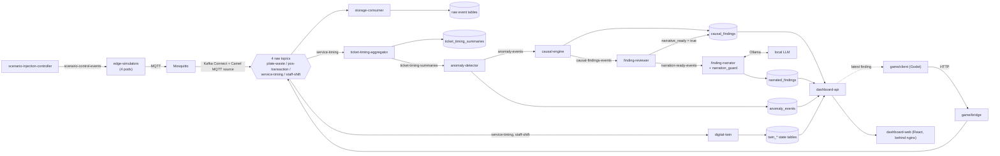

# Codebase Guide: file by file

**What this is.** A reference for every file in this repository: what it does, why it is built the way it is, what it connects to, and what it is for. It was written by reading each file, not from memory of how the project was built. Where a file's own comments disagree with reality, the entry says so and section 11 collects all of those disagreements in one place.

**Scope.** Every tracked file plus the new, uncommitted `game/` directory (the version 2 add-on). Left out on purpose: `node_modules/`, `dist/` and `.godot/` (generated, git-ignored), Godot's `*.gd.uid` sidecar files (auto-generated, one per script), and the contents of image files (they are named and explained, not described pixel by pixel).

**How each entry is laid out.**

- **What it does** is the file's behaviour, in plain terms.
- **Why it works this way** is the reason for the non-obvious choices. In this project those reasons are usually a bug that was hit for real, and the entry names it.
- **Connects to** lists what feeds the file and what consumes it.
- **Purpose** is its role in the software as a whole.

**Paths.** Everything lives under `restaurant-platform-phase1/restaurant-platform/` unless an entry says otherwise. The repo root has only `README.md`, and `restaurant-platform-phase1/` holds editor and ignore files.

**Contents**

1. [The system on one page](#1-the-system-on-one-page): data flow, Kafka topics, database tables, ports, the two deployment paths, and the design rules behind the code
2. [Repository root and top-level files](#2-repository-root-and-top-level-files): README, Compose file, config, and the narrative documents
3. [`schemas/`](#3-schemas-the-data-contracts): the seven data contracts
4. [`edge-simulators/`](#4-edge-simulators-the-fake-sensors): the four fake sensors
5. [`storage/`](#5-storage-persistence): the ingest consumer and the SQL schema
6. [`docker-compose/`](#6-docker-compose-compose-only-support-files): Compose-only support files
7. [`services/`](#7-services-the-phase-5-to-7-application-services): analytics, narrator and dashboard
8. [`game/`](#8-game-version-2-the-game-and-its-bridge): version 2, the Godot client and its bridge
9. [`k8s/`](#9-k8s-the-kubernetes-helm-deployment): every Helm chart
10. [Where to change what](#10-where-to-change-what), including how to run the tests
11. [Known inconsistencies and limitations](#11-known-inconsistencies-and-limitations)

---

## 1. The system on one page

This is a simulated restaurant-operations data platform. Fake sensors emit events; real infrastructure moves, stores and analyses them; a small language model phrases the results. It has two deployments of the same application code (section 1.5) and a prototype game client that produces the same events from a human player.

### 1.1 Data flow

Two things are easy to miss in that picture:

- **The game and the simulators are interchangeable producers.** Both write the same schema-validated events to the same Kafka topics. Nothing downstream of Kafka knows or cares which one produced an event, apart from the `source_kind` column.
- **The narrator is deliberately the last, weakest link.** It only ever reads `causal_findings`, only ever writes `narrated_findings`, and everything it produces is checked before it is stored.

### 1.2 Kafka topics

| Topic | Produced by | Consumed by (consumer group) |
|---|---|---|
| `plate-waste-events` | Kafka Connect (from MQTT) | storage-consumer |
| `pos-transaction-events` | Kafka Connect | storage-consumer |
| `service-timing-events` | Kafka Connect; game-bridge | storage-consumer, ticket-timing-aggregator, digital-twin |
| `staff-shift-events` | Kafka Connect; game-bridge | storage-consumer, digital-twin |
| `ticket-timing-summaries` | ticket-timing-aggregator | anomaly-detector |
| `anomaly-events` | anomaly-detector | causal-engine |
| `causal-findings-events` | causal-engine | finding-reviewer |
| `narration-ready-events` | finding-reviewer | finding-narrator |
| `scenario-control-events` | scenario-injection-controller | the service-timing simulator (group `service-timing-scenario-control`) |

Nothing declares these topics. There are no `KafkaTopic` objects on k3s and no topic-creation step in Compose, so the broker creates each one the first time something produces to or consumes from it. Kafka Connect and Kafka itself add their own internal topics (`connect-*`, `__consumer_offsets`).

### 1.3 Database tables (TimescaleDB, database `restaurant_platform`)

| Table | Kind | Written by | Read by |
|---|---|---|---|
| `plate_waste_events`, `pos_transaction_events`, `service_timing_events`, `staff_shift_events` | hypertable, append-only | storage-consumer | causal-engine (plate waste, staff shift); otherwise queried by hand |
| `pos_transaction_line_items` | hypertable, append-only | storage-consumer (one row per entry in a POS event's `line_items`, same transaction as the parent row) | queried by hand; the data a per-item analysis or a guest-ordering game mode would use |
| `ticket_timing_summaries` | plain table, upserted per ticket | ticket-timing-aggregator | causal-engine |
| `anomaly_events` | hypertable | anomaly-detector | dashboard-api |
| `causal_findings` | hypertable | causal-engine (insert), finding-reviewer (sets `narrative_ready`) | finding-narrator, dashboard-api |
| `narrated_findings` | plain table | finding-narrator | dashboard-api |
| `twin_table_state`, `twin_staff_state`, `twin_station_state` | plain tables, one current row per entity | digital-twin | dashboard-api |

Two database roles matter. `restaurant_app` is the ordinary application role that every service uses except the narrator. `narrator_app` has `SELECT` on `causal_findings` and `SELECT, INSERT, UPDATE` on `narrated_findings`, and nothing else. That grant is the real enforcement of "the narrator can only read findings".

### 1.4 Ports (Compose path)

| Port | Service | Notes |
|---|---|---|
| `8080` | dashboard-web | the only thing meant for a browser; proxies `/api/` to dashboard-api |
| `127.0.0.1:8001` | game-bridge | only when the game overlay is used (section 1.7); localhost only because it has no authentication |
| everything else | internal to the Compose network | |

On k3s every service is `ClusterIP`; use `kubectl port-forward` to reach the dashboard or Grafana.

### 1.5 Two deployment paths

| | Kubernetes (`k8s/`) | Docker Compose (`docker-compose.yml`) |
|---|---|---|
| Purpose | shows real Kubernetes/Strimzi operational depth | runs anywhere with Docker, one command |
| Kafka | Strimzi-managed, KRaft | plain `apache/kafka`, KRaft |
| Kafka Connect connectors | `KafkaConnector` custom resources | REST calls from a one-shot init container |
| Schema application | Helm hook Job runs the four SQL files | Postgres image runs `docker-entrypoint-initdb.d` on first init |
| LLM | `qwen2.5:3b-instruct`, Ollama native on the host, GPU | `qwen2.5:0.5b-instruct`, Ollama in a container, CPU |
| Observability | Prometheus, Grafana, kube-state-metrics, Kafka exporter | not included |
| game-bridge | not deployed | only with the game overlay (`game/docker-compose.game.yml`) |

### 1.6 Design rules that explain most of the code

These recur in nearly every file, so they are stated once here and referred to by name below.

1. **Contract first.** The JSON Schemas in `schemas/` are written before, and are the source of truth for, every producer and consumer. `source_kind` exists so a simulator, a real vendor system or a human player can be swapped in without touching a consumer.
2. **Validate before publishing, and choose fail-loud or fail-soft deliberately.** A service that produces its own data treats a schema violation as its own bug and crashes (`edge-simulators`, `ticket-timing-aggregator`, `anomaly-detector`, `causal-engine`). A service that only receives data logs and skips a bad message so one bad message cannot block a whole topic (`storage-consumer`).
3. **At-least-once processing made safe by idempotence.** Consumers commit their Kafka offset only after the work succeeds, so a crash re-delivers rather than loses. Inserts use `ON CONFLICT DO NOTHING` or upserts, so a re-delivery is harmless.
4. **Fixed workarounds for two real library problems.** `kafka-python` 2.0.2 cannot negotiate versions with Kafka 4.3.1, so `api_version=(2, 8, 0)` is pinned in code. It also vendors a copy of `six` that breaks on Python 3.12, so every image is `python:3.11-slim`.
5. **Hand-rolled infrastructure over third-party charts.** Three separate dependencies went stale or disappeared (Timescale's Helm chart, Bitnami's catalog, MinIO's official images). TimescaleDB, MinIO, Prometheus, Grafana and kube-state-metrics are therefore small hand-written manifests around official or Chainguard images.
6. **Narrow blast radius for the LLM.** The narrator connects as a role that can only read one table, receives only a structured finding, and has its output verified before storage.

### 1.7 Version 1 and version 2 are separate

Version 1 is the simulated platform, everything outside `game/`. Version 2 is the human-playable game, and all of it lives under `game/` (`game/bridge`, `game/client`, `game/docker-compose.game.yml`, `game/README.md`). **Version 1 never references version 2**; the dependency runs one way, from the game onto the platform. The base `docker-compose.yml` starts 21 services and has no game in it; the game is added by layering the overlay: `docker compose -f docker-compose.yml -f game/docker-compose.game.yml up -d --build` (22 services).

The game touches version 1 in exactly four places, all intentional: the `player` value of `source_kind` in the event schemas and its database migration `004` (a shared contract, so it has to live in the shared tree and reach every database), `edge-simulators/common/world.py` (copied into the bridge image so entity ids match), and the base stack's Kafka and TimescaleDB. `game/README.md` states this and includes a one-line check for the rule.

---

## 2. Repository root and top-level files

### `README.md` (repo root)
- **What it does:** The public front page. It pitches the project, shows a Mermaid architecture diagram, lists two verified results, compares the two deployment paths, and lists the tech stack and build phases. It also states the narrator's limits honestly (verification layer, and that the small CPU model mostly falls back to a template).
- **Why it works this way:** It is written for a recruiter who will read the first screen and maybe run one command, so the run command comes before the explanation. Every claim in it traces to a verified result recorded in `restaurant-platform-implementation-status.md`.
- **Connects to:** `QUICKSTART.md` (how to run), `restaurant-platform-project-notes.md` (design rationale), `restaurant-platform-implementation-status.md` (evidence).
- **Purpose:** Portfolio entry point.

### `restaurant-platform-phase1/.gitignore`
- **What it does:** Ignores `__pycache__/`, compiled Python, and the virtualenvs `.venv/`, `.venv-1/`, `venv/`.
- **Why it works this way:** Two virtualenv directories had been committed by accident; they were untracked and added here so they cannot come back.
- **Connects to:** git only.
- **Purpose:** Repo hygiene.

### `restaurant-platform-phase1/.vscode/settings.json`
- **What it does:** One VS Code setting, `python-envs.defaultEnvManager: ms-python.python:system`.
- **Why it works this way:** It is a personal editor preference that was committed early. It is harmless, so it was left.
- **Connects to:** VS Code only.
- **Purpose:** Editor convenience; no runtime role.

### `.env.example`
- **What it does:** A template for optional overrides: the two database passwords (`TIMESCALEDB_PASSWORD`, `NARRATOR_PGPASSWORD`, both `changeme-local-dev-only`) and `OLLAMA_MODEL` (default `qwen2.5:0.5b-instruct`).
- **Why it works this way:** Every value already has the same default baked into `docker-compose.yml` (`${VAR:-default}`), so the file is optional. The placeholder password matches the convention in the k8s charts' `values.yaml`, which keeps the two paths consistent and makes it obvious these are dev-only credentials.
- **Connects to:** read by Docker Compose when copied to `.env`; values feed `timescaledb`, every database-using service and `llm-narrator`.
- **Purpose:** Lets a user change passwords or the model without editing the compose file.

### `QUICKSTART.md`
- **What it does:** Step-by-step instructions for the Compose path: requirements, the one run command, what to look at while it runs (the dashboard URL, psql queries, how to force a finding immediately), how to stop or reset, and a comparison table against the k3s path.
- **Why it works this way:** It assumes only Docker. The "force a finding" command exists because organic findings need about 30 completed tickets per station before the anomaly detector has a baseline, which is too long to wait during a demo. It notes that with the small model most narrations will be the `template-fallback` text.
- **Connects to:** `docker-compose.yml` and `services/causal-engine` (the manual finding command). It says nothing about the game; that lives in `game/README.md`.
- **Purpose:** The "clone and run" document.

### `docker-compose.yml`
- **What it does:** Defines the whole portable stack, 21 services, in dependency order: Mosquitto; Kafka; Kafka Connect and a one-shot connector registrar; TimescaleDB; the four simulators; storage-consumer; the Phase 5 services (aggregator, anomaly detector, causal engine, reviewer, scenario controller); digital twin; narrator; dashboard API and web; Ollama and a one-shot model puller. It is version 1 only: the game bridge is added separately by `game/docker-compose.game.yml`. Three named volumes persist Kafka, TimescaleDB and Ollama data.
- **Why it works this way:**
  - YAML anchors (`&edge-sim`, `&phase5-service`, `&phase5-env`) remove duplication, since four simulators share one image and most Phase 5 services share their environment.
  - `restart: unless-stopped` is on every long-running service because Compose, unlike a Kubernetes Deployment, does not restart crashed containers by default. A load-induced anomaly-detector crash stayed down forever until this was added.
  - The Kafka healthcheck is deliberately slow and forgiving (30 retries, 15 s timeout) because each check starts a JVM, and it flapped on a busy machine even though the broker was fine.
  - `KAFKA_LOG_DIRS: /var/lib/kafka/data` is set because without it Kafka wrote to an in-container `/tmp` path and every recreation wiped all topics, even though a volume was mounted at a different path.
  - Every image is fully qualified (`docker.io/...`) because rootless Podman has no unqualified-search registries and fails on short names.
  - `.sql` files are mounted into `docker-entrypoint-initdb.d`, which Postgres runs once on first initialisation. This replaces the k8s Helm-hook Job. Because it only runs on a fresh volume, an old volume needs migration 004 applied by hand.
  - `dashboard-web` publishes `8080`. (The game bridge, which binds to `127.0.0.1` only, is not here; see `game/docker-compose.game.yml`.)
- **Connects to:** the `docker-compose/` support files, every service's Dockerfile, `storage/schema/*.sql`, `schemas/`, `.env`. Extended, not modified, by `game/docker-compose.game.yml`.
- **Purpose:** The single entry point for running the platform on any machine.

### `restaurant-platform-project-notes.md`
- **What it does:** The original design brief plus later additions: purpose and cost constraints, why the original camera-based pitch was rejected, the version 2 (game) and Steam/licensing analysis, the seven layers, the seven-phase build sequence and the scope guardrail.
- **Why it works this way:** It records decisions and the reasons for them, so a later reader does not re-litigate them (for example, Godot over Unity or Unreal, itch.io over Steam, and why plate-waste-camera computer vision is out of scope).
- **Connects to:** referenced by the README, the status doc and several code comments.
- **Purpose:** The "why the project is shaped like this" document.

### `restaurant-platform-implementation-status.md`
- **What it does:** A long running technical log: onboarding notes, design decisions, the phase status table, environment details, and a numbered problem log of every real bug and its fix, with verification evidence.
- **Why it works this way:** It exists so the same root cause is not diagnosed twice. New results are appended as table rows rather than rewriting history.
- **Connects to:** the phase handoffs and the study guide, which it points to.
- **Purpose:** The evidence trail behind every claim in the README. Its sections 0 to 3 record the design as of Phase 4 (left as written, with a dated update note at the top); section 4 (the status table) and the problem log carry the later work, and sections 7 and 8 were refreshed on 2026-09-20.

### `phase3-resume-brief.md`
- **What it does:** A short "paste this into a new chat" brief written mid-Phase 3, listing what was done and how to confirm the four connectors and topics.
- **Why it works this way:** It was written to resume a session that had run out of context.
- **Connects to:** refers to paths (`k8s/charts/...`) that were later corrected.
- **Purpose:** Historical, and marked as such by a banner at the top. Everything it lists as unfinished was completed; it is safe to ignore.

### `phase4-handoff.md`
- **What it does:** A self-contained hand-off for the storage layer: what was built, how data flows, where files live, why the manifests are hand-rolled, operational lessons, and how to verify with row counts and consumer-group lag.
- **Why it works this way:** It is written for someone with no prior exposure, so it restates context instead of pointing back.
- **Connects to:** `storage/`, `k8s/timescaledb`, `k8s/minio`, `k8s/storage-consumer`.
- **Purpose:** Onboarding for the storage layer.

### `phase5-handoff.md`
- **What it does:** The same kind of hand-off for the causal and anomaly engine, including the closed-loop verification (an injected staffing shortage producing 26 station-localised anomalies and a +73,851 ms refutation-tested effect) and the bugs behind it (problem log items 38 to 51).
- **Why it works this way:** The verification steps are written as runnable commands so the done condition can be re-checked, not just believed.
- **Connects to:** all Phase 5 services, `services/scenario-injection-controller`, `k8s/phase5-schemas`.
- **Purpose:** Onboarding and verification recipe for Phase 5. The "known open items" that have since been resolved are marked as such in place.

### `linux-k8s-docker-helm-study-guide.md`
- **What it does:** A tool-level reference (Linux, Docker/Podman, Kubernetes, Helm, Python packaging, `ENTRYPOINT` semantics, supply-chain volatility) organised by the specific failure modes hit in this project, with a command quick-reference.
- **Why it works this way:** It is indexed by symptom, so it can be searched when a command fails in an unfamiliar way before re-deriving a diagnosis.
- **Connects to:** cited by comments in the Dockerfiles, requirements files and charts (for example "study guide Section 6.3" for the Python 3.11 pin).
- **Purpose:** A troubleshooting reference; not part of the running system.

### `CODEBASE-GUIDE.md`
- **What it does:** This document.
- **Why it works this way:** It is written by reading each file and records where a file's own comments were wrong, so a reader can trust it over the comments; the wrong comments it found were fixed on 2026-09-20 and section 11 lists only what genuinely remains.
- **Purpose:** The map of the repository. Update it when files are added, moved or removed.

---

## 3. `schemas/`: the data contracts

Seven JSON Schema (draft 2020-12) files. Four describe events that leave a producer; three describe records the platform derives itself. All use `"additionalProperties": false`, so a producer that adds an unlisted field is rejected instead of silently widening the contract.

### `schemas/PlateWasteEvent.schema.json`
- **What it does:** Defines one bussed-plate observation: waste grams, the menu items on the plate, an optional table, and a `confounder_flags` object (`to_go_container_used`, `declared_dietary_restriction`, `portion_size_variant`).
- **Why it works this way:** The confounders are captured on the event itself so the causal engine does not have to infer them. That is the whole reason the original "waste means dissatisfaction" idea was replaced by causal inference: portion size, doggy-bag intent and dietary restriction all confound it.
- **Connects to:** produced by `simulators/plate_waste.py`; validated by `common/runtime.py` and `storage/consumer/consumer.py`; stored in `plate_waste_events`; queried by `causal_engine.py`.
- **Purpose:** The contract for the plate-waste stream.

### `schemas/POSTransactionEvent.schema.json`
- **What it does:** One completed sale: transaction id, table, server, an array of line items, total, currency, payment method and discount.
- **Why it works this way:** Line items are a real array (a transaction has several), which is why the database has a separate line-items table. Money is integer cents to avoid floating-point error.
- **Connects to:** `simulators/pos_transaction.py`, `storage/consumer/consumer.py`, `pos_transaction_events`.
- **Purpose:** The contract for the point-of-sale stream. Nothing downstream analyses it yet beyond storage.

### `schemas/ServiceTimingEvent.schema.json`
- **What it does:** One stage transition of a kitchen ticket: `order_fired`, `cook_started`, `plated`, `picked_up_by_server`, `delivered`, with `elapsed_since_previous_stage_ms`.
- **Why it works this way:** `plated` and `picked_up_by_server` are separate stages so kitchen cook time and front-of-house pickup delay can be measured independently; the file records that split. The producer computes the elapsed time, which is why the game bridge does too rather than trusting a client.
- **Connects to:** `simulators/service_timing.py`, `game/bridge`, the aggregator, the digital twin, `storage/consumer`.
- **Purpose:** The most heavily used contract; it drives anomaly detection and the twin's kitchen state.

### `schemas/StaffShiftEvent.schema.json`
- **What it does:** A staffing state change: `clock_in`, `clock_out`, `break_start`, `break_end` or `station_reassign`, with role, optional station, and `scheduled_vs_actual`.
- **Why it works this way:** `scheduled_vs_actual` is kept explicit as a modelled confounder instead of being implied.
- **Connects to:** `simulators/staff_shift.py`, `game/bridge`, the digital twin, `storage/consumer`, the causal engine's `staffing_level` query.
- **Purpose:** The staffing contract.

All four event schemas share a `source_kind` field with values `simulated`, `vendor_integration` and `player`. `player` was added on 2026-09-20 for the game; the change is recorded in each schema's description and in migration `004`.

### `schemas/TicketTimingSummary.schema.json`
- **What it does:** One row per ticket summarising its stage timestamps and derived durations (`cook_duration_ms`, `pickup_delay_ms`, `service_delay_ms`, and so on), with `is_complete`.
- **Why it works this way:** It is a mutable per-ticket record (a summary is updated as later stages arrive), unlike the append-only event schemas. The description warns that incomplete summaries have provisional durations, which is why the anomaly detector ignores them.
- **Connects to:** produced by `aggregator.py`, consumed by `detector.py`, stored in `ticket_timing_summaries`, mounted into three k8s pods through `k8s/phase5-schemas`.
- **Purpose:** The feature record that anomaly detection runs on.

### `schemas/AnomalyEvent.schema.json`
- **What it does:** A detected anomaly: method (`control_limit` or `isolation_forest`), metric, scope (station, ticket and so on), window, observed value, expected range or anomaly score, and severity.
- **Why it works this way:** `detection_method` is a closed enum on purpose: a third method should be a schema version bump, not a silent new string a consumer might mis-handle. The expected range is only meaningful for control limits and the score only for the isolation forest, so each is nullable.
- **Connects to:** produced by `detector.py`, consumed by `causal_engine.py`, stored in `anomaly_events`, summarised by `dashboard-api`.
- **Purpose:** Hand-off from detection to attribution.

### `schemas/CausalFinding.schema.json`
- **What it does:** A causal estimate: treatment, outcome, controlled confounders, effect and unit, method, `refutation_passed`, and the `narrative_ready` gate.
- **Why it works this way:** Its description states the narrator boundary in the contract itself: this is the only object the narrator may read. `confounders_controlled` must be non-empty, so an uncontrolled correlation cannot validate as a finding. `narrative_ready` separates "computed" from "safe to phrase". The unit is nullable but strongly recommended because a number without a unit cannot be phrased safely.
- **Connects to:** produced by `causal_engine.py`, read by `narrator.py` and `narration_guard.py` (which use its field names), stored in `causal_findings`.
- **Purpose:** The safety contract at the centre of the AI-integration story.

---

## 4. `edge-simulators/`: the fake sensors

One image runs all four sensors; an environment variable picks which. Every simulator emits at a Poisson-process rate (random exponential gaps) rather than on a fixed tick, because real devices do not fire on a clock.

### `edge-simulators/entrypoint.py`
- **What it does:** Reads `SENSOR_TYPE`, looks the module up in a four-entry table, imports it and calls its `main()`. An unknown value exits with an error.
- **Why it works this way:** One image with a selector variable replaces four near-identical images that would each need building, tagging and importing into k3s.
- **Connects to:** `simulators/*.py`; `SENSOR_TYPE` is set per Deployment by `k8s/edge-simulators` or per service in `docker-compose.yml`.
- **Purpose:** The container's single start point.

### `edge-simulators/common/runtime.py`
- **What it does:** Defines the `Simulator` class: load one schema, connect to MQTT with exponential backoff, validate each event against the schema, publish it (QoS 1) and sleep a Poisson-distributed interval.
- **Why it works this way:**
  - A schema violation is fatal (`sys.exit(1)`) because it means the generator has a bug; logging and skipping would hide it and could let bad data reach Kafka.
  - Connection and publish errors are logged and retried because the broker may simply not be up yet, and a crash loop would fix nothing.
  - The interval is floored at 0.5 s so a tiny random draw cannot hammer the broker.
- **Connects to:** `common/ids.py`; the four `simulators/*.py`; Mosquitto over MQTT; `schemas/` at `/app/schemas`.
- **Purpose:** The behaviour all four sensors share.

### `edge-simulators/common/world.py`
- **What it does:** The shared simulated world: `RESTAURANT_ID` (`rest-001`), six stations, twenty tables, ten staff with roles, a twelve-item priced menu, and `SCHEMA_VERSION`.
- **Why it works this way:** All four simulators (and the game bridge) draw ids from these lists, which is what makes the four event types joinable later. Separate id spaces would break joins silently. The file's own docstring says exactly that.
- **Connects to:** imported by all four simulators; copied into the game-bridge image by its Dockerfile.
- **Purpose:** The single source of truth for entity ids.

### `edge-simulators/common/ids.py`
- **What it does:** Two helpers: `new_event_id()` (a UUID4 string) and `now_iso()` (current UTC time in ISO 8601).
- **Why it works this way:** Kept in a tiny module so every event gets ids and timestamps the same way.
- **Connects to:** all simulators; re-exported through `runtime.py`.
- **Purpose:** Identifier and timestamp utilities.

### `edge-simulators/common/__init__.py`, `edge-simulators/simulators/__init__.py`
- **What they do:** Empty files that make the directories Python packages.
- **Purpose:** Package markers, so `from common import world` and `simulators.plate_waste` resolve.

### `edge-simulators/simulators/plate_waste.py`
- **What it does:** Generates plate-waste events. Waste is drawn from a normal distribution around 120 g, then multiplied by 0.25 when a to-go container is used (15% of plates). A dietary restriction is declared 10% of the time.
- **Why it works this way:** The confounder relationship is encoded in the data on purpose. If waste were independent of the flags, the causal engine would have nothing real to detect. This is why a later analysis finds roughly a 90 g reduction from to-go containers.
- **Connects to:** `common/runtime.py`, `common/world.py`; MQTT topic `sensors/plate-waste`.
- **Purpose:** Source of the plate-waste stream and the ground truth for the waste finding.

### `edge-simulators/simulators/pos_transaction.py`
- **What it does:** Builds a sale of one to five line items with quantities, a 3% chance each line is voided, an 8% chance of a 10 to 20% discount, and a randomly chosen server and payment method. The total is computed consistently from the non-voided lines.
- **Why it works this way:** The total is derived from the lines so the event is internally consistent, which the schema cannot enforce itself.
- **Connects to:** `common/`; topic `sensors/pos-transaction`.
- **Purpose:** Source of the POS stream.

### `edge-simulators/simulators/service_timing.py`
- **What it does:** Simulates kitchen tickets moving through the five stages. `TicketLifecycle` keeps open tickets in memory, picks one at random to advance (or starts a new one), and computes `elapsed_since_previous_stage_ms` from real time. Tickets are capped and forced forward when stale. When `SCENARIO_CONTROL_ENABLED` is true it also runs a background thread consuming `scenario-control-events`.
- **Why it works this way:** The long comment at the top explains the design of the staffing-shortage perturbation. Removing a station only changes where new tickets land and does not slow any existing ticket. Weighting selection cancels itself out, and a real sleep would freeze the whole simulator. So an active shortage instead raises the open-ticket cap fivefold: the backlog grows, each ticket waits longer for its turn, and pickup delay rises for real. That mechanism was confirmed empirically (roughly 31 s baseline to 105 s during).
- **Connects to:** `services/scenario-injection-controller` (via Kafka); `common/`; `kafka-python` with `api_version` pinned, loaded lazily so the module does not need Kafka when scenario control is off.
- **Purpose:** The producer behind the anomaly detector and digital twin, and the vehicle for the injected-scenario test.

### `edge-simulators/simulators/staff_shift.py`
- **What it does:** `ShiftState` tracks who is clocked in so the sequence is plausible (no clock-out without a clock-in, no reassignment for someone off shift), then emits clock-in, clock-out, break and reassign events.
- **Why it works this way:** Plausible sequences matter because the causal engine's `staffing_level` counts staff clocked in. State is in memory and resets on restart, which is accepted for a simulator.
- **Connects to:** `common/`; topic `sensors/staff-shift`; consumed by the digital twin and the causal engine.
- **Purpose:** Source of the staffing stream.

### `edge-simulators/requirements.txt`
- **What it does:** Pins `paho-mqtt`, `jsonschema`, `numpy` and `kafka-python==2.0.2`.
- **Why it works this way:** `kafka-python` is only used by the service-timing scenario thread but is listed because all four simulators share one image. A comment points at the version-negotiation issue.
- **Purpose:** Python dependencies for the image.

### `edge-simulators/Dockerfile`
- **What it does:** Builds on `python:3.11-slim`, installs requirements, copies `schemas/`, `common/`, `simulators/` and `entrypoint.py`, runs as UID 1001 and starts `entrypoint.py`.
- **Why it works this way:** It builds from the repository root so the canonical `schemas/` are copied directly rather than duplicated. Python 3.11 is required because `kafka-python` 2.0.2 breaks on 3.12. `--network=host` is documented because rootless Podman builds under WSL2 do not reliably resolve DNS for `pip`. Because schemas are baked in, a schema change needs an image rebuild.
- **Connects to:** `schemas/`, `edge-simulators/`; deployed by `k8s/edge-simulators` and the four `edge-sim-*` compose services.
- **Purpose:** The simulator container image.

---

## 5. `storage/`: persistence

### `storage/consumer/consumer.py`
- **What it does:** One Kafka consumer subscribed to all four raw topics (`auto_offset_reset="earliest"`, manual commits). For each message it decodes JSON, validates against that topic's schema, then inserts into the matching hypertable through a per-topic insert function that fills typed columns and a `raw_payload` JSONB copy.
- **Why it works this way:**
  - Failures are split by kind. An unparseable or schema-invalid message is logged and skipped (offset committed) so one bad message cannot block the topic. A database failure is retried with exponential backoff and, if it persists, the offset is not committed so the message is redelivered.
  - Inserts use `ON CONFLICT (event_id, "timestamp") DO NOTHING`, so redelivery after a crash never duplicates rows.
  - `raw_payload` is kept on every row so the true event survives even if a typed column is wrong.
  - It is a single-threaded consumer of all four topics, so one persistently failing insert delays every topic behind it. That is exactly what happened when `insert_plate_waste` referenced a column that does not exist: it retried for about 30 seconds per message and starved the working topics too.
  - The column lists were corrected against the real schemas (`plate_item_ids` instead of `menu_item_id`; `server_staff_id`, `total_amount_cents` and related instead of `staff_id`, `quantity`, `unit_price`). The comment above the insert functions now states the rule (every column list is checked against the schemas and `001`) rather than the history.
  - A POS event is stored as a parent row plus one `pos_transaction_line_items` row per entry in its `line_items` array, inside the same database transaction (`write_with_retry` commits once), so a transaction can never be stored without its items. The line-item insert has its own `ON CONFLICT (parent_event_id, line_item_index, "timestamp") DO NOTHING`, so redelivery stays idempotent. Added 2026-09-21; verified live (after a few minutes, zero parents without items and zero item-count mismatches against `raw_payload`).
- **Connects to:** Kafka (the four raw topics); `schemas/` at `/app/schemas`; the raw tables in `001_hypertables.sql` (the four event hypertables plus `pos_transaction_line_items`). Its default Kafka address now names the real Strimzi bootstrap Service (it used to name one that does not exist; every deployment overrides it anyway).
- **Purpose:** Phase 4's core: makes the event stream durable and queryable independent of any dashboard.

### `storage/consumer/Dockerfile`
- **What it does:** `python:3.11-slim`, installs requirements, copies `consumer.py` and `schemas/`, runs as UID 1001.
- **Why it works this way:** Builds from the repo root like the simulators, so `schemas/` is copied in rather than duplicated. The old "copy schemas in, build, delete" dance was removed.
- **Connects to:** `storage/consumer/consumer.py`, `schemas/`; run by `k8s/storage-consumer` and the `storage-consumer` compose service.
- **Purpose:** The consumer's image.

### `storage/consumer/build.sh`
- **What it does:** Builds `local/storage-consumer:1.0`, pipes `docker save` into `sudo k3s ctr images import -`, and prints a verify command.
- **Why it works this way:** k3s has no registry here, so a locally built image must be imported into its containerd store by hand. The script writes the sequence once instead of pasting it each session. The import needs `sudo`.
- **Connects to:** the Dockerfile above; k3s's containerd.
- **Purpose:** k3s deployment helper (the Compose path does not need it).

### `storage/consumer/requirements.txt`
- **What it does:** Pins `kafka-python==2.0.2`, `psycopg2-binary==2.9.9`, `jsonschema==4.23.0`.
- **Purpose:** Consumer dependencies.

### `storage/schema/001_hypertables.sql`
- **What it does:** Creates the TimescaleDB extension and five hypertables: `plate_waste_events`, `pos_transaction_events`, `pos_transaction_line_items`, `staff_shift_events` and `service_timing_events`. Each has typed columns checked against the JSON Schemas (with `CHECK` constraints mirroring the enums), a `raw_payload` JSONB column, an ingest timestamp, a composite primary key `(event_id, "timestamp")` and query indexes.
- **Why it works this way:**
  - The primary key includes the timestamp because a hypertable's unique constraints must include its partitioning column.
  - The line-items table has no foreign key, because a foreign key onto a hypertable's composite key is not supported cleanly across chunks, so integrity is the consumer's responsibility (though see below: the consumer never writes it).
  - Everything is `IF NOT EXISTS`, so re-running is safe, which is also why edits to this file do not reach a database that already exists.
  - `source_kind` here allows only two values; migration 004 widens it to three.
  - The big comment blocks are a revision history: they list each column that was removed, renamed or added when the inferred columns were corrected against the real schemas.
- **Connects to:** `storage/consumer/consumer.py` (writer); `causal_engine.py` (reader); `k8s/timescaledb/files/001_hypertables.sql` (a copy that must be kept identical) and the Compose `initdb.d` mount.
- **Purpose:** The schema for the raw event log. Its header comment (which used to describe a long-fixed stage-name mismatch between producer and schema) was rewritten on 2026-09-20 to describe the file as it is, and (since 2026-09-21) `storage/consumer/consumer.py` writes `pos_transaction_line_items`.

### `storage/schema/002_phase5_hypertables.sql`
- **What it does:** Creates `ticket_timing_summaries` (a plain table with `ticket_id` as primary key), `anomaly_events` (hypertable) and `causal_findings` (hypertable), with checks that mirror the schemas, including `confounders_controlled` having at least one element.
- **Why it works this way:** The summaries table is deliberately not a hypertable. It holds mutable per-ticket state that is upserted repeatedly, and it is queried by ticket or station rather than by time range, so time partitioning would not help. The `confounders_controlled` check enforces in the database what the schema enforces in JSON.
- **Connects to:** `aggregator.py`, `detector.py`, `causal_engine.py`, `narrator.py`, `dashboard-api`.
- **Purpose:** The derived-data tables.

### `storage/schema/003_phase6.sql`
- **What it does:** Creates `narrated_findings` and the three `twin_*_state` tables, then creates (or re-syncs the password of) the restricted role `narrator_app` and grants it only `SELECT` on `causal_findings` and `SELECT, INSERT, UPDATE` on `narrated_findings`.
- **Why it works this way:**
  - `narrated_findings` is a separate table rather than a column on `causal_findings`, because putting the narrator's output there would require giving it write access to the table it must only read.
  - No foreign key crosses the privilege boundary, since enforcing one would need a broader grant.
  - The password reaches SQL through psql's `\getenv`, and the role is built with `SELECT ... \gexec` rather than a `DO $$` block, because psql does not substitute variables inside dollar-quoted strings. The comment records that this failed first.
- **Connects to:** `narrator.py` (uses the role), `twin.py`, `dashboard-api`, the `NARRATOR_PGPASSWORD` env var in both deployment paths.
- **Purpose:** Where the narrator's read-only boundary is actually enforced, and the digital twin's state tables.

### `storage/schema/004_player_source_kind.sql`
- **What it does:** Drops and re-adds the `source_kind` `CHECK` on the four event tables so the allowed set is `simulated`, `vendor_integration`, `player`.
- **Why it works this way:** It is a standalone, idempotent migration rather than an edit to `001` because `CREATE TABLE IF NOT EXISTS` never changes an existing table. It is safe on a fresh database, on one whose `001` already had the check (Compose), and on one built from an older `001` with no check at all (k3s before this change); all three end in the same state.
- **Connects to:** the four schema files' `source_kind` enum; `game/bridge`; applied by the k8s schema-init Job, Compose `initdb.d`, and by hand on old volumes. It lives in the shared tree on purpose (see section 1.7).
- **Purpose:** Lets human-driven events into the database. It is the one piece of version 2 that is deliberately part of version 1's tree, because the contract must be shared.

---

## 6. `docker-compose/`: Compose-only support files

### `docker-compose/mosquitto/mosquitto.conf`
- **What it does:** Listens on 1883, allows anonymous clients, disables persistence, logs to stdout.
- **Why it works this way:** It is a copy of the ConfigMap content in `k8s/mosquitto`, so both paths behave the same. Anonymous access is a local-development simplification, not a production position.
- **Connects to:** mounted into the `mosquitto` service.
- **Purpose:** Broker configuration for Compose.

### `docker-compose/kafka-connect/Dockerfile`
- **What it does:** Builds a Kafka Connect image on the official `apache/kafka` image, downloads the Camel MQTT source connector into `/opt/kafka/plugins`, deletes a conflicting `connect-json` jar, and starts `connect-distributed.sh` with the worker properties.
- **Why it works this way:** The k8s image is built on a Strimzi-specific base whose entrypoint expects the Strimzi operator, so it cannot run standalone. This variant uses the plain Apache image. That image is Alpine, which has neither `curl` nor `apt-get`, so the download uses `wget`. The Camel connector is chosen because it is Apache-licensed, unlike Confluent's MQTT connector.
- **Connects to:** `connect-worker.properties`; `kafka` and `mosquitto`; the `kafka-connect` compose service.
- **Purpose:** The MQTT-to-Kafka bridge image for the portable path.

### `docker-compose/kafka-connect/connect-worker.properties`
- **What it does:** A distributed-mode Connect worker config: bootstrap `kafka:9092`, group `connect-cluster`, byte-array converters, single-replica internal topics, plugin path `/opt/kafka/plugins`.
- **Why it works this way:** Replication factors are 1 because there is one broker. Byte-array converters pass the JSON payload through untouched instead of re-encoding it.
- **Connects to:** the Dockerfile above.
- **Purpose:** Worker configuration.

### `docker-compose/kafka-connect/register-connectors.sh`
- **What it does:** A one-shot script that waits for the Connect REST API, then `POST`s each JSON file in `/connectors` to register the connectors.
- **Why it works this way:** With no Strimzi operator there are no `KafkaConnector` resources, so registration is a plain REST call. A failed or duplicate registration prints a hint rather than failing the stack.
- **Connects to:** `connectors/*.json`; the `kafka-connect` REST API; run by `kafka-connect-init`.
- **Purpose:** Compose's stand-in for the operator-managed connectors.

### `docker-compose/kafka-connect/connectors/plate-waste-source-connector.json`, `pos-transaction-source-connector.json`, `service-timing-source-connector.json`, `staff-shift-source-connector.json`
- **What they do:** Each defines one Camel MQTT source connector: subscribe to `sensors/<name>` on `tcp://mosquitto:1883` and write to `<name>-events`, with byte-array converters and a unique `clientId` (`kafka-connect-plate-waste` and so on).
- **Why they work this way:** The unique `clientId`s fix a real bug: with the default id, two connectors kicked each other off the broker in a reconnect loop. They mirror the k8s connectors exactly so the two paths behave identically.
- **Connects to:** Mosquitto, Kafka, `register-connectors.sh`.
- **Purpose:** The four MQTT-topic to Kafka-topic bridges.

### `docker-compose/ollama/pull-model.sh`
- **What it does:** Waits for Ollama, then calls `/api/pull` for the configured model, retrying up to five times.
- **Why it works this way:** Ollama returns HTTP 200 with an `{"error": ...}` body when a pull fails (for example a transient DNS timeout), so checking the status code alone reported success while no model existed. The script inspects the response body. On final failure it prints the manual command.
- **Connects to:** the `ollama` service; run by `ollama-init`; `OLLAMA_MODEL`.
- **Purpose:** Ensures the narrator has a model to call.

---

## 7. `services/`: the Phase 5 to 7 application services

All Python services follow the same skeleton: read configuration from environment variables, connect to Kafka with `api_version=(2, 8, 0)` and to Postgres through `phase5_common`, loop over messages, do the work, commit the offset only on success, and on an unexpected error roll back and re-raise so the container restarts and the message is redelivered.

### `services/phase5_common.py`
- **What it does:** Shared constants and helpers: `RESTAURANT_ID` and `SCHEMA_VERSION` from the environment, the Kafka bootstrap address and pinned `KAFKA_API_VERSION`, the Postgres connection settings and `pg_connect()`, plus `new_event_id()`, `now_iso()` and `load_schema()`.
- **Why it works this way:** Every Phase 5/6/7 service needs the same connection boilerplate, so it lives in one module that each Dockerfile copies next to the service. That is why those images build from the `services/` directory. Defaults point at the in-cluster Kubernetes DNS names; Compose overrides them with environment variables. Its docstring (rewritten 2026-09-20) explains why it is separate from `edge-simulators/common`. Its defaults were also corrected: the Kafka bootstrap address now names the real Strimzi Service, the "verify this name" hedges are gone (the names were confirmed against the cluster), and `RESTAURANT_ID` defaults to `rest-001`, the value the simulators use.
- **Connects to:** imported by the aggregator, detector, causal engine, scenario controller, twin, narrator and dashboard API.
- **Purpose:** The shared plumbing layer.

### `services/ticket-timing-aggregator/aggregator.py`
- **What it does:** Consumes `service-timing-events` and keeps an in-memory state machine per `ticket_id`. On each event it updates the ticket's stage timestamps, computes the five duration fields, validates a `TicketTimingSummary`, upserts it into `ticket_timing_summaries`, and publishes it to `ticket-timing-summaries`. A finished ticket is dropped from memory.
- **Why it works this way:**
  - It does not re-validate the incoming events (the producer already did) but does validate its own output, since that is its contract to everything after it.
  - The offset is committed only after both the database upsert and the Kafka publish succeed.
  - The in-memory state means a ticket already mid-sequence when the pod restarts loses its earlier stages. Such a ticket never gets a summary rather than crashing the consumer. The docstring names this as an accepted gap.
  - Durations are computed from event timestamps, not wall-clock arrival, so processing lag does not distort them.
- **Connects to:** Kafka in (`service-timing-events`) and out (`ticket-timing-summaries`); `ticket_timing_summaries`; `TicketTimingSummary.schema.json`.
- **Purpose:** Turns a stream of stage events into per-ticket features for anomaly detection.

### `services/ticket-timing-aggregator/Dockerfile`, `requirements.txt`
- **What they do:** Python 3.11 image (the comment explains the `kafka-python` and Python 3.12 incompatibility) with `kafka-python`, `jsonschema`, `psycopg2-binary`. Schemas are deliberately not baked in: a ConfigMap (k8s) or a volume mount (Compose) supplies them at `/app/schemas`, so a schema fix does not need an image rebuild.
- **Connects to:** `k8s/phase5-schemas` and the `./schemas` compose volume. The Dockerfile's comment now gives the actual build command (it used to point at a `PHASE5-SETUP.md` that does not exist).

### `services/anomaly-detector/detector.py`
- **What it does:** Consumes `ticket-timing-summaries`, ignores incomplete tickets, and keeps a rolling window (default 200) per station. For each of four duration metrics it runs a control-limit test (mean plus or minus 3 standard deviations). It also periodically refits a scikit-learn `IsolationForest` over all four metrics jointly. Each flagged ticket becomes an `AnomalyEvent`, inserted into `anomaly_events` and published to `anomaly-events`.
- **Why it works this way:**
  - Two detectors are independent and may both flag the same ticket; `detection_method` lets consumers tell them apart instead of one hiding the other.
  - Nothing is evaluated until a window has 30 observations, because a short window is not a baseline.
  - A ticket is judged against the window before it is added, so an outlier is not compared with a baseline it has already contaminated.
  - The forest is refit only every 20 tickets because refitting each time wastes CPU. That CPU cost is also why it can miss a Kafka poll deadline on a loaded machine; the pod then crashes and restarts, which is expected behaviour rather than a logic bug.
  - Severity thresholds are explicitly labelled a starting calibration, not derived from data.
- **Connects to:** Kafka in and out; `anomaly_events`; `AnomalyEvent.schema.json`; scikit-learn and numpy.
- **Purpose:** Detects unusual ticket timings that the causal engine then tries to explain.

### `services/anomaly-detector/Dockerfile`, `requirements.txt`
- **What they do:** Python 3.11 image with `kafka-python`, `jsonschema`, `psycopg2-binary`, `numpy==1.26.4`, `scikit-learn==1.5.1`.
- **Purpose:** The detector's image and pinned scientific stack.

### `services/causal-engine/causal_engine.py`
- **What it does:** One module with three modes selected by flags. Default: a Kafka consumer on `anomaly-events`. `--scenario-injection-id ... --metric-name ... --window-start ... --window-end ...`: a one-shot run for a chosen window. `--review`: the reviewer loop. A small hand-written `TREATMENT_MAP` links a metric to a treatment, outcome, confounders and a SQL query. Two entries exist: to-go containers on waste grams (confounders portion size and dietary restriction), and staffing level on pickup delay (confounder station). For each anomaly it loads the rows, runs a DoWhy `backdoor.linear_regression` estimate, runs a placebo-treatment refutation, builds a `CausalFinding`, validates it, inserts it and publishes to `causal-findings-events`.
- **Why it works this way:**
  - The map is deliberately small: an entry should only be added once the data is confirmed to exist and to carry the relationship, not speculatively.
  - `refutation_passed` is `abs(placebo effect) < 0.25 * abs(estimate)`, because DoWhy returns text rather than a boolean; the `bool(...)` cast exists because a numpy boolean fails strict JSON Schema validation.
  - Findings are written with `narrative_ready = false`. Flipping it is a separate step, so "computed" and "safe to narrate" stay distinct.
  - `run_reviewer()` marks a finding ready only when `refutation_passed` is true, then publishes to `narration-ready-events`. That extra topic is necessary because the finding message was published before review, so it always says not-ready and nothing else could learn when a finding became ready.
  - "Insufficient data" is a warning and a skip, not a crash.
  - `staffing_level` is a coarse proxy (staff clocked in and not out, counted at pickup time) and is flagged as unvalidated in the code.
- **Connects to:** Kafka (`anomaly-events` in; `causal-findings-events` and `narration-ready-events` out); `plate_waste_events`, `staff_shift_events`, `ticket_timing_summaries` (read); `causal_findings` (write); `CausalFinding.schema.json`; DoWhy, pandas, statsmodels.
- **Purpose:** The project's core analytical step: attributing an anomaly to a cause while controlling for confounders, plus the gate that decides what may be narrated.

### `services/causal-engine/Dockerfile`, `requirements.txt`
- **What they do:** Python 3.11 image that also installs `build-essential` defensively for C extensions. Requirements pin `dowhy==0.11.1`, `pandas`, `statsmodels`, and pin `scipy==1.13.1` and `networkx==3.2.1` with comments explaining why: newer scipy removed a function statsmodels 0.14.2 imports, and newer networkx removed one DoWhy 0.11.1 calls. The same image serves both the engine and the reviewer.
- **Purpose:** A reproducible causal-inference environment.

### `services/scenario-injection-controller/controller.py`
- **What it does:** A command-line tool (`run`, `start`, `end`) that publishes `start` and `end` messages for a scenario (`staffing_shortage` or `order_volume_spike`) to `scenario-control-events`. `run` starts a scenario, waits, and ends it.
- **Why it works this way:** The docstring records the design decision: perturbation is a Kafka control message rather than a mutation of Kubernetes objects. That works the same whether the target is a simulator or, later, a real system; it needs no Kubernetes permissions; and an explicit start and end give the precisely known window that "an attributable finding" requires. It is honest about coverage: only the service-timing simulator consumes these messages, so scenarios aimed at the other three publish but have no effect.
- **Connects to:** Kafka (`scenario-control-events`); the service-timing simulator; `phase5_common.py`.
- **Purpose:** Creates known, controlled disturbances so the causal engine can be checked against ground truth.

### `services/scenario-injection-controller/Dockerfile`, `requirements.txt`
- **What they do:** Python 3.11 image with only `kafka-python`. There is no fixed command, only `--help`, because it runs as an idle pod (`sleep infinity`) that you `exec` into repeatedly.
- **Purpose:** A long-lived CLI container.

### `services/digital-twin/twin.py`
- **What it does:** Consumes `service-timing-events` and `staff-shift-events` and maintains three current-state tables by upsert: which tables are occupied (set on `order_fired`, cleared on `delivered`), how many open tickets each station holds, and each staff member's status and station (from clock-in, break and reassign events).
- **Why it works this way:** It reads the raw streams rather than Phase 5's derived tables, so the twin is an independent view of live state rather than a by-product of analytics. It is a snapshot, not a log, so it upserts one row per entity. The open-ticket count is clamped at zero so a redelivered or missed event cannot drive it negative.
- **Connects to:** Kafka in; `twin_table_state`, `twin_staff_state`, `twin_station_state`; read by `dashboard-api`.
- **Purpose:** The "digital twin": current restaurant state. Its docstring used to say nothing consumes it; it now says `dashboard-api` reads the tables.

### `services/digital-twin/Dockerfile`, `requirements.txt`
- **What they do:** Python 3.11 with `kafka-python` and `psycopg2-binary`.
- **Purpose:** The twin's image.

### `services/finding-narrator/narrator.py`
- **What it does:** Consumes `narration-ready-events`. For each, it reads exactly one row from `causal_findings`, builds a prompt from that row, asks Ollama for one or two plain sentences, verifies the text with `narration_guard`, and stores the result in `narrated_findings`. A rejected text is regenerated up to `NARRATOR_MAX_ATTEMPTS` (default 3) times; if none passes, a deterministic template sentence is stored and `model_used` is set to `template-fallback`.
- **Why it works this way:**
  - It connects as `narrator_app`, so it is structurally unable to see anything except findings.
  - The prompt forbids adding numbers, percentages or comparisons and forbids naming the method. The effect is pre-rounded before it goes in, so the model copies a short number.
  - The HTTP timeout is 180 s because a 60 s timeout crashed the pod once under CPU contention.
  - Output is verified because the database boundary cannot stop a small model inventing detail inside the finding it was given; a live 0.5B model wrote a fabricated percentage and invented confidence intervals, which is what prompted `narration_guard`.
  - `ON CONFLICT DO NOTHING` and manual offset commits make redelivery safe.
- **Connects to:** Kafka (`narration-ready-events`); Ollama over HTTP (`OLLAMA_HOST`, `OLLAMA_MODEL`); `causal_findings` (read) and `narrated_findings` (write); `narration_guard.py`.
- **Purpose:** Phrases a statistically established finding for a manager, without being allowed to originate a claim.

### `services/finding-narrator/narration_guard.py`
- **What it does:** Pure functions that check generated text against its finding: every number must trace to the finding (the effect rounded or truncated, milliseconds converted to seconds, the confounder count, or digits inside the finding's own identifiers); a percent sign is allowed only for percent effects; unsupported statistical terms (significant, confidence, interval, p-value, proves and similar) are rejected; the text must not contradict the sign of the effect; it must not contain raw snake_case identifiers; and it may be at most three sentences. `render_fallback()` builds the template sentence from the finding's own fields.
- **Why it works this way:** Every rule was added because a real model output broke it. It is a separate module with no third-party imports so it can be unit-tested (the narrator itself imports `kafka-python`, which cannot load on Python 3.12). The checks are mechanical and narrow what a model can get wrong; they do not prove the prose is faithful, and the module says so.
- **Connects to:** imported by `narrator.py`; tested by `test_narration_guard.py`.
- **Purpose:** The verification layer between a language model and the database.

### `services/finding-narrator/test_narration_guard.py`
- **What it does:** 28 pytest cases, including the actual fabricated sentence ("1.81% greater than the baseline") and two leaky texts from the live model as regression tests, and a check that the fallback template always passes its own guard.
- **Why it works this way:** Testing against sentences that really occurred keeps the guard tied to observed failures.
- **Connects to:** `narration_guard.py`. Run with `python -m pytest test_narration_guard.py`.
- **Purpose:** Regression safety for the guard.

### `services/finding-narrator/Dockerfile`, `requirements.txt`
- **What they do:** Python 3.11 with `kafka-python`, `psycopg2-binary`, `requests`; copies `phase5_common.py`, `narrator.py` and `narration_guard.py` (the last had to be added to the Dockerfile explicitly).
- **Purpose:** The narrator's image.

### `services/dashboard-api/main.py`
- **What it does:** A FastAPI service with read-only endpoints: `/api/health`, `/api/twin/tables|staff|stations`, `/api/findings/narrated?limit=` (narrations joined with their finding's numbers), and `/api/anomalies/summary`.
- **Why it works this way:** It only ever `SELECT`s and uses the ordinary application role, because there is no "must not see raw data" rule for a dashboard as there is for the narrator. CORS is open for a local demo. Each request opens its own connection, which is fine at demo scale.
- **Connects to:** `twin_*`, `anomaly_events`, `causal_findings`, `narrated_findings`; called by `dashboard-web` through nginx and by the game's findings panel.
- **Purpose:** The read side of the platform for any user interface.

### `services/dashboard-api/Dockerfile`, `requirements.txt`
- **What they do:** Python 3.11 with FastAPI, uvicorn and `psycopg2-binary`, serving on port 8000. Note that the k8s chart also passes `KAFKA_BOOTSTRAP_SERVERS`, which this service never uses.

### `services/dashboard-web/src/App.jsx`
- **What it does:** The whole dashboard: a `useApi` hook that fetches a path on a timer (4 s, 5 s for findings), and four panels: station load, staff, anomaly counts and the narrated-findings feed. Each narrated finding carries a small badge: "model · verified" when the language model's text passed the checks, "template" when the stored text is the deterministic fallback (`model_used = template-fallback`), with a hover explanation, so the page never presents template text as model output. `API_BASE` is `/api` in production and `VITE_API_BASE` in local development.
- **Why it works this way:** Polling is the simplest correct approach for a demo. Because the browser calls a same-origin `/api`, nginx can proxy to the API with no CORS or hostnames in the frontend.
- **Connects to:** `dashboard-api` via nginx.
- **Purpose:** What a recruiter sees in a browser.

### `services/dashboard-web/src/main.jsx`, `index.html`, `vite.config.js`
- **What they do:** `main.jsx` mounts `<App />` in React strict mode; `index.html` is the page shell (title "Restaurant Platform Dashboard", favicon); `vite.config.js` enables the React plugin.
- **Purpose:** Standard Vite entry points.

### `services/dashboard-web/src/App.css`
- **What it does:** The dark theme and layout: a two-column grid that collapses to one column under 700 px, panel cards, tables, the findings list and the narration-source badge.
- **Purpose:** All the dashboard's actual styling.

### `services/dashboard-web/src/index.css`
- **What it does:** Global styles inherited from the Vite starter: colour variables, and base rules that centre the page (`#root` is centred, `text-align: center`, flex column) and set heading and paragraph spacing.
- **Why it matters:** It is **not** dead. Those rules still shape the rendered page (for example the centred header), and `App.css` only overrides some of them, so removing the file would visibly change the dashboard. Some parts (the `#social` and `.counter` rules, the light/dark colour variables) style nothing that exists. It was deliberately left alone because there is no way here to compare renders before and after trimming.
- **Purpose:** Base page styling; a candidate for trimming only with a visual check.

### `services/dashboard-web/nginx.conf`
- **What it does:** Serves the built app from `/usr/share/nginx/html` (falling back to `index.html`) and proxies `/api/` to `http://dashboard-api:8000/api/`.
- **Why it works this way:** The upstream name `dashboard-api` matches both the Compose service name and the Kubernetes Service name, so one file works on both paths unchanged.
- **Purpose:** Reverse proxy and static host.

### `services/dashboard-web/Dockerfile`
- **What it does:** A two-stage build: `node:22-slim` runs `npm install` and `npm run build`; `nginx:1.27-alpine` serves the result with the config above. Both bases are fully qualified for Podman.
- **Why it works this way:** The final image contains no Node toolchain, only static files and nginx. It builds from the `dashboard-web` directory itself (unlike the Python services).
- **Purpose:** The dashboard's image.

### `services/dashboard-web/package.json`, `package-lock.json`
- **What they do:** Declare React 19 and Vite 8 (with the React plugin and oxlint) and scripts `dev`, `build`, `lint`, `preview`; the lockfile pins the exact dependency tree for reproducible builds.

### `services/dashboard-web/.oxlintrc.json`, `.gitignore`, `README.md`
- **What they do:** oxlint rules (React hook rules, and only-export-components as a warning); ignore rules for `node_modules`, `dist` and logs; and a short project-specific README (what the app is, how to run it locally, how it is served). The README used to be the unmodified Vite starter text.
- **Purpose:** Tooling and local-development notes.

### `services/dashboard-web/public/favicon.svg`
- **What it does:** The page icon, referenced by `index.html`.
- **Note:** Four other Vite starter images (`src/assets/hero.png`, `react.svg`, `vite.svg` and `public/icons.svg`) were unreferenced and were deleted on 2026-09-20; the rebuilt bundle has identical content hashes, confirming nothing used them.

---

## 8. `game/`: version 2, the game and its bridge

Everything for the human-playable version lives here, and nothing outside `game/` refers to it (section 1.7). It is all committed; the bridge was moved here from `services/game-bridge`. Since 2026-09-21 the game has roles and a crew (below).

### `game/README.md`
- **What it does:** The version 2 front page: the layout of `game/`, the boundary rule and the exact places the game depends on version 1, how to start the platform with the game added and how to run the client, the bridge's API with curl examples, how in-game actions map to events, the tests, and the known limits. It includes a one-line `grep` that should print nothing if version 1 has stayed free of game references.
- **Why it works this way:** The separation is only useful if it can be checked, so the rule is written down along with a check for it. It also holds the material that used to sit in the version 1 QUICKSTART.
- **Purpose:** The single entry point for anything to do with the game.

### `game/docker-compose.game.yml`
- **What it does:** A Compose overlay that adds one service, `game-bridge`, to the base stack: built from `game/bridge/Dockerfile`, waiting for a healthy Kafka, published on `127.0.0.1:8001`. Used as `docker compose -f docker-compose.yml -f game/docker-compose.game.yml up -d --build`.
- **Why it works this way:** An overlay keeps the base file version 1 only, so the platform can be run, read and shipped without the game. Relative paths in it resolve against the first `-f` file's directory (the base file's), not its own, which is why `context: .` is correct here. The bridge is published on the host because the Godot client runs outside the Compose network, and bound to localhost because it has no authentication.
- **Connects to:** `docker-compose.yml` (the `kafka` service it depends on); `game/bridge/Dockerfile`.
- **Purpose:** The only place the game is wired into a deployment.

### `game/bridge/main.py`
- **What it does:** A FastAPI service (port 8001) that turns a game's actions into schema-validated events on the existing topics, and runs the rest of the kitchen. `POST /api/service-timing` takes a player, a stage and (for the first stage) a table and station; `POST /api/staff-shift` takes a role and a shift action; `GET /api/world` lists valid stations, tables, stages, roles and which stages each playable role performs; `GET /api/tickets?player_id=` is the ticket board (each open ticket, its next stage, how long it has waited, who it is waiting on, and whether that player can act). It enforces ticket stage order, clock-in/break/clock-out sequencing, **roles** (a `line_cook` performs `cook_started` and `plated` and only at their own station; a `server` performs `picked_up_by_server` and `delivered`; anything else is 403) and a fixed role per shift. It fills in the event envelope (id, timestamp, `source_id`, `source_kind`), computes `elapsed_since_previous_stage_ms`, validates the finished event against the JSON Schema, publishes with an acknowledged send, and only then updates its in-memory state. A daemon **director** thread (started by the FastAPI lifespan, ticking every 0.5 s) is the crew and the dining room: it fires a ticket every 8 s while a playable player is on shift (at a cook's station, or anywhere if only servers are working; at most 5 open per staffed station), and advances every ticket whose next stage no clocked-in, not-on-break player can do, after a random 6 to 14 s delay. Its events are `source_kind = simulated`, `source_id = game-crew`; a player's are `player` / `game-<name>`. All pacing is environment-tunable.
- **Why it works this way:**
  - The client sends only domain fields, so it cannot produce a malformed or self-inconsistent event even by accident, and validation lives in exactly one place.
  - Enum values are read from the schema files, not copied, so a schema change flows through.
  - Player ids are turned into staff ids `player-<name>`, which never collide with the simulators' ten-person roster, and station and table ids must come from `world.py`, which keeps player events joinable with simulated ones.
  - State advances only after a successful publish, so a Kafka outage cannot leave the bridge believing a stage happened.
  - The Kafka client is imported lazily, because `kafka-python` cannot load on Python 3.12 and the tests do not need it.
  - The crew makes the player's speed matter: a slow cook delays the server, a slow server delays the guest, and the platform sees that as real timing data. Crew events are tagged `simulated` rather than `player`, so downstream analysis can separate a human's actions from the bridge's.
  - The crew stands back the moment a player can do a stage (and covers when they clock out or go on break), so the ownership rule is one function, `_can_act`, used by the API, the ticket board and the director alike.
  - The director publishes through the same `_publish_stage` path as a player action, so crew events get the same schema validation and the same publish-then-advance guarantee. A failed crew publish backs off and retries rather than hammering a down Kafka; a failed spawn waits a full spawn interval.
  - Time goes through one function, `_clock`, so the tests can fake it.
  - The spawn cap is per staffed station (a global cap let one backed-up station starve a cook who arrived at another; the live smoke test found that).
  - State is in memory and resets on restart, the same trade-off the simulators make. The director holds the state lock while it publishes, exactly as the API does, so a slow Kafka delays both. There is no authentication, hence the localhost-only binding.
- **Connects to:** Kafka (`service-timing-events`, `staff-shift-events`); `schemas/` and `edge-simulators/common/world.py` copied into the image; called by `game/client`.
- **Purpose:** The seam between a human player and the platform; the reason the rest of the pipeline needed no changes for the game.

### `game/bridge/test_bridge.py`
- **What it does:** 27 pytest cases with Kafka replaced by a recorder and time replaced by a fake clock (the director is called directly, so a 5 s crew delay is tested exactly, instantly). Covers the ticket lifecycle, envelope ownership, out-of-order and unknown-ticket rejection, duplicate ids, bad player ids and stages, a failed publish not advancing state, the shift sequence and fixed role, role and station gating (403s), players needing to be clocked in and off break, the crew doing exactly the stages no player can (and tagging its events `simulated`/`game-crew`), the crew covering a break and a clock-out, retry after a failed crew publish, spawn timing and caps (including the per-station cap), a failed spawn not retrying every tick, and the ticket board's `waiting_on` values. Deliberately breaking the station gate and the crew-yields rule each makes tests fail.
- **Purpose:** Tests the state machines and the crew, which is where the bugs would be. Run from `game/bridge`.

### `game/bridge/Dockerfile`, `game/bridge/requirements.txt`
- **What they do:** Python 3.11 with FastAPI, uvicorn, `kafka-python` and `jsonschema`. Built from the platform directory (the Compose context) so it can copy `schemas/` and `edge-simulators/common/world.py`, the single source of truth for entity ids, instead of duplicating them.
- **Purpose:** The bridge's image.

### `game/client/project.godot`
- **What it does:** The Godot project file: name and description, the main scene (`res://scenes/main.tscn`), engine feature version 4.5, a 1024 by 680 window, canvas-items stretch scaling, and the OpenGL "Compatibility" renderer. The renderer is set explicitly because the game is 2D UI: the default (Vulkan) fails on WSL2 machines with no Vulkan driver and prints two errors and a warning before falling back to OpenGL anyway. Compatibility is also the only renderer a web export supports.
- **Why it works this way:** It is kept minimal and hand-written so the project can be created and tested without the editor.
- **Purpose:** Marks the directory as a Godot project and sets how it launches. Open `game/client` in Godot, or run `godot4 --path game/client`.

### `game/client/scenes/main.tscn`
- **What it does:** A scene with a single full-screen `Control` node named `Main` with `scripts/main.gd` attached.
- **Why it works this way:** The whole interface is built in code inside `main.gd`. A hand-written `.tscn` with dozens of nodes is error-prone, and code-built UI is testable headlessly.
- **Purpose:** The entry scene.

### `game/client/scripts/main.gd`
- **What it does:** The game. It builds the UI in code (title, status line, a setup panel with a name box, role picker, a station picker shown only for line cooks and a Clock in button, a shift panel with a ticket board and Clock out button, and a findings panel). The role and station lists come from `/api/world`. It clocks the player in (and a cook onto a station), then polls `GET /api/tickets` every 1.5 s and shows each ticket the player should see (a cook sees their own station, a server the whole floor). A ticket waiting on the player has a live button labelled for the action ("Start cooking", "Plate it", "Pick up", "Deliver"); any other ticket is disabled and says who it is waiting on ("waiting on crew"). It colours the wait timer red past 15 seconds on tickets waiting on you, tracks your action count and the average time a ticket waited for you, polls the dashboard API every 15 seconds for the latest narration, retries the bridge every 3 seconds if it is unreachable, and clocks the player out if the window is closed mid-shift.
- **Why it works this way:**
  - The bridge decides what is valid, when tickets arrive and what the crew does, so the game holds no ticket rules and no spawn timer; it re-reads the board after every action instead of guessing what happens next, and a ticket that disappears (bridge restart, or the crew finished it) just vanishes from the board.
  - Stage names, roles and stations come from `/api/world`, not from constants, so they follow the bridge.
  - Player names are sanitised to the bridge's pattern (`^[a-z0-9][a-z0-9-]{0,31}$`).
  - Clock-out on window close exists because otherwise the digital twin would show the player on shift forever.
  - `bridge` is typed as the preloaded script class so Godot's analyser can see its methods.
  - Endpoints are overridable through `BRIDGE_URL` and `DASHBOARD_URL`.
  - Only two roles are playable so far; a role with no player is covered by the crew, so a single player always has a working restaurant around them.
- **Connects to:** `bridge_client.gd` (HTTP), `game/bridge` (events), `dashboard-api` on port 8080 (findings panel).
- **Purpose:** The interactive front end of version 2.

### `game/client/scripts/bridge_client.gd`
- **What it does:** An async HTTP client node. Every call returns `{ok, status, data, error}`; `status` is 0 when no HTTP response arrived. It offers `get_world()`, `get_tickets()`, `post_staff_shift()`, `post_service_timing()` and a generic `request_json()`, and turns FastAPI's `{"detail": ...}` errors into readable text.
- **Why it works this way:** It creates one `HTTPRequest` node per call because a node handles a single request at a time and the UI can have several in flight (a ticket advance and a findings poll). Uniform result dictionaries mean callers never handle raw HTTP details.
- **Connects to:** `game/bridge` and `dashboard-api`; used by `main.gd` and `tests/smoke_test.gd`.
- **Purpose:** The game's only network layer.

### `game/client/tests/smoke_test.gd`
- **What it does:** A headless integration test against a live bridge (`godot4 --headless --path game/client -s res://tests/smoke_test.gd`). It checks the client and rules end to end (reachability, the playable roles, tagging, 403/409/422 rejections, a server refused a cook's stage and a cook refused a server's), waits for the crew to pick up and deliver a ticket the cook plated, and then drives the real main scene through its own handlers (clock in as a line cook, wait for a fresh ticket to arrive on its own, cook and plate it, see the card say "waiting on crew", clock out). It takes up to about a minute because it waits on the crew and the dining room. It exits non-zero on failure.
- **Why it works this way:** It uses a fixed player id (`smoke-test`) so repeat runs reuse one staff row in the twin. It preloads scripts by path instead of relying on `class_name`, so it works on a fresh clone before Godot has built its class cache.
- **Connects to:** a running `game/bridge`; `bridge_client.gd`, `main.gd`.
- **Purpose:** Verifies the client and UI logic without a display.

### `game/client/.gitignore`
- **What it does:** Ignores `.godot/` (the import cache), translation files, `build/` and `export_presets.cfg`.
- **Purpose:** Keeps generated and machine-local files out of git.

### `game/client/scripts/*.gd.uid`, `game/client/tests/*.gd.uid` (auto-generated)
- **What they do:** Sidecar files Godot 4.4+ writes next to each script to keep a stable identifier.
- **Why they exist:** They are meant to be committed, so scene and resource references survive file moves.

---

## 9. `k8s/`: the Kubernetes (Helm) deployment

One Helm chart per component, directly under `k8s/` (there is no `charts/` subdirectory; an early note claiming otherwise was corrected). Everything runs in the `kafka` namespace. Locally built images are named `localhost/local/<name>:1.0`: rootless Podman prefixes local images with `localhost/`, and the chart must match or the pod fails with `ImagePullBackOff`. Since k3s has no registry, each image is imported into its containerd store by hand.

The Phase 5 to 7 service charts share one pattern, so it is described once here: a single `Deployment` in the `kafka` namespace; the image and pull policy from `values.yaml`; environment variables from a `values.yaml` map; `PGPASSWORD` read from the `timescaledb-credentials` Secret rather than written in plain text; `resources` requests and limits; and, for services that validate schemas, the `phase5-schemas` ConfigMap mounted read-only at `/app/schemas`.

### 9.1 Message backbone

#### `k8s/kafka-strimzi/Chart.yaml`, `values.yaml`
- **What they do:** The chart's identity and values: cluster name `restaurant-platform-kafka`, one replica, and resource limits for the Kafka exporter.
- **Why it works this way:** Names live in `values.yaml` so the Kafka CR, node pool and exporter Service stay in step. The `Chart.yaml` description used to say "Placeholder"; it now describes the chart.
- **Purpose:** Configuration for the Kafka cluster chart.

#### `k8s/kafka-strimzi/templates/kafka-nodepool.yaml`
- **What it does:** A Strimzi `KafkaNodePool` named `dev-pool`: one node that is both controller and broker (KRaft mode, no ZooKeeper), a 10 Gi persistent volume that is kept when the pool is deleted, 1 to 2 Gi memory, and a JVM heap of 512 MB to 1 GB.
- **Why it works this way:** A single combined node is the smallest legitimate KRaft cluster and fits a laptop. `deleteClaim: false` keeps the data if the pool is removed.
- **Connects to:** `kafka-cluster.yaml` through the `strimzi.io/cluster` label.
- **Purpose:** The Kafka broker's compute and storage.

#### `k8s/kafka-strimzi/templates/kafka-cluster.yaml`
- **What it does:** The Strimzi `Kafka` resource: a plain internal listener on 9092 (no TLS), replication factors of 1, the entity operator, a JMX-to-Prometheus `metricsConfig`, and a `kafkaExporter` for consumer-group lag. It also defines a hand-written Service for that exporter.
- **Why it works this way:**
  - Consumer lag is not a broker JMX metric at all (committed offsets live in the internal `__consumer_offsets` topic), so Strimzi's dedicated exporter is used.
  - The exporter must use Strimzi's own bundled image; overriding it with the upstream `kafka-exporter` image crashed with `kafka_exporter_run.sh` not found.
  - Strimzi creates a Deployment but no Service for the exporter, so one is written here.
- **Connects to:** `kafka-nodepool.yaml`, `metrics-configmap.yaml`; scraped by `k8s/observability`.
- **Purpose:** The Kafka cluster definition.

#### `k8s/kafka-strimzi/templates/metrics-configmap.yaml`
- **What it does:** The `jmx_exporter` rules for the broker: per-topic bytes and messages rates, under-replicated and offline partitions, cumulative per-topic counters, and per-partition log end offset.
- **Why it works this way:** A comment records that consumer-group lag cannot be derived here, and why the exporter exists. The metric names were confirmed against a live Prometheus after a first guess turned out wrong.
- **Purpose:** Exposes Kafka throughput to Prometheus.

#### `k8s/kafka-connect-mqtt/Chart.yaml`, `values.yaml`
- **What they do:** Chart identity, and its description now says the connectors are not Helm templates and how to apply them (`kubectl apply -n kafka -f k8s/kafka-connect-mqtt/connectors/`). `values.yaml` is empty because the chart has no tunables.

#### `k8s/kafka-connect-mqtt/templates/kafka-connect.yaml`
- **What it does:** A Strimzi `KafkaConnect` resource: Kafka 4.3.1, one replica, bootstrapping from the cluster's Service, using the custom image `localhost/local/kafka-connect-mqtt:1.1`, with its own internal storage topics and a JMX exporter.
- **Why it works this way:** The annotation `strimzi.io/use-connector-resources: "true"` lets `KafkaConnector` resources manage connectors declaratively. Replication factors of 1 match the single broker.
- **Connects to:** the Kafka cluster; `metrics-configmap.yaml`; the connector resources.
- **Purpose:** The Connect worker that bridges MQTT to Kafka.

#### `k8s/kafka-connect-mqtt/templates/metrics-configmap.yaml`
- **What it does:** `jmx_exporter` rules for Connect: task status, connector task count and record errors.
- **Purpose:** Connect health for Prometheus.

#### `k8s/kafka-connect-mqtt/docker/Dockerfile`
- **What it does:** Builds the Connect image on `quay.io/strimzi/kafka`, downloads the Camel MQTT source connector into the plugin path, removes a conflicting `connect-json` jar, and drops to UID 1001.
- **Why it works this way:** Strimzi's operator expects a Strimzi-derived image. The Camel connector is Apache-licensed, which fits the project's cost and licensing rule.
- **Connects to:** referenced by `kafka-connect.yaml`.
- **Purpose:** The Kubernetes-path Connect image (the Compose variant is in `docker-compose/kafka-connect`).

#### `k8s/kafka-connect-mqtt/connectors/plate-waste-source-connector.yaml`, `pos-transaction-source-connector.yaml`, `service-timing-source-connector.yaml`, `staff-shift-source-connector.yaml`
- **What they do:** The four live `KafkaConnector` resources (JSON written with a `.yaml` extension, which is valid YAML). Each subscribes to one `sensors/*` MQTT topic and writes to the matching Kafka topic, with byte-array converters and a **unique `clientId`**.
- **Why they work this way:** All connectors run in one Connect worker, and without distinct client ids each reconnect kicked the others off the broker, leaving three of four connectors `FAILED`. These files are applied with `kubectl apply -f` (they are not Helm templates) and are the version actually running.
- **Purpose:** The authoritative MQTT-to-Kafka bridge definitions on k3s.

#### `k8s/mosquitto/Chart.yaml`, `values.yaml`, `templates/configmap.yaml`, `templates/deployment.yaml`, `templates/service.yaml`
- **What they do:** A working Mosquitto deployment: a ConfigMap with the same four-line config as Compose, a one-replica Deployment on `eclipse-mosquitto:2` mounting it, and a Service on 1883.
- **Why it works this way:** It is small and stateless (`persistence false`). `values.yaml` now holds the real image and replica count and the Deployment template reads them (the render was checked to be identical to the deployed manifest); it used to hold unused `TBD` placeholders.
- **Purpose:** The MQTT broker the simulators publish to.

### 9.2 Storage

#### `k8s/timescaledb/Chart.yaml`, `values.yaml`
- **What they do:** The chart description explains why it is hand-rolled (the community `timescaledb-single` chart is archived). `values.yaml` sets the image `timescale/timescaledb-ha:pg16-ts2.16-all`, database `restaurant_platform`, one replica, 20 Gi storage, resource limits, the application credentials, and a second credentials block for `narrator_app`.
- **Why it works this way:** The `-all` image bundles Timescale-licensed features, but none are used (no compression or continuous aggregates), so licensing stays Apache-2.0. The narrator password is a separate Secret so it can be handed to the narrator chart alone. Dev-only placeholder passwords are stated as such.
- **Purpose:** Configuration for the database chart.

#### `k8s/timescaledb/templates/statefulset.yaml`
- **What it does:** A one-replica StatefulSet with a volume claim template, credentials from a Secret, and `pg_isready` readiness and liveness probes.
- **Why it works this way:** A StatefulSet gives stable pod identity and storage. `pg_isready` proves Postgres accepts connections, whereas a plain "pod Running" only proves the container started.
- **Purpose:** The database server.

#### `k8s/timescaledb/templates/service.yaml`
- **What it does:** A headless Service (`clusterIP: None`) on 5432.
- **Why it works this way:** StatefulSets need a headless Service for DNS identity, and it is sufficient as the connection point at one replica.
- **Purpose:** How services reach the database (`timescaledb.kafka.svc.cluster.local`).

#### `k8s/timescaledb/templates/secret.yaml`, `narrator-secret.yaml`
- **What they do:** Generate the two credential Secrets from `values.yaml` when `create: true`.
- **Why it works this way:** A local-development convenience; a real deployment would supply existing Secrets and set `create: false`.

#### `k8s/timescaledb/templates/schema-configmap.yaml`
- **What it does:** Packs the four SQL files from `files/` into one ConfigMap.
- **Why it works this way:** Helm can only read files inside the chart directory, which is why the SQL is duplicated under `files/`.

#### `k8s/timescaledb/templates/schema-init-job.yaml`
- **What it does:** A Helm `post-install,post-upgrade` hook Job. An init container waits for Postgres, then `psql -v ON_ERROR_STOP=1` applies the four SQL files in order, with the narrator password passed as an environment variable.
- **Why it works this way:** A hook only waits for the previous hook weight, not for Postgres readiness, so the wait is explicit. Every statement is idempotent, so re-running on each upgrade is safe. Its header comment (updated 2026-09-20) now says it applies all four numbered migrations in order.
- **Purpose:** Creates and updates the schema on k3s.

#### `k8s/timescaledb/files/001_hypertables.sql`, `002_phase5_hypertables.sql`, `003_phase6.sql`, `004_player_source_kind.sql`
- **What they do:** Byte-for-byte copies of `storage/schema/*.sql`.
- **Why it works this way:** Helm cannot reach outside the chart, so a copy is needed. They must be kept identical by hand. The `001` copy had silently drifted to an older version, which is the root cause of the early k3s column-name bugs; it was re-synced and all four were verified identical (checked again after the 2026-09-20 header rewrite). The live k3s database was created from the older `001`, so it does not match these files (section 11).
- **Purpose:** The SQL the schema Job applies.

#### `k8s/minio/Chart.yaml`, `values.yaml`
- **What they do:** A long description records why MinIO is on a Chainguard image (MinIO stopped publishing free images) and a licensing note (the server is AGPLv3; unmodified internal use is fine, but re-read it before any commercial offering). Values set the image `cgr.dev/chainguard/minio:latest` with `pullPolicy: Always`, 10 Gi storage, credentials and a bucket name.
- **Why it works this way:** `:latest` is the only account-free tag, so `Always` makes an upgrade re-check it. The trade-off (an unpinned version) is stated in the file.
- **Purpose:** Object storage. Nothing writes to it yet; it stands ready for a possible computer-vision stretch goal.

#### `k8s/minio/templates/statefulset.yaml`, `service.yaml`, `secret.yaml`, `bucket-init-job.yaml`
- **What they do:** A StatefulSet running `minio server /data` with S3 (9000) and console (9001) ports and health probes; a headless Service; a credentials Secret; and a post-install Job that creates the placeholder bucket with `mc mb --ignore-existing`.
- **Why they work this way:** The same pattern as the TimescaleDB chart, and the bucket Job is idempotent for the same reason as the schema Job.
- **Purpose:** The complete MinIO deployment.

#### `k8s/storage-consumer/Chart.yaml`, `values.yaml`, `templates/deployment.yaml`
- **What they do:** Deploy `storage/consumer` as one replica. The database connection string is assembled from Secret-sourced username and password using Kubernetes `$(VAR)` substitution.
- **Why they work this way:** One replica is deliberate; more would split the partitions, and the `ON CONFLICT` clauses already make a failover safe. `$(VAR)` substitution only works for variables declared earlier in the list, so the order matters. A stale comment in `values.yaml` that named the abandoned `timescaledb-single` chart was corrected.
- **Purpose:** Runs the Phase 4 ingest consumer.

#### `k8s/realign/realign-live-cluster.sh` and `k8s/realign/drop-legacy-raw-tables.sql`
- **What they do:** A one-time repair for a k3s database built before the raw-table corrections (section 11.1). The SQL is a guarded `DO` block: if `plate_waste_events` still has `menu_item_id`, or `pos_transaction_events` still has `staff_id`/`menu_item_id`/`quantity`/`unit_price`, it drops the five raw tables (one `DROP TABLE` each) and otherwise reports "nothing to do". The script chains the whole sequence: build the storage-consumer, narrator and dashboard-web images; scale every database client (eight deployments) to 0; run the SQL in the `timescaledb-0` pod; `helm upgrade` the `timescaledb` release (its schema-init Job recreates the tables from `001` to `004`); import the images into k3s (`sudo`); restart the three workloads; print row counts. `--dry-run` prints the steps only.
- **Why they work this way:** The steps only work together: `001` is all `IF NOT EXISTS`, so it never alters an old table and then fails on an index over a missing column, and a new consumer writes columns the old tables lack. Dropping is acceptable because the raw tables hold simulated, regenerable data. The script stops *all* database clients, and the SQL disconnects stragglers and sets a 30 s `lock_timeout`, because the first real run hung: the services read inside transactions they never end (psycopg2, no autocommit), so a `DROP TABLE` waited forever for its exclusive lock (reproduced in the scratch container, then fixed). The one-statement-per-table drops exist because TimescaleDB refuses a single `DROP TABLE` naming several hypertables; that was found by testing the SQL against a scratch TimescaleDB container that had been given the legacy layout, not by running it on the cluster.
- **Connects to:** `storage/schema/001` to `004` (via the Helm chart), `k8s/timescaledb`, the `storage-consumer`, `llm-narrator` and `dashboard-web` deployments.
- **Purpose:** Makes the pending k3s realignment a single command that can be re-run safely. Not run yet (needs `sudo`; see 11.1). It is not part of any chart and nothing else references it.

### 9.3 Simulators and analytics

#### `k8s/edge-simulators/Chart.yaml`, `values.yaml`, `templates/deployment.yaml`
- **What they do:** One chart that loops over a `simulators` list in `values.yaml` and renders one Deployment per sensor type (image, `SENSOR_TYPE`, MQTT topic, `SOURCE_ID`, event rate). `scenarioControlEnabled` is applied to all four even though only the service-timing simulator reads it.
- **Why they work this way:** A `range` loop turns "one container per sensor type" into four list entries and one template. Event rates (8, 12, 20 and 3 per minute) are the Poisson means.
- **Purpose:** Deploys the four fake sensors.

#### `k8s/phase5-schemas/Chart.yaml`, `templates/configmap.yaml`, `files/AnomalyEvent.schema.json`, `CausalFinding.schema.json`, `TicketTimingSummary.schema.json`
- **What they do:** A chart whose only job is a ConfigMap, literally named `phase5-schemas`, built from every JSON file in `files/`. The three files are identical copies of the corresponding `schemas/` files.
- **Why they work this way:** The ConfigMap is owned by exactly one chart, because the same ConfigMap in two charts triggers Helm ownership conflicts. It has a fixed name so the three consuming charts can mount it by that name, and it must be installed first.
- **Purpose:** Supplies schemas to the aggregator, detector and causal engine without baking them into images.

#### `k8s/ticket-timing-aggregator/`, `k8s/anomaly-detector/`, `k8s/causal-engine/`
- **What they do:** Each has `Chart.yaml`, `values.yaml` and `templates/deployment.yaml` following the shared pattern above. The detector's values also carry its tuning knobs (window size 200, minimum 30, 3 sigma, refit every 20, contamination 0.05) and larger limits (up to 1 CPU, 1 Gi) for the isolation forest. The causal engine gets the biggest limits (1.5 CPU, 2 Gi) for DoWhy. The causal engine's deployment runs the default entrypoint (the anomaly-stream consumer); the one-shot mode is run with `kubectl exec` against the same pod.
- **Why they work this way:** Resource limits follow each service's real cost. Reusing one running pod for the ad-hoc mode avoids a second image.
- **Purpose:** Deploy the analytics pipeline.

#### `k8s/finding-reviewer/`
- **What it does:** Deploys the reviewer as a second Deployment of the causal-engine image with `args: ["--review"]`. It has no schema mount, because the reviewer never loads a schema.
- **Why it works this way:** One image, two entry points, no second Dockerfile to maintain.
- **Purpose:** Runs the `narrative_ready` gate.

#### `k8s/digital-twin/`
- **What it does:** Deploys the twin with the standard pattern. It has no schema mount because it validates nothing.
- **Purpose:** Runs the digital twin.

#### `k8s/llm-narrator/`
- **What it does:** Deploys the narrator with `PGUSER=narrator_app` and its own Secret. Ollama runs natively on the host (for GPU access), so the pod builds its `OLLAMA_HOST` from the node's IP through the Downward API (`status.hostIP`).
- **Why it works this way:** k3s has no NVIDIA device plugin, and the host GPU already works outside the cluster. The node IP is used instead of a hardcoded address; because k3s is single-node the node is the host. `NODE_IP` must be declared before `OLLAMA_HOST` uses it, a mistake that was made once already.
- **Purpose:** Runs the narrator on the Kubernetes path with the 3B model.

#### `k8s/scenario-injection-controller/`
- **What it does:** Deploys the controller as an idle pod (`command: sleep infinity`) that is used through `kubectl exec`; a comment shows an example invocation (its station id, previously wrong, is now `station-grill`).
- **Purpose:** Keeps the CLI available for repeated scenario runs.

### 9.4 Dashboard and observability

#### `k8s/dashboard/Chart.yaml`, `values.yaml`, `templates/deployment.yaml`
- **What they do:** Two Deployments and two Services: `dashboard-api` (port 8000, database credentials from the Secret) and `dashboard-web` (port 80). The web Service is `ClusterIP`, so reaching it needs `kubectl port-forward`.
- **Why they work this way:** Both Service names match what `nginx.conf` expects (`dashboard-api`), which is why the same nginx config works on both paths.
- **Purpose:** The dashboard on Kubernetes.

#### `k8s/observability/Chart.yaml`, `values.yaml`
- **What they do:** Image tags and resource limits for kube-state-metrics, Prometheus (3-day retention) and Grafana (with placeholder admin credentials).
- **Why they work this way:** The description explains that all three are hand-rolled from official images, for the same reason as the TimescaleDB and MinIO charts.

#### `k8s/observability/templates/kube-state-metrics.yaml`
- **What it does:** A ServiceAccount, a read-only ClusterRole and binding (pods, nodes, deployments, jobs and similar), a Deployment and a Service on 8080.
- **Purpose:** Exposes the state of Kubernetes objects (restarts, phases) as metrics.

#### `k8s/observability/templates/prometheus.yaml`
- **What it does:** A ServiceAccount and RBAC, a ConfigMap holding the scrape configuration, a Deployment and a Service. Scrape jobs: Prometheus itself, kube-state-metrics, the Kafka exporter (`kafka-consumer-lag`), the Strimzi JMX exporters (`kafka-jmx`) and cAdvisor through the kubelet.
- **Why it works this way:**
  - The `kafka-jmx` job discovers pods by label and is restricted to `strimzi.io/component-type` of `kafka` or `kafka-connect`. Without that, it also scraped the Kafka exporter pod (same cluster label, same port 9404) and produced duplicate lag series.
  - The Kafka exporter is scraped by a fixed Service name because Strimzi creates no Service for it and one was added by hand.
  - Storage is an `emptyDir`, so metric history is lost whenever the pod restarts.
- **Purpose:** Collects and stores platform metrics.

#### `k8s/observability/templates/grafana.yaml`
- **What it does:** A Secret with admin credentials, ConfigMaps that provision a Prometheus datasource and a dashboard provider, a ConfigMap containing one dashboard ("Restaurant Platform Overview"), a Deployment and a Service on 3000. The dashboard has six panels: pod restarts, Kafka broker bytes in and out, bytes out by topic, consumer-group lag by group and topic, running pods and container memory.
- **Why it works this way:** Provisioning from ConfigMaps means the dashboard exists as soon as Grafana starts, with no clicking. The queries use the metric names confirmed against a live Prometheus. The bytes-out-by-topic panel is titled "(rate, 5m)" to match what it plots (it used to say "cumulative").
- **Purpose:** Platform observability: pod health, Kafka throughput and consumer lag.

---

## 10. Where to change what

| To do this | Touch these files |
|---|---|
| Add or change a field on an event | the `schemas/*.schema.json`; a **new** numbered SQL migration (never edit an applied one) copied to `k8s/timescaledb/files/` and wired into `schema-configmap.yaml`, `schema-init-job.yaml` and the Compose `initdb.d` mounts; the insert function in `storage/consumer/consumer.py`; then rebuild every image that bakes schemas in (edge-simulators, storage-consumer, game-bridge). The three Phase 5 schemas also need their copy in `k8s/phase5-schemas/files/`. |
| Add a new kind of sensor | `edge-simulators/common/world.py` (ids), a new `simulators/<name>.py`, the table in `entrypoint.py`, a schema, a table and consumer insert, a connector JSON in `docker-compose/kafka-connect/connectors/`, a connector in `k8s/kafka-connect-mqtt/connectors/`, and an entry in `k8s/edge-simulators/values.yaml` and `docker-compose.yml`. |
| Ask a new causal question | a `TREATMENT_MAP` entry in `causal_engine.py` (query, confounders, unit). The metric must already be one the anomaly detector emits (`TRACKED_METRICS` in `detector.py`), and the underlying rows must exist. |
| Change how findings are phrased | the prompt and retry settings in `narrator.py`; the rules in `narration_guard.py` plus a regression case in `test_narration_guard.py`; the model through `OLLAMA_MODEL`. |
| Add a dashboard panel | an endpoint in `services/dashboard-api/main.py`, then a component in `services/dashboard-web/src/App.jsx`. |
| Add a player action | a request model and handler in `game/bridge/main.py` (with a test in `test_bridge.py`), the schema if it is a new event, then a method in `game/client/scripts/bridge_client.gd` and the UI in `game/client/scripts/main.gd`. |
| Change a password, port or model on the Compose path | `.env` (or the defaults in `docker-compose.yml`). |
| Change a password on k3s | the relevant `values.yaml` (`timescaledb`, `minio`, `observability`). |

**Running the tests**

| Suite | Command | Needs |
|---|---|---|
| Game bridge | `cd game/bridge && python -m pytest test_bridge.py` | `pip install -r requirements.txt pytest httpx` (no Kafka) |
| Narration guard | `cd services/finding-narrator && python -m pytest test_narration_guard.py` | `pytest` only |
| Godot client | `godot4 --headless --path game/client -s res://tests/smoke_test.gd` | the Compose stack running with the game overlay |

There are no automated tests for the simulators, the storage consumer or the Phase 5 services; they are verified by running the pipeline and checking row counts and consumer-group lag, as the handoff documents describe.

---

## 11. Known issues and limitations

A first version of this section (2026-09-20) listed a set of stale comments, dangling references and unused files. Those were cleaned up the same day (see the end of this section); what remains below is what genuinely remains. Each item was checked against the files or the running systems.

### 11.1 The k3s deployment has drifted from the repo (the important one)

k3s was built before several fixes and is consistent with itself but not with the repo:

- Its database still has the **original** table shapes: `plate_waste_events` has `menu_item_id` and no `plate_item_ids`; `pos_transaction_events` has `menu_item_id`, `staff_id`, `quantity`, `unit_price` and no `transaction_id` or `total_amount_cents`; there is no `pos_transaction_line_items`. (Checked directly against the live database on 2026-09-20; not re-read on 2026-09-21.)
- Its `storage-consumer`, narrator and dashboard-web images are the older builds.
- Consequences: importing a rebuilt `storage-consumer` image on its own would crash on inserts, and `helm upgrade` on the `timescaledb` release would fail (the current `001` indexes `plate_item_ids`, which the live table lacks; confirmed by running that statement in a rolled-back transaction).
- **The fix is written and tested against a scratch database, but not run.** `bash k8s/realign/realign-live-cluster.sh` does the whole sequence in order (see its entry in section 9.1), and `--dry-run` shows it. It has to be run by someone with `sudo`, because importing images into k3s's containerd needs root; this shell has none. The Compose path is unaffected, and the game bridge is not deployed on k3s, so none of this blocks game work.

### 11.2 Defined but not used

- ~~`pos_transaction_line_items` is never populated~~ **Resolved 2026-09-21:** `storage/consumer/consumer.py` now writes one row per line item in the same transaction as the parent (see its entry).
- **MinIO** is deployed but nothing writes to it; it only reserves the storage contract for a possible future image feature. The Compose path omits it.
- **Parts of `services/dashboard-web/src/index.css`** (the `#social` and `.counter` rules and the colour variables) style nothing that exists, but the file as a whole is still what centres the page, so it was left alone (see its entry).

### 11.3 Copies that must be kept in sync by hand

- `storage/schema/*.sql` and `k8s/timescaledb/files/*.sql` (all four are identical as of writing, verified byte for byte; the `001` copy had previously drifted and caused real bugs).
- `schemas/{AnomalyEvent,CausalFinding,TicketTimingSummary}.schema.json` and `k8s/phase5-schemas/files/` (identical as of writing).
- `docker-compose/kafka-connect/connectors/*.json` and `k8s/kafka-connect-mqtt/connectors/*.yaml` describe the same four connectors in two syntaxes.
- `docker-compose/mosquitto/mosquitto.conf` and the ConfigMap in `k8s/mosquitto/templates/configmap.yaml`.

Nothing checks any of these automatically.

### 11.4 Small inconsistencies

- **Kafka Connect topic names** differ between paths (`connect-cluster-configs` on k8s, `connect-configs` on Compose). Each path is self-consistent.
- **The status document's Sections 1 to 3** still describe the design as of Phase 4; they carry a dated update note and the current state is in Section 4 and the problem log.

### 11.5 Limitations that are design trade-offs, not bugs

- **In-memory state** in the aggregator, the simulators and the game bridge is lost on restart. A ticket mid-sequence at that moment is dropped rather than resumed.
- **Single replicas everywhere;** no database backup or restore; dev-only static passwords; Mosquitto allows anonymous clients; the bridge has no authentication.
- **Prometheus stores metrics in an `emptyDir`,** so history resets when its pod restarts.
- **Scenario injection** only affects the service-timing simulator; scenarios aimed at the other three publish but do nothing.
- **Narration on the CPU path.** The 0.5B model rarely produces text that passes verification, so most narrations are the deterministic template (labelled `template-fallback`). Mechanical checks narrow what a model can get wrong but do not prove its prose faithful. **Decided 2026-09-21:** keep verify-or-template as the policy. It can never store a wrong number, the fallback is labelled in the database, and the dashboard now shows the same label as a badge. Paraphrase-only prompting is an experiment worth trying on a larger model, not a fix.
- **The Compose path has no observability stack,** and rootless Podman containers do not survive a WSL restart (k3s does); after a restart run `systemctl --user start podman.socket` and `docker compose up -d`. Named volumes persist.

### 11.6 Cleaned up on 2026-09-20

For the record, so the earlier version of this section can be reconciled with the files: stale comments in `001_hypertables.sql`, `twin.py`, `controller.py`, `phase5_common.py`, the k8s schema-init Job and the storage-consumer values were rewritten; the dangling `PHASE4-DESIGN.md` and `PHASE5-SETUP.md` references were pointed at real documents; the three "Placeholder chart" descriptions and the Mosquitto values were made real; the superseded `k8s/kafka-connectors/simulator-connectors.yaml` and four leftover `.gitkeep` files were deleted; four unused Vite starter images were deleted (the build is unchanged) and the dashboard README replaced; `RESTAURANT_ID` was aligned to `rest-001` everywhere, including the three live k3s releases; the Grafana panel title was corrected; the stale narrative documents were marked and refreshed; and the version 2 files were moved under `game/`.

### 11.7 Resolved on 2026-09-21

`pos_transaction_line_items` is now populated by the storage-consumer (older Compose rows were backfilled once from `raw_payload`); the dashboard labels each narration as model-written or template; the narrator's CPU-path policy was decided (keep verify-or-template); the k3s realignment was turned into a tested script (not yet run, needs `sudo`); and the SSH key note was closed (`~/.ssh` holds the standard `id_ed25519` pair).
