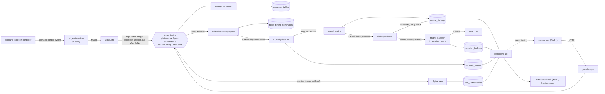

# Codebase Guide: file by file

**What this is.** A reference for every file in this repository: what it does, why it is built the way it is, what it connects to, and what it is for. It was written by reading each file, not from memory of how the project was built. Where a file's own comments disagree with reality, the entry says so and section 11 collects all of those disagreements in one place.

**Scope.** Every tracked file plus the new, uncommitted `game/` directory (the version 2 add-on). Left out on purpose: `node_modules/`, `dist/` and `.godot/` (generated, git-ignored), Godot's `*.gd.uid` sidecar files (auto-generated, one per script), and the contents of image files (they are named and explained, not described pixel by pixel).

**How each entry is laid out.**

- **What it does** is the file's behaviour, in plain terms.
- **Why it works this way** is the reason for the non-obvious choices. In this project those reasons are usually a bug that was hit for real, and the entry names it.
- **Connects to** lists what feeds the file and what consumes it.
- **Purpose** is its role in the software as a whole.

**Paths.** Everything lives under `restaurant-platform-phase1/restaurant-platform/` unless an entry says otherwise. The repo root has only `README.md`, and `restaurant-platform-phase1/` holds editor and ignore files.

**Contents**

1. [The system on one page](#1-the-system-on-one-page): data flow, Kafka topics, database tables, ports, the two deployment paths, and the design rules behind the code
2. [Repository root and top-level files](#2-repository-root-and-top-level-files): README, Compose file, config, and the narrative documents
3. [`schemas/`](#3-schemas-the-data-contracts): the seven data contracts
4. [`edge-simulators/`](#4-edge-simulators-the-fake-sensors): the four fake sensors
5. [`storage/`](#5-storage-persistence): the ingest consumer and the SQL schema
6. [`docker-compose/`](#6-docker-compose-compose-only-support-files): Compose-only support files
7. [`services/`](#7-services-the-phase-5-to-7-application-services): analytics, narrator and dashboard
8. [`game/`](#8-game-version-2-the-game-and-its-bridge): version 2, the Godot client and its bridge
9. [`k8s/`](#9-k8s-the-kubernetes-helm-deployment): every Helm chart
10. [Where to change what](#10-where-to-change-what), including how to run the tests
11. [Known inconsistencies and limitations](#11-known-inconsistencies-and-limitations)

---

## 1. The system on one page

This is a simulated restaurant-operations data platform. Fake sensors emit events; real infrastructure moves, stores and analyses them; a small language model phrases the results. It has two deployments of the same application code (section 1.5) and a prototype game client that produces the same events from a human player.

### 1.1 Data flow

Two things are easy to miss in that picture:

- **The game and the simulators are interchangeable producers.** Both write the same schema-validated events to the same Kafka topics. Nothing downstream of Kafka knows or cares which one produced an event, apart from the `source_kind` column.
- **The narrator is deliberately the last, weakest link.** It only ever reads `causal_findings`, only ever writes `narrated_findings`, and everything it produces is checked before it is stored.

### 1.2 Kafka topics

| Topic | Produced by | Consumed by (consumer group) |
|---|---|---|
| `plate-waste-events` | mqtt-kafka-bridge (from MQTT) | storage-consumer |
| `pos-transaction-events` | mqtt-kafka-bridge | storage-consumer |
| `service-timing-events` | mqtt-kafka-bridge; game-bridge | storage-consumer, ticket-timing-aggregator, digital-twin |
| `staff-shift-events` | mqtt-kafka-bridge; game-bridge | storage-consumer, digital-twin |
| `ticket-timing-summaries` | ticket-timing-aggregator | anomaly-detector |
| `anomaly-events` | anomaly-detector | causal-engine |
| `causal-findings-events` | causal-engine | finding-reviewer |
| `narration-ready-events` | finding-reviewer | finding-narrator |
| `scenario-control-events` | scenario-injection-controller | the service-timing simulator (group `service-timing-scenario-control`) |

Nothing declares these topics. There are no `KafkaTopic` objects on k3s and no topic-creation step in Compose, so the broker creates each one the first time something produces to or consumes from it. Kafka itself adds its internal topics (`__consumer_offsets`); the `connect-*` topics left by the retired Kafka Connect worker are unused.

### 1.3 Database tables (TimescaleDB, database `restaurant_platform`)

| Table | Kind | Written by | Read by |
|---|---|---|---|
| `plate_waste_events`, `pos_transaction_events`, `service_timing_events`, `staff_shift_events` | hypertable, append-only | storage-consumer | causal-engine (plate waste, staff shift); dashboard-api (`service_timing_events`, for the player-vs-crew comparison); otherwise queried by hand |
| `pos_transaction_line_items` | hypertable, append-only | storage-consumer (one row per entry in a POS event's `line_items`, same transaction as the parent row) | queried by hand; the data a per-item analysis or a guest-ordering game mode would use |
| `ticket_timing_summaries` (has an `origin` column: `simulated`, `vendor_integration` or `interactive`) | plain table, upserted per ticket | ticket-timing-aggregator | causal-engine (simulated tickets only), dashboard-api (comparison) |
| `anomaly_events` | hypertable | anomaly-detector | dashboard-api |
| `causal_findings` | hypertable | causal-engine (insert), finding-reviewer (sets `narrative_ready`) | finding-narrator, dashboard-api |
| `narrated_findings` | plain table | finding-narrator | dashboard-api |
| `twin_table_state`, `twin_staff_state`, `twin_station_state` | plain tables, one current row per entity | digital-twin | dashboard-api |

Two database roles matter. `restaurant_app` is the ordinary application role that every service uses except the narrator. `narrator_app` has `SELECT` on `causal_findings` and `SELECT, INSERT, UPDATE` on `narrated_findings`, and nothing else. That grant is the real enforcement of "the narrator can only read findings".

### 1.4 Ports (Compose path)

| Port | Service | Notes |
|---|---|---|
| `8080` | dashboard-web | the only thing meant for a browser; proxies `/api/` to dashboard-api |
| `127.0.0.1:8001` | game-bridge | only when the game overlay is used (section 1.7); localhost only because it has no authentication |
| everything else | internal to the Compose network | |

On k3s every service is `ClusterIP`; use `kubectl port-forward` to reach the dashboard or Grafana.

### 1.5 Two deployment paths

| | Kubernetes (`k8s/`) | Docker Compose (`docker-compose.yml`) |
|---|---|---|
| Purpose | shows real Kubernetes/Strimzi operational depth | runs anywhere with Docker, one command |
| Kafka | Strimzi-managed, KRaft | plain `apache/kafka`, KRaft |
| MQTT-to-Kafka bridge | `k8s/mqtt-kafka-bridge` (one Deployment, TLS to both brokers) | the `mqtt-kafka-bridge` service |
| Schema application | Helm hook Job runs the four SQL files | Postgres image runs `docker-entrypoint-initdb.d` on first init |
| LLM | `qwen2.5:3b-instruct`, Ollama native on the host, GPU | `qwen2.5:0.5b-instruct`, Ollama in a container, CPU |
| Observability | Prometheus, Grafana, kube-state-metrics, Kafka exporter | not included |
| game-bridge | not deployed | only with the game overlay (`game/docker-compose.game.yml`) |

### 1.6 Design rules that explain most of the code

These recur in nearly every file, so they are stated once here and referred to by name below.

1. **Contract first.** The JSON Schemas in `schemas/` are written before, and are the source of truth for, every producer and consumer. `source_kind` exists so a simulator, a real vendor system or a human player can be swapped in without touching a consumer.
2. **Validate before publishing, and choose fail-loud or fail-soft deliberately.** A service that produces its own data treats a schema violation as its own bug and crashes (`edge-simulators`, `ticket-timing-aggregator`, `anomaly-detector`, `causal-engine`). A service that only receives data logs and skips a bad message so one bad message cannot block a whole topic (`storage-consumer`).
3. **At-least-once processing made safe by idempotence.** Consumers commit their Kafka offset only after the work succeeds, so a crash re-delivers rather than loses. Inserts use `ON CONFLICT DO NOTHING` or upserts, so a re-delivery is harmless.
4. **Fixed workarounds for two real library problems.** `kafka-python` 2.0.2 cannot negotiate versions with Kafka 4.3.1, so `api_version=(2, 8, 0)` is pinned in code. It also vendors a copy of `six` that breaks on Python 3.12, so every image is `python:3.11-slim`.
5. **Hand-rolled infrastructure over third-party charts.** Three separate dependencies went stale or disappeared (Timescale's Helm chart, Bitnami's catalog, MinIO's official images). TimescaleDB, MinIO, Prometheus, Grafana and kube-state-metrics are therefore small hand-written manifests around official or Chainguard images.
6. **Narrow blast radius for the LLM.** The narrator connects as a role that can only read one table, receives only a structured finding, and has its output verified before storage.

### 1.7 Version 1 and version 2 are separate

Version 1 is the simulated platform, everything outside `game/`. Version 2 is the human-playable game, and all of it lives under `game/` (`game/bridge`, `game/client`, `game/k8s/bridge`, `game/docker-compose.game.yml`, `game/README.md`). **Version 1 never references version 2**; the dependency runs one way, from the game onto the platform. The base `docker-compose.yml` starts 21 services and has no game in it; the game is added by layering the overlay: `docker compose -f docker-compose.yml -f game/docker-compose.game.yml up -d --build` (22 services). The same rule is why the bridge's Kubernetes chart lives at `game/k8s/bridge/`, not under the shared `k8s/`.

The game touches version 1 in exactly four places, all intentional: the shared contract (the `player` value of `source_kind` in the event schemas, the `crew` value in `ServiceTimingEvent`, the ticket `origin` field, and migrations `004` and `005`, which have to live in the shared tree and reach every database); the **quarantine** that contract enables (the aggregator stamps each ticket's origin, the anomaly detector keeps `interactive` tickets out of its baselines, the causal engine leaves them out of its analysis, and `dashboard-api` and the dashboard compare them with the rest, all worded generically, with nothing naming the game); `edge-simulators/common/world.py` (copied into the bridge image so entity ids match); and the base stack's Kafka and TimescaleDB. Guests (2026-09-22) add no new dependency: ordering reuses `world.MENU` (already shared, already used by the POS and plate-waste simulators) and `POSTransactionEvent`'s existing `player` value. `game/README.md` states the rule and includes a one-line check for it.

---

## 2. Repository root and top-level files

### `README.md` (repo root)
- **What it does:** The public front page. It pitches the project, shows a Mermaid architecture diagram, lists two verified results, compares the two deployment paths, and lists the tech stack and build phases. It also states the narrator's limits honestly (verification layer, and that the small CPU model mostly falls back to a template).
- **Why it works this way:** It is written for a recruiter who will read the first screen and maybe run one command, so the run command comes before the explanation. Every claim in it traces to a verified result recorded in `restaurant-platform-implementation-status.md`.
- **Connects to:** `QUICKSTART.md` (how to run), `restaurant-platform-project-notes.md` (design rationale), `restaurant-platform-implementation-status.md` (evidence).
- **Purpose:** Portfolio entry point.

### `.github/workflows/tests.yml` (added 2026-09-28; **moved 2026-09-30**)
- **Where it actually lives:** at the true git repository root (`.github/workflows/tests.yml` relative to the *repo* root, one level above `restaurant-platform-phase1/`) -- **not** under `restaurant-platform-phase1/restaurant-platform/` the way every other path in this guide is. A real bug, found live: it was first committed at the latter, natural-feeling location, and GitHub Actions only ever discovers workflow files at the repo root, so it silently never registered as a workflow at all -- `gh workflow list`/`gh run list` came back completely empty after the first real push, on a file that had existed (and been iterated on) for several days. Every matrix `dir` and the `game-smoke-test` job's working directory are prefixed with `restaurant-platform-phase1/restaurant-platform` accordingly, since `actions/checkout@v4` now lands the repo root here instead.
- **What it does:** Runs on every push to `main` and every pull request. A `fail-fast: false` matrix with one job per existing unit test suite (`game/bridge`, `services/dashboard-api`, `services/anomaly-detector`, `services/ticket-timing-aggregator`, `services/finding-narrator`, `services/alert-relay`) -- six independent jobs so one suite failing doesn't hide the others' results, each using that test file's own documented `pip install`/`pytest` invocation (see each file's own top-of-file docstring) rather than a separately-maintained list of dependencies that could drift from what the file actually says it needs.
- **Why it works this way:** Every one of these suites was already written to need zero live infrastructure -- Kafka, Postgres and MQTT clients are stubbed via `sys.modules.setdefault(...)` or (for the two FastAPI services) `dependency_overrides` -- confirmed by actually running all jobs' exact commands locally in throwaway virtualenvs before this file was written, not assumed from reading the test files. `python-version: "3.11"` is pinned to match every service's own `Dockerfile` (`FROM python:3.11-slim`), not left as "latest", so CI can't pass on a newer interpreter while the real image behaves differently.
- **Connects to:** every test file's own docstring (the source of truth for each job's install/run commands, not duplicated logic); GitHub's own Actions UI for pass/fail per job.
- **Purpose:** The project's first automated safety net -- until this, every one of these tests only ran when a human remembered to run it by hand.

#### `game-smoke-test` job (added 2026-09-29)
- **What it does:** A second, separate job in the same workflow file that automates `game/client/tests/smoke_test.gd` -- the project's one true integration test, previously manual-only. Brings up a *minimal* Compose subset (`kafka`, `timescaledb`, `storage-consumer`, `ticket-timing-aggregator`, `dashboard-api`, `dashboard-web`, `game-bridge`), polls both `/api/health` endpoints until they answer, downloads the official Godot 4.5 Linux binary (matching `game/client/project.godot`'s `config/features` exactly, not "whatever's latest" -- confirmed the exact release asset name against Godot's own GitHub API rather than guessing a URL), and runs the smoke test headless.
- **Why it works this way:**
  - The service subset was derived by actually reading what the test calls, not copied from the full stack: it never touches MQTT or the MQTT-Kafka bridge (the game bridge publishes straight to Kafka) or the simulators, and skips anomaly-detector/causal-engine/finding-reviewer/llm-narrator/ollama entirely since the test never reads a narrated finding -- pulling an Ollama model alone would make this job far slower for zero coverage gained. `ticket-timing-aggregator` earned its place by tracing `dashboard-api`'s `/api/comparison` (`services/dashboard-api/comparison.py`) down to the `ticket_timing_summaries` table it writes.
  - `SPAWN_SECONDS=1`/`CREW_MIN_SECONDS=1`/`CREW_MAX_SECONDS=2` (the same "fast test run" pacing `game/README.md` already documents for manual use) keeps the test's several wait-for-the-crew loops from running at their default 6-14s cadence.
  - `BRIDGE_API_KEY` is set explicitly to match `docker-compose.yml`'s own fallback exactly -- `bridge_client.gd` reads it from the environment with no fallback of its own, so leaving it unset (rather than matching) would 401 every authenticated call, silently, not loudly.
  - No `DASHBOARD_API_KEY` is needed even though `dashboard-api` requires one: `services/dashboard-web/nginx.conf.template` injects `X-API-Key` server-side from its own environment variable (which Compose already defaults to the same value dashboard-api expects), so the Godot client calling `dashboard-web`'s port never needs to know it -- confirmed by reading the nginx template, not assumed.
  - `--headless` needs no X server or GPU at all (Godot's dummy rendering driver) -- confirmed against Godot's own documented behavior, not tested live in this shell (downloading and running the real binary here would mean building and starting all seven images just to validate the CI job itself); `docker compose config` was used instead to confirm the exact service subset and file merge resolve with no errors before this was written.
  - `defaults.run.working-directory: restaurant-platform-phase1/restaurant-platform` at the job level (added when the file moved to the repo root, 2026-09-30) -- every `run:` step here assumes that as its CWD and none overrides it, unlike the `test` job's matrix steps, which set their own `working-directory` per step and so needed each `dir` value prefixed instead (a job-level default doesn't combine with a step's own explicit `working-directory`, it's simply replaced by it).
  - Runs as its own job, not folded into the fast matrix above, exactly per that job's own header comment anticipating this as a future need: a slow or flaky Compose stack should never block or delay the fast, dependency-free unit tests.
- **Purpose:** The first automated coverage of the actual event pipeline (bridge to Kafka to storage-consumer to TimescaleDB to dashboard-api) -- previously provable only by a human running Godot by hand. **Not yet confirmed by an actual run on GitHub's own runners**, same honest caveat as the rest of this workflow when it was first added.

### `.github/workflows/production-readiness.yml` (added 2026-10-02)
- **What it does:** The heavy half of the test regime, run nightly (07:17 UTC) and on demand from the Actions tab. Three jobs: `stack` (the real Docker Compose stack: end-to-end, the injected-scenario acceptance test, load, and resilience), `statistical` (the causal engine against synthetic ground truth, inside the project's own Python 3.11 image) and `security` (every pinned dependency against published advisories). `tests.yml` also gained `static` and `integration` jobs, which run on every push.
- **Why it works this way:** `tests.yml` answers "does this commit still work?" in minutes. These layers answer "would it survive production?" and take 40+ minutes or need the internet; running them on every push would make every push slow, so they run on a schedule instead.
- **Connects to:** `TESTING.md` (what each test is and why it exists), `tests/run_stack_tests.sh`, `tests/statistical/run_statistical_tests.sh`.
- **Purpose:** The production-analogous testing regime's scheduler. Written and validated locally (each command run for real); not yet observed running on GitHub.

### `.github/workflows/publish-images.yml` and `.devcontainer/devcontainer.json` (added 2026-10-02)
- **What they do:** Set up, deliberately inert. The workflow builds the 11 custom images and pushes them to `ghcr.io`, but only on a manual trigger (`workflow_dispatch`). The devcontainer lets a recruiter open a GitHub Codespace and get the Compose stack running with no local installs; it still builds from source rather than pulling from `ghcr.io`.
- **Why they work this way:** Written while the Codespaces allowance was exhausted, so neither has ever been run. Nothing pulls from `ghcr.io` yet; wiring Compose or the devcontainer to prebuilt images is a follow-up once a real publish run is checked.
- **Purpose:** Cutting a recruiter's first-run time and removing the "install Docker" step.

### `TESTING.md` (added 2026-10-02)
- **What it does:** The catalogue of the whole test regime: the production-analogy rationale, how to run each layer, what building the regime found, and then every test in the repository with *what it is, what it does, why it was created, and why it matters*.
- **Why it works this way:** The catalogue is itself tested: `tests/static/test_testing_doc.py` fails if a test is missing from it or if it describes a test that no longer exists.
- **Purpose:** The reader's map of how this project knows it works.

### `docs/quality/` (added 2026-10-03)
- **What it does:** A complete quality-document set, written retrospectively from the project's own records: a requirements specification (96 identified requirements), master test plan, requirements traceability matrix, SQA plan, risk register (34 risks), defect and difficulty log (147 entries, including failures of the test regime itself), test summary report, lessons learned, environment and configuration baseline, and a release-readiness assessment with known issues. `README.md` indexes them and holds a glossary.
- **Why it works this way:** The project began from a design brief and a technical log, not formal requirements, so these documents state the requirements, show which test proves each, and list every failure honestly (including the open ones). They claim no compliance with IEEE or ISO standards. Their registers are checked by `tests/static/test_quality_docs.py`: ids must be unique and real, every requirement must be traced, every test cited must exist, and every summary total must match its rows.
- **Connects to:** `TESTING.md` (the per-test catalogue), `restaurant-platform-implementation-status.md` (the original problem log whose items are cross-referenced in the defect log's Source column).
- **Purpose:** The evidence trail a reviewer can read to judge how the project was verified, what failed, and what is still open.

### `tests/` (added 2026-10-02)
- **What it does:** The cross-cutting test layers, those needing more than one service, a real database, or the whole stack. `static/` (compose, Dockerfiles, Helm, schemas, lint, secrets, the version boundary), `integration/` (real application code against a real TimescaleDB built from the real migrations, run by `run_db_tests.sh`), `statistical/` (the causal engine against data with a known answer), `e2e/` (the running stack end to end, plus the slow injected-scenario acceptance test), `resilience/` (kill the consumer, database, Kafka, MQTT), `load/` (bursts, memory, concurrency), `security/` (dependency advisories). `run_stack_tests.sh` brings the real stack up as an isolated compose project, runs the stack layers and tears it down; `e2e/docker-compose.test.yml` only speeds up pacing. Per-service unit tests are *not* here: they stay next to the service they test.
- **Why it works this way:** Each layer simulates one thing production does to a system; see the table at the top of `TESTING.md`.
- **Connects to:** `docker-compose.yml` (the stack under test), `storage/schema/` (applied by `run_db_tests.sh`), `game/README.md` (whose version-boundary exclusion list `test_repo_hygiene.py` reads).

### `restaurant-platform-phase1/.gitignore`
- **What it does:** Ignores `__pycache__/`, compiled Python, and the virtualenvs `.venv/`, `.venv-1/`, `venv/`.
- **Why it works this way:** Two virtualenv directories had been committed by accident; they were untracked and added here so they cannot come back.
- **Connects to:** git only.
- **Purpose:** Repo hygiene.

### `restaurant-platform-phase1/.vscode/settings.json`
- **What it does:** One VS Code setting, `python-envs.defaultEnvManager: ms-python.python:system`.
- **Why it works this way:** It is a personal editor preference that was committed early. It is harmless, so it was left.
- **Connects to:** VS Code only.
- **Purpose:** Editor convenience; no runtime role.

### `.env.example`
- **What it does:** A template for optional overrides: the two database passwords (`TIMESCALEDB_PASSWORD`, `NARRATOR_PGPASSWORD`, both `changeme-local-dev-only`) and `OLLAMA_MODEL` (default `qwen2.5:0.5b-instruct`).
- **Why it works this way:** Every value already has the same default baked into `docker-compose.yml` (`${VAR:-default}`), so the file is optional. The placeholder password matches the convention in the k8s charts' `values.yaml`, which keeps the two paths consistent and makes it obvious these are dev-only credentials.
- **Connects to:** read by Docker Compose when copied to `.env`; values feed `timescaledb`, every database-using service and `llm-narrator`.
- **Purpose:** Lets a user change passwords or the model without editing the compose file.

### `QUICKSTART.md`
- **What it does:** Step-by-step instructions for the Compose path: requirements, the one run command, what to look at while it runs (the dashboard URL, psql queries, how to force a finding immediately), how to stop or reset, and a comparison table against the k3s path.
- **Why it works this way:** It assumes only Docker. The "force a finding" command exists because organic findings need about 30 completed tickets per station before the anomaly detector has a baseline, which is too long to wait during a demo. It notes that with the small model most narrations will be the `template-fallback` text.
- **Connects to:** `docker-compose.yml` and `services/causal-engine` (the manual finding command). It says nothing about the game; that lives in `game/README.md`.
- **Purpose:** The "clone and run" document.

### `docker-compose.yml`
- **What it does:** Defines the whole portable stack, 20 services, in dependency order: Mosquitto (with a persistent volume); Kafka; the MQTT-Kafka bridge, which the simulators wait for (its persistent session must exist before the first event is published); TimescaleDB; the four simulators; storage-consumer; the Phase 5 services (aggregator, anomaly detector, causal engine, reviewer, scenario controller); digital twin; narrator; dashboard API and web; Ollama and a one-shot model puller. It is version 1 only: the game bridge is added separately by `game/docker-compose.game.yml`. Four named volumes persist Mosquitto's session and queue, Kafka, TimescaleDB and Ollama data.
- **Why it works this way:**
  - YAML anchors (`&edge-sim`, `&phase5-service`, `&phase5-env`) remove duplication, since four simulators share one image and most Phase 5 services share their environment.
  - `restart: unless-stopped` is on every long-running service because Compose, unlike a Kubernetes Deployment, does not restart crashed containers by default. A load-induced anomaly-detector crash stayed down forever until this was added.
  - The Kafka healthcheck is deliberately slow and forgiving (30 retries, 15 s timeout) because each check starts a JVM, and it flapped on a busy machine even though the broker was fine.
  - `KAFKA_LOG_DIRS: /var/lib/kafka/data` is set because without it Kafka wrote to an in-container `/tmp` path and every recreation wiped all topics, even though a volume was mounted at a different path.
  - Every image is fully qualified (`docker.io/...`) because rootless Podman has no unqualified-search registries and fails on short names.
  - `.sql` files are mounted into `docker-entrypoint-initdb.d`, which Postgres runs once on first initialisation. This replaces the k8s Helm-hook Job. Because it only runs on a fresh volume, an old volume needs migration 004 applied by hand.
  - `dashboard-web` publishes `8080`. (The game bridge, which binds to `127.0.0.1` only, is not here; see `game/docker-compose.game.yml`.)
- **Connects to:** the `docker-compose/` support files, every service's Dockerfile, `storage/schema/*.sql`, `schemas/`, `.env`. Extended, not modified, by `game/docker-compose.game.yml`.
- **Purpose:** The single entry point for running the platform on any machine.

### `restaurant-platform-project-notes.md`
- **What it does:** The original design brief plus later additions: purpose and cost constraints, why the original camera-based pitch was rejected, the version 2 (game) and Steam/licensing analysis, the seven layers, the seven-phase build sequence and the scope guardrail.
- **Why it works this way:** It records decisions and the reasons for them, so a later reader does not re-litigate them (for example, Godot over Unity or Unreal, itch.io over Steam, and why plate-waste-camera computer vision is out of scope).
- **Connects to:** referenced by the README, the status doc and several code comments.
- **Purpose:** The "why the project is shaped like this" document.

### `restaurant-platform-implementation-status.md`
- **What it does:** A long running technical log: onboarding notes, design decisions, the phase status table, environment details, and a numbered problem log of every real bug and its fix, with verification evidence.
- **Why it works this way:** It exists so the same root cause is not diagnosed twice. New results are appended as table rows rather than rewriting history.
- **Connects to:** the phase handoffs and the study guide, which it points to.
- **Purpose:** The evidence trail behind every claim in the README. Its sections 0 to 3 record the design as of Phase 4 (left as written, with a dated update note at the top); section 4 (the status table) and the problem log carry the later work, and sections 7 and 8 were refreshed on 2026-09-20.

### `linux-k8s-docker-helm-study-guide.md`
- **What it does:** A tool-level reference (Linux, Docker/Podman, Kubernetes, Helm, Python packaging, `ENTRYPOINT` semantics, supply-chain volatility) organised by the specific failure modes hit in this project, with a command quick-reference.
- **Why it works this way:** It is indexed by symptom, so it can be searched when a command fails in an unfamiliar way before re-deriving a diagnosis.
- **Connects to:** cited by comments in the Dockerfiles, requirements files and charts (for example "study guide Section 6.3" for the Python 3.11 pin).
- **Purpose:** A troubleshooting reference; not part of the running system.

### `CODEBASE-GUIDE.md`
- **What it does:** This document.
- **Why it works this way:** It is written by reading each file and records where a file's own comments were wrong, so a reader can trust it over the comments; the wrong comments it found were fixed on 2026-09-20 and section 11 lists only what genuinely remains.
- **Purpose:** The map of the repository. Update it when files are added, moved or removed.

---

## 3. `schemas/`: the data contracts

Seven JSON Schema (draft 2020-12) files. Four describe events that leave a producer; three describe records the platform derives itself. All use `"additionalProperties": false`, so a producer that adds an unlisted field is rejected instead of silently widening the contract.

### `schemas/PlateWasteEvent.schema.json`
- **What it does:** Defines one bussed-plate observation: waste grams, the menu items on the plate, an optional table, and a `confounder_flags` object (`to_go_container_used`, `declared_dietary_restriction`, `portion_size_variant`). Schema 1.1.0 adds an optional `edge_inference` object (1.2.0 adds `shift_score` to it, 1.3.0 `flatline_score`), present when the estimate was computed by a model on the node itself: model id, version, a SHA-256 over everything that determines the model's behaviour, inference latency, an out-of-distribution distance and flag, and a drift score and flag.
- **Why it works this way:** The confounders are captured on the event itself so the causal engine does not have to infer them. That is the whole reason the original "waste means dissatisfaction" idea was replaced by causal inference: portion size, doggy-bag intent and dietary restriction all confound it.
The `edge_inference` block was added as an additive optional field, with no database migration: `plate_waste_events.raw_payload` (JSONB) already keeps the whole event, and the two consumers of the block (the causal-engine filter and the dashboard's edge view) read it by JSON path. The trade-off is that those paths are not indexed.
- **Connects to:** produced by `simulators/plate_waste.py`; validated by `common/runtime.py` and `storage/consumer/consumer.py`; stored in `plate_waste_events`; queried by `causal_engine.py`; summarised by `dashboard-api`'s `/api/edge/plate-waste`.
- **Purpose:** The contract for the plate-waste stream.

### `schemas/POSTransactionEvent.schema.json`
- **What it does:** One completed sale: transaction id, table, server, an array of line items, total, currency, payment method and discount.
- **Why it works this way:** Line items are a real array (a transaction has several), which is why the database has a separate line-items table. Money is integer cents to avoid floating-point error.
- **Connects to:** `simulators/pos_transaction.py`, `storage/consumer/consumer.py`, `pos_transaction_events`.
- **Purpose:** The contract for the point-of-sale stream. Nothing downstream analyses it yet beyond storage.

### `schemas/ServiceTimingEvent.schema.json`
- **What it does:** One stage transition of a kitchen ticket: `order_fired`, `cook_started`, `plated`, `picked_up_by_server`, `delivered`, with `elapsed_since_previous_stage_ms`.
- **Why it works this way:** `plated` and `picked_up_by_server` are separate stages so kitchen cook time and front-of-house pickup delay can be measured independently; the file records that split. The producer computes the elapsed time, which is why the game bridge does too rather than trusting a client.
- **Connects to:** `simulators/service_timing.py`, `game/bridge`, the aggregator, the digital twin, `storage/consumer`.
- **Purpose:** The most heavily used contract; it drives anomaly detection and the twin's kitchen state.
- **`source_kind` here has a fourth value, `crew` (2026-09-21):** an automated participant working alongside a human-driven source, used by the game bridge for the staff nobody is playing. It exists so the aggregator can recognise an interactive ticket from its very first event (the crew fires the ticket, before any player acts); it is only in this schema because the crew only ever publishes stage events.

### `schemas/StaffShiftEvent.schema.json`
- **What it does:** A staffing state change: `clock_in`, `clock_out`, `break_start`, `break_end` or `station_reassign`, with role, optional station, and `scheduled_vs_actual`.
- **Why it works this way:** `scheduled_vs_actual` is kept explicit as a modelled confounder instead of being implied.
- **Connects to:** `simulators/staff_shift.py`, `game/bridge`, the digital twin, `storage/consumer`, the causal engine's `staffing_level` query.
- **Purpose:** The staffing contract.

All four event schemas share a `source_kind` field with values `simulated`, `vendor_integration` and `player`. `player` was added on 2026-09-20 for the game; the change is recorded in each schema's description and in migration `004`. `ServiceTimingEvent` alone also accepts `crew` (migration `005`).

### `schemas/TicketTimingSummary.schema.json`
- **What it does:** One row per ticket summarising its stage timestamps and derived durations (`cook_duration_ms`, `pickup_delay_ms`, `service_delay_ms`, and so on), with `is_complete`.
- **Why it works this way:** It is a mutable per-ticket record (a summary is updated as later stages arrive), unlike the append-only event schemas. The description warns that incomplete summaries have provisional durations, which is why the anomaly detector ignores them.
- **Connects to:** produced by `aggregator.py`, consumed by `detector.py`, stored in `ticket_timing_summaries`, mounted into three k8s pods through `k8s/phase5-schemas`.
- **`origin` (added 2026-09-21):** `simulated`, `vendor_integration` or `interactive`. It is `interactive` if any event on the ticket has `source_kind` `player` or `crew`, otherwise the events' own kind. Its description states the rule downstream consumers follow: keep interactive tickets out of the baseline for the others.
- **Purpose:** The feature record that anomaly detection runs on.

### `schemas/AnomalyEvent.schema.json`
- **What it does:** A detected anomaly: method (`control_limit` or `isolation_forest`), metric, scope (station, ticket and so on), window, observed value, expected range or anomaly score, and severity.
- **Why it works this way:** `detection_method` is a closed enum on purpose: a third method should be a schema version bump, not a silent new string a consumer might mis-handle. The expected range is only meaningful for control limits and the score only for the isolation forest, so each is nullable.
- **Connects to:** produced by `detector.py`, consumed by `causal_engine.py`, stored in `anomaly_events`, summarised by `dashboard-api`.
- **Purpose:** Hand-off from detection to attribution.

### `schemas/CausalFinding.schema.json`
- **What it does:** A causal estimate: treatment, outcome, controlled confounders, effect and unit, method, `refutation_passed`, and the `narrative_ready` gate.
- **Why it works this way:** Its description states the narrator boundary in the contract itself: this is the only object the narrator may read. `confounders_controlled` must be non-empty, so an uncontrolled correlation cannot validate as a finding. `narrative_ready` separates "computed" from "safe to phrase". The unit is nullable but strongly recommended because a number without a unit cannot be phrased safely.
- **Connects to:** produced by `causal_engine.py`, read by `narrator.py` and `narration_guard.py` (which use its field names), stored in `causal_findings`.
- **Purpose:** The safety contract at the centre of the AI-integration story.

### `schemas/test_producer_schema_compatibility.py` (added 2026-09-30)
- **What it does:** Calls each producer's own real event-construction function -- `plate_waste.generate_event()`, `pos_transaction.generate_event()`, `service_timing.TicketLifecycle().next_event()`, `staff_shift.ShiftState().next_event()`, `detector.build_control_limit_event()`/`build_isolation_forest_event()`, `causal_engine._build_finding()` -- and validates the real dict it returns against the matching schema file with `jsonschema.validate`. `TicketTimingSummary` isn't repeated here since `services/ticket-timing-aggregator/test_origin.py` already covers it the same way.
- **Why it works this way:** Every schema file already documents its own field-level contract, and every producer already validates its own output against it *at runtime* (`edge-simulators/common/runtime.py`, `services/phase5_common.py`) -- but that only runs when the real pipeline is live. This test exercises the same real construction code offline, in CI, on every push, catching the class of producer/schema drift this project has otherwise only found by hand (see the implementation-status doc's problem log). Deliberately calls the actual functions rather than hand-writing example payloads, which would just be a second place for the contract to drift out of sync with the real code. `causal_engine._build_finding` needed no `dowhy`/`statsmodels`/`scipy`/`networkx` at all to test -- confirmed by reading the file first: the real DoWhy call (`_run_dowhy`) does `from dowhy import CausalModel` as a *lazy* import inside its own function, not at module level, so importing `causal_engine.py` only needs `pandas` and `jsonschema`. A real, if minor, gap was found writing this: `edge-simulators/common/runtime.py` imports `paho.mqtt.client` at module level for its `Simulator` class (never constructed here), so the stub list needed `paho`/`paho.mqtt`/`paho.mqtt.client` alongside the usual `kafka`/`psycopg2` -- and needed real `types.ModuleType` instances, not `types.SimpleNamespace`, since Python's own submodule-binding machinery for `import paho.mqtt.client as mqtt` broke against the latter with a confusing `cannot import name 'mqtt'` error. Confirmed the check is real, not vacuous, by deliberately breaking a generated event (removing a required field) and watching `jsonschema.ValidationError` actually raise before writing this into CI.
- **Connects to:** every schema file in this directory; the producer modules under `edge-simulators/simulators/`, `services/anomaly-detector/detector.py`, `services/causal-engine/causal_engine.py`; wired into `.github/workflows/tests.yml`'s matrix as the `schema-compatibility` job.
- **Purpose:** Automated protection for the contract-first architecture this project's own README calls out as a design pillar -- previously enforced only by runtime validation (only checked when live) and human review (only checked when someone remembers).

---

## 4. `edge-simulators/`: the fake sensors

One image runs all four sensors; an environment variable picks which. Every simulator emits at a Poisson-process rate (random exponential gaps) rather than on a fixed tick, because real devices do not fire on a clock.

### `edge-simulators/entrypoint.py`
- **What it does:** Reads `SENSOR_TYPE`, looks the module up in a four-entry table, imports it and calls its `main()`. An unknown value exits with an error.
- **Why it works this way:** One image with a selector variable replaces four near-identical images that would each need building, tagging and importing into k3s.
- **Connects to:** `simulators/*.py`; `SENSOR_TYPE` is set per Deployment by `k8s/edge-simulators` or per service in `docker-compose.yml`.
- **Purpose:** The container's single start point.

### `edge-simulators/common/runtime.py`
- **What it does:** Defines the `Simulator` class: load one schema, connect to MQTT with exponential backoff, validate each event against the schema, publish it (QoS 1) and sleep a Poisson-distributed interval.
- **Why it works this way:**
- **Added 2026-10-04:** `subscribe` (handlers per topic, re-subscribed on every connect because a clean-session reconnect drops them), `_on_message` (routes by topic; a failing handler is logged, never raised into the network thread) and `publish_state` (retained, QoS 1) so simulators can share simulated-world state.
  - A schema violation is fatal (`sys.exit(1)`) because it means the generator has a bug; logging and skipping would hide it and could let bad data reach Kafka.
  - Connection and publish errors are logged and retried because the broker may simply not be up yet, and a crash loop would fix nothing.
  - The interval is floored at 0.5 s so a tiny random draw cannot hammer the broker.
- **Connects to:** `common/ids.py`; the four `simulators/*.py`; Mosquitto over MQTT; `schemas/` at `/app/schemas`.
- **Purpose:** The behaviour all four sensors share.

### `edge-simulators/common/world.py`
- **What it does:** The shared simulated world: `RESTAURANT_ID` (`rest-001`), six stations, twenty tables, ten staff with roles, a twelve-item priced menu, and `SCHEMA_VERSION`.
- **Why it works this way:** All four simulators (and the game bridge) draw ids from these lists, which is what makes the four event types joinable later. Separate id spaces would break joins silently. The file's own docstring says exactly that.
- **Connects to:** imported by all four simulators; copied into the game-bridge image by its Dockerfile.
- **Purpose:** The single source of truth for entity ids.

### `edge-simulators/common/ids.py`
- **What it does:** Two helpers: `new_event_id()` (a UUID4 string) and `now_iso()` (current UTC time in ISO 8601).
- **Why it works this way:** Kept in a tiny module so every event gets ids and timestamps the same way.
- **Connects to:** all simulators; re-exported through `runtime.py`.
- **Purpose:** Identifier and timestamp utilities.

### `edge-simulators/common/__init__.py`, `edge-simulators/simulators/__init__.py`
- **What they do:** Empty files that make the directories Python packages.
- **Purpose:** Package markers, so `from common import world` and `simulators.plate_waste` resolve.

### `edge-simulators/simulators/plate_waste.py`
- **What it does:** The plate-waste node. The simulator still draws the true waste (normal around 120 g, times 0.25 when a to-go container is used on 15% of plates; a dietary restriction on 10%), but the node never sees it. It reads four simulated sensor channels for the plate (`edge_ai/sensor.py`), runs the on-node model (`edge_ai/model.py`) to estimate the grams, feeds the reading's out-of-distribution distance to a rolling spread monitor and its per-channel deviation to a rolling shift monitor and a flatline monitor, and publishes the estimate together with an `edge_inference` block (model id, version and hash, latency, distance, drift, shift and flatline scores, and the two flags; `drift_suspected` is true when any monitor alarms). The model in service belongs to a `ModelUpdater` (`edge_ai/updater.py`) and can change between two readings when the cloud sends a checked model; a swap restarts the monitors. `attach_control` subscribes the node to its own control topic and the fleet's and publishes its status retained; the node's id is `SOURCE_ID`. `last_true_grams` keeps the truth simulator-side so tests can score the node; it is never published. `EDGE_LENS_FOULING` (0 to 1) injects a sensor fault.
- **Why it works this way:** The confounder relationship is still encoded in the true waste on purpose, so the causal engine has something real to find in estimates that now come from a model. The model is loaded in `main()` before the event loop, because `Simulator.run_forever` logs and continues past errors raised while generating an event; a model that failed its integrity check inside the generator would be retried forever instead of stopping the pod.
- **Connects to:** `common/runtime.py`, `common/world.py`, `edge_ai/`; MQTT topic `sensors/plate-waste`; `schemas/PlateWasteEvent.schema.json` (schema 1.3.0). `EDGE_SENSOR_FAULT` runs the node with a named sensor fault (`edge_ai/sensor.py` `inject_fault`).
- **Purpose:** Source of the plate-waste stream, the ground truth for the waste finding, and the project's edge-intelligence node.

### `edge-simulators/simulators/pos_transaction.py`
- **What it does:** Builds a sale of one to five line items with quantities, a 3% chance each line is voided, an 8% chance of a 10 to 20% discount, and a randomly chosen server and payment method. The total is computed consistently from the non-voided lines.
- **Why it works this way:** The total is derived from the lines so the event is internally consistent, which the schema cannot enforce itself.
- **Connects to:** `common/`; topic `sensors/pos-transaction`.
- **Purpose:** Source of the POS stream.

### `edge-simulators/simulators/service_timing.py`
- **What it does:** Simulates kitchen tickets moving through the five stages. `TicketLifecycle` keeps open tickets in memory, picks one at random to advance (or starts a new one), and computes `elapsed_since_previous_stage_ms` from real time. Tickets are forced forward when stale. The backlog the kitchen may hold is **inversely proportional to the staffing level** (`common/staffing.py`): more open tickets competing for the same tick budget means each waits longer for its next stage, so fewer people working really does slow the kitchen. The staffing level is read from a retained MQTT message the staff-shift simulator publishes. When `SCENARIO_CONTROL_ENABLED` is true it also follows `scenario-control-events` (through `common/scenario.py`) and removes the stations a staffing-shortage scenario names from the pool that new tickets land on.
- **Why it works this way:** The long comment at the top records what was tried. Removing a station only changes where new tickets land. Weighting selection cancels itself out, and a real sleep would freeze the whole simulator, so letting the backlog grow is the mechanism. **Until 2026-10-04 a direct x5 multiplier on the backlog, applied while a scenario was active, did the slowing without touching the staffing signal, so the engine's `staffing_level` treatment had no true effect to find and the repaired refutation gate refuted the finding (DEF-141). Capacity now depends on staffing alone,** and the scenario acts by lowering staffing.
- **Connects to:** `services/scenario-injection-controller` (via Kafka); `edge-simulators/simulators/staff_shift.py` (via the retained staffing message); `common/`.
- **Purpose:** The producer behind the anomaly detector and digital twin, and the vehicle for the injected-scenario test.

### `edge-simulators/simulators/staff_shift.py`
- **What it does:** `ShiftState` tracks who is clocked in so the sequence is plausible (no clock-out without a clock-in, no reassignment for someone off shift), then emits clock-in, clock-out, break and reassign events. While a staffing-shortage scenario is active (`SCENARIO_CONTROL_ENABLED`, target `staff-shift` or `all`) it clocks the surplus out down to `SHORTAGE_MAX_CLOCKED_IN` (default 2), holds it there, and refills afterwards. After every event it publishes the number clocked in as a retained MQTT message (`sim/world/staffing`) for the timing simulator.
- **Why it works this way:** A shortage is an intervention on staffing itself, which is what the causal engine's `staffing_level` counts. The simulator is the source of truth for staffing and shares it as simulated-world state, outside the bridged `sensors/` topics, so it never enters Kafka or the database. State is in memory and resets on restart, which is accepted for a simulator. Normal staffing settles at about 8.
- **Connects to:** `common/`; topic `sensors/staff-shift`; consumed by the digital twin and the causal engine.
- **Purpose:** Source of the staffing stream, and the lever the injected shortage pulls.

### `edge-simulators/common/staffing.py`
- **What it does:** Staffing as a real driver in the simulated world: the topic name, `NOMINAL_STAFFING` (8, measured), `backlog_factor` (capacity proportional to nominal over actual staffing, bounded 0.5 to 4), the wire encoding and a holder that keeps the latest valid level and ignores garbage.
- **Why it works this way:** Until 2026-10-04 nothing encoded that staffing affects anything. This does for staffing what the to-go factor does for plate waste: puts the relationship into the data on purpose.
- **Connects to:** `simulators/service_timing.py`, `simulators/staff_shift.py`, `test_world_coupling.py`.
- **Purpose:** The staffing-to-delay relationship the staffing analysis depends on.

### `edge-simulators/common/scenario.py`
- **What it does:** The scenario-control consumer, moved out of the timing simulator so the staff-shift simulator can share it: a background thread following `scenario-control-events`, a pure `apply` that folds each message into the current scenario, and target filtering (each simulator answers to its own name and to `all`).
- **Why it works this way:** One scenario can now act on the kitchen and the staff together. `kafka-python` is imported inside the function so a simulator without scenario control does not need it.
- **Connects to:** both simulators; `services/scenario-injection-controller`.
- **Purpose:** Shared scenario hook.

### `edge-simulators/edge_ai/__init__.py`
- **What it does:** Empty. Makes `edge_ai` a package.
- **Purpose:** Package marker.

### `edge-simulators/edge_ai/sensor.py`
- **What it does:** The node's simulated sensing hardware: a load cell, a camera area channel, a depth channel and an ambient-light reading. `true_waste_grams` is the ground truth the simulator holds back; `read_sensors` turns it into four noisy readings; `lens_fouling` is the one fault knob. One plate in four carries 15 to 60 g of cutlery or napkin on the scale, so the scale alone is often wrong; the camera area saturates; dim light makes both camera channels noisier.
- **Why it works this way:** The same module generates the simulator's readings and the trainer's data, so the two cannot drift apart. The channels are designed so that no single one is enough and fusing them genuinely helps, which is what makes a model worth running on the node. They are a stand-in, not measurements of real hardware.
- **Connects to:** `simulators/plate_waste.py`, `training/train_plate_waste_model.py`, `test_edge_ai.py`.
- **Purpose:** The raw signal the on-node model works from.

### `edge-simulators/edge_ai/model.py`
- **What it does:** The whole inference path of a small edge model, needing numpy only: standardise the four channels, a 4-16-8-1 network with int8 weights (dequantised once at load, float32 arithmetic), and a Mahalanobis distance from the training data. `EdgeModel` refuses to load an artifact whose SHA-256 over its behavioural fields does not match the hash it declares. `DriftMonitor` keeps a rolling mean of the squared distance over a window and alarms above a calibrated threshold (the spread monitor). `FlatlineMonitor` (added in model 1.2.0) watches how much each channel varies within a window and alarms when the least-varying channel falls below a threshold calibrated at the lower tail of clean windows: it is the one that sees a sensor stuck at a normal value or a gain that has fallen (DEF-157), which move neither of the other two. `NoShiftMonitor` stands in for a model from before the shift or flatline monitor, so that version (the rollback target) still loads. `ShiftMonitor` (added in model 1.1.0) computes a Hotelling T-squared of the mean per-channel deviation over a shorter window and alarms above its own calibrated threshold. The size and latency budgets are constants here, enforced by tests.
- **Why it works this way:** Two guards because measurement showed one is not enough: the per-reading flag catches gross outliers but, at lens fouling 0.4 where error is already five times worse, flags under 1% of readings; a rolling mean of the distance catches that, but only the larger faults (fouling 0.2 in 59.5% of onsets), so a second monitor tests the window's *mean* deviation, which is what a fouling lens moves (0.2 in 99.5%, median 23 readings). The two are kept because the first reacts to added noise far more strongly than the second. CUSUM on the distance was tried first and did not help (DEF-155). The hash makes any estimate traceable to the exact model and makes a corrupted or hand-edited artifact fail at startup instead of emitting plausible numbers.
- **Connects to:** `edge_ai/plate_waste_edge_model.json`, `simulators/plate_waste.py`, `training/train_plate_waste_model.py`.
- **Purpose:** The on-device model and its guards.

### `edge-simulators/edge_ai/updater.py`
- **What it does:** How the plate-waste node takes a new model from the cloud and refuses a bad one (added 2026-10-06). `ModelUpdater.handle()` receives a control message on the MQTT thread and never raises: it checks that the command names this node and is signed with this node's own key, or the previous one during a rotation (a node with no key takes no commands), that the command is newer than the last one acted on, that the artifact is this model, within the size budget, passes the loader's hash check and carries the hash the command declares, that the node computes the cloud's answers on sixteen probe readings (known-answer test), and that inference meets the latency budget. Then it holds the candidate as a shadow: `observe()`, called by the node once per reading, runs the candidate on the same inputs as the model in service and promotes it only if the mean absolute difference stays under the command's limit and it raised no errors. `force` skips only that comparison. Every outcome is reported as a status (`shadowing`, `applied`, `rejected` with a reason, `unchanged`, `ignored`, `superseded`).
- **Why it works this way:** The quality gate is agreement with the model in service, because there is no ground truth in the field and the out-of-distribution rate depends on the inputs, not the weights. One lock covers the state because commands arrive on the network thread and readings on the node's own. A rollback is just a forced command for an older version, so there is one mechanism.
- **Connects to:** `edge_ai/model.py` (the loader and its budgets), `simulators/plate_waste.py` (which asks it for the model in service on every reading), `control/edge_control.py` (which builds the commands).
- **Purpose:** Lets a model change on a running node without a restart or a rebuild, and without trusting what it is sent.

### `edge-simulators/control/edge_control.py` and `edge-simulators/model_store/`
- **What they do:** The cloud side of the control path (added 2026-10-06). `ModelStore` reads `model_store/<model_id>/<version>.json`, refusing a file whose hash, id or version does not match; `command_from_artifact` builds a signed `set_model` command with sixteen known-answer probes; the CLI (`python -m control.edge_control list|rollout|rollback|clear|status|advise`) publishes retained commands to `control/edge/plate-waste/<node>` or `.../all` and reads the nodes' retained statuses from `edge/status/plate-waste/<node>`. `advise` turns the dashboard API's edge rows into plain-language things to look at. The store holds 1.0.0 (byte for byte as first shipped, so a rollback target that really ran) and 1.1.0 (the model baked into the image).
- **Why it works this way:** It is copied into the node image so an operator runs it inside the node's own container, where the broker address, the TLS certificate and the key are already in place. A rollout is a retained message (desired state) so a restarted node is told again. A drift alarm only produces advice, never a rollout: it cannot tell a dirty lens from a changed population, and retraining on a fouled lens's data would learn the fault.
- **Connects to:** `edge_ai/updater.py`, `edge_ai/plate_waste_edge_model.json` (a test fails if the newest stored version differs from it), `edge-simulators/Dockerfile`, `docker-compose.yml` (the `edge-operator` service), `k8s/edge-simulators`, `k8s/mosquitto/provision-mqtt-auth.sh`.
- **Keys and login (2026-10-06):** each node has its own key, HMAC-SHA256 of its id and generation under an operator master secret (`derive-key`); a command names its node and goes on that node's own topic (there is no fleet-wide topic; `--nodes all` is every node that has reported a status); the tool logs in to the broker as `edge-operator` over MQTT 5 so a refused publish is an error. It runs as the separate `edge-operator` Compose service, which alone holds the master secret and the operator login.
- **Purpose:** Versioned models, a canary, a rollback, and a path from the cloud to a node.

### `edge-simulators/footprint_probe.py` and `edge-simulators/validation/real_drift_check.py`
- **What they do:** Two measurements of the plate-waste node that the simulation cannot give (added 2026-10-06). `footprint_probe.py` is piped into the node's own image under the limits its chart sets (100m CPU, 96Mi) and prints the whole process's resident memory, inference latency at the node's real pace and back to back, the container's CPU throttling, and the cost of taking a model update; `tests/load/test_edge_footprint.py` runs it against the stack. `validation/real_drift_check.py` downloads a public chemical-sensor drift dataset (UCI, 13,910 measurements over 36 months, SHA-256 pinned), and runs the shipped `DriftMonitor` and `ShiftMonitor` on it with the same calibration recipe: false alarms on clean held-out data, time in alarm in each later batch against the error of a classifier trained on batch 1, and a dose-response mixing drifted readings into clean ones.
- **Why they work this way:** The repository's budgets describe the model, not the process; the real image under the real limits is the nearest thing to a constrained device without one, and it is labelled as that. The real-data check controls two things the data would otherwise fake: readings within a batch are grouped by gas (so they are drawn in random order) and the gas mix changes between batches (so every batch is resampled to the first batch's mix). It validates the drift-detection method, not the plate model, which no public data can test. Its harness is tested offline on synthetic batches (`test_real_drift_harness.py`) so a bug in it cannot pass for a finding.
- **Connects to:** `edge_ai/model.py` (the monitor classes are used as shipped), `edge-simulators/Dockerfile`, `MODEL_CARD.md` (where the results are), `docs/quality` (RSK-031, RSK-032, DEF-157).
- **Purpose:** Replaces "measured on the author's laptop and the author's simulation" with measured under the deployed limits and, for the method, on drift the author did not generate.

### `edge-simulators/edge_ai/plate_waste_edge_model.json`
- **What it does:** The trained model as data: int8 weights with per-layer scales, biases, the input statistics, the guard calibration, a `weights_sha256` over everything that determines behaviour, and a `card` of measured figures (accuracy, int8 versus float32, the guards' false-alarm rates and their response to a fouling lens). About 3.4 KB.
- **Why it works this way:** Committed, so the artifact and its hash are the source of truth; retraining can differ in the last bits between scikit-learn versions. The card sits inside the file so the numbers cannot be separated from the model they describe, and `test_the_committed_card_matches_what_the_committed_artifact_does` keeps it honest.
- **Connects to:** `edge_ai/model.py`, which loads it; the Dockerfile copies it into the image.
- **Purpose:** The deployed model.

### `edge-simulators/MODEL_CARD.md`
- **What it does:** Plain-language model card generated from the artifact's own card: what the model is for, what it is and is not, accuracy, budgets, the two guards and the measured weakness of the per-reading one, how the platform uses the node's self-assessment, known limitations and how to retrain.
- **Why it works this way:** It states the limits as plainly as the results: the sensors are a simulation designed by the author, nothing here is embedded firmware, and the drift monitor misses about 40% of subtle (fouling 0.2) onsets. Kept outside `edge_ai/` so it is not copied into the image.
- **Purpose:** The honest description of the edge feature.

### `edge-simulators/training/train_plate_waste_model.py`
- **What it does:** The offline trainer (scikit-learn, not on the node). Draws training data from `edge_ai/sensor.py`, fits a 16-8 MLP, quantises the weights to int8, calibrates the guards on data the model never saw (99.9th percentile of clean readings), measures accuracy and the guards' response to a fouling lens through the deployed code path, and writes the artifact. Refuses to write NaN or infinity. `--add-shift-monitor` and `--add-flatline-monitor` upgrade an existing artifact without retraining: the weights are asserted unchanged, only the shift monitor's calibration, the version, the hash and the card change, and an artifact that does not match its own hash is refused.
- **Why it works this way:** All randomness is seeded. Everything the model card claims is measured here, through `EdgeModel`, `DriftMonitor` and `ShiftMonitor`, not through a separate re-implementation. The upgrade path exists because retraining may not reproduce the shipped weights, and the committed artifact is the source of truth.
- **Connects to:** `edge_ai/`, `training/requirements.txt`; output `edge_ai/plate_waste_edge_model.json`.
- **Purpose:** Reproducible training and calibration.

### `edge-simulators/training/requirements.txt`
- **What it does:** Pins `scikit-learn` and `numpy` for the trainer.
- **Why it works this way:** Exact pins, like every requirements file here, and separate from the node's requirements because the node must not carry scikit-learn.
- **Purpose:** Trainer dependencies.

### `edge-simulators/test_edge_ai.py`, `edge-simulators/training/test_training.py`
- **What they do:** The tests of the edge feature: tamper-evidence, size, latency and memory budgets, accuracy against the scale alone and against fresh data, int8 cost, the to-go confounder surviving, a no-leak check, both guards (quiet on clean data, firing on faults, with the per-reading guard's miss pinned), the drift monitor's arithmetic, the event schema and its strictness, and startup refusal of a corrupt model; and, in the trainer's test, that retraining reproduces the model's quality. Each is described in `TESTING.md`.
- **Why it works this way:** Every threshold is set from a measurement written beside it. The tests were checked for teeth by breaking the node six ways and confirming a specific test went red each time.
- **Purpose:** Verification of the edge-intelligence feature.

### `edge-simulators/requirements.txt`
- **What it does:** Pins `paho-mqtt`, `jsonschema`, `numpy` (the one deliberate range, `>=1.26`, which the node's model now also relies on) and `kafka-python`.
- **Why it works this way:** `kafka-python` is only used by the service-timing scenario thread but is listed because all four simulators share one image. A comment points at the version-negotiation issue.
- **Purpose:** Python dependencies for the image.

### `edge-simulators/Dockerfile`
- **What it does:** Builds on `python:3.11-slim`, installs requirements, copies `schemas/`, `common/`, `edge_ai/` (the model and its code, not the trainer), `simulators/` and `entrypoint.py`, runs as UID 1001 and starts `entrypoint.py`.
- **Why it works this way:** It builds from the repository root so the canonical `schemas/` are copied directly rather than duplicated. Python 3.11 is required because `kafka-python` 2.0.2 breaks on 3.12. `--network=host` is documented because rootless Podman builds under WSL2 do not reliably resolve DNS for `pip`. Because schemas are baked in, a schema change needs an image rebuild.
- **Connects to:** `schemas/`, `edge-simulators/`; deployed by `k8s/edge-simulators` and the four `edge-sim-*` compose services.
- **Purpose:** The simulator container image.

---

## 5. `storage/`: persistence

### `storage/consumer/consumer.py`
- **What it does:** One Kafka consumer subscribed to all four raw topics (`auto_offset_reset="earliest"`, manual commits). For each message it decodes JSON, validates against that topic's schema, then inserts into the matching hypertable through a per-topic insert function that fills typed columns and a `raw_payload` JSONB copy.
- **Why it works this way:**
  - Failures are split by kind. An unparseable or schema-invalid message can never be stored, so it is logged and skipped (offset committed) and cannot block the topic. A database failure *can* be recovered from, so it is retried with exponential backoff and, if the retry budget runs out, the consumer **rewinds** to that message and tries again; it never moves past it. `write_with_retry` also replaces a dead database connection, so a database restart delays storage instead of ending it. (Both were bugs until 2026-10-02: the consumer kept one connection forever, and after exhausting its retries it skipped the message and the next success committed Kafka's position over it, losing events. `handle_message` holds the per-message logic so it can be tested; see `TESTING.md`.)
  - Inserts use `ON CONFLICT (event_id, "timestamp") DO NOTHING`, so redelivery after a crash never duplicates rows.
  - `raw_payload` is kept on every row so the true event survives even if a typed column is wrong.
  - It is a single-threaded consumer of all four topics, so one persistently failing insert delays every topic behind it. That is exactly what happened when `insert_plate_waste` referenced a column that does not exist: it retried for about 30 seconds per message and starved the working topics too.
  - The column lists were corrected against the real schemas (`plate_item_ids` instead of `menu_item_id`; `server_staff_id`, `total_amount_cents` and related instead of `staff_id`, `quantity`, `unit_price`). The comment above the insert functions now states the rule (every column list is checked against the schemas and `001`) rather than the history.
  - A POS event is stored as a parent row plus one `pos_transaction_line_items` row per entry in its `line_items` array, inside the same database transaction (`write_with_retry` commits once), so a transaction can never be stored without its items. The line-item insert has its own `ON CONFLICT (parent_event_id, line_item_index, "timestamp") DO NOTHING`, so redelivery stays idempotent. Added 2026-09-21; verified live (after a few minutes, zero parents without items and zero item-count mismatches against `raw_payload`).
- **Connects to:** Kafka (the four raw topics); `schemas/` at `/app/schemas`; the raw tables in `001_hypertables.sql` (the four event hypertables plus `pos_transaction_line_items`). Its default Kafka address now names the real Strimzi bootstrap Service (it used to name one that does not exist; every deployment overrides it anyway).
- **Purpose:** Phase 4's core: makes the event stream durable and queryable independent of any dashboard.

### `storage/consumer/Dockerfile`
- **What it does:** `python:3.11-slim`, installs requirements, copies `consumer.py` and `schemas/`, runs as UID 1001.
- **Why it works this way:** Builds from the repo root like the simulators, so `schemas/` is copied in rather than duplicated. The old "copy schemas in, build, delete" dance was removed.
- **Connects to:** `storage/consumer/consumer.py`, `schemas/`; run by `k8s/storage-consumer` and the `storage-consumer` compose service.
- **Purpose:** The consumer's image.

### `storage/consumer/build.sh`
- **What it does:** Builds `local/storage-consumer:1.0`, pipes `docker save` into `sudo k3s ctr images import -`, and prints a verify command.
- **Why it works this way:** k3s has no registry here, so a locally built image must be imported into its containerd store by hand. The script writes the sequence once instead of pasting it each session. The import needs `sudo`.
- **Connects to:** the Dockerfile above; k3s's containerd.
- **Purpose:** k3s deployment helper (the Compose path does not need it).

### `storage/consumer/requirements.txt`
- **What it does:** Pins `kafka-python==2.0.2`, `psycopg2-binary==2.9.9`, `jsonschema==4.23.0`.
- **Purpose:** Consumer dependencies.

### `storage/schema/001_hypertables.sql`
- **What it does:** Creates the TimescaleDB extension and five hypertables: `plate_waste_events`, `pos_transaction_events`, `pos_transaction_line_items`, `staff_shift_events` and `service_timing_events`. Each has typed columns checked against the JSON Schemas (with `CHECK` constraints mirroring the enums), a `raw_payload` JSONB column, an ingest timestamp, a composite primary key `(event_id, "timestamp")` and query indexes.
- **Why it works this way:**
  - The primary key includes the timestamp because a hypertable's unique constraints must include its partitioning column.
  - The line-items table has no foreign key, because a foreign key onto a hypertable's composite key is not supported cleanly across chunks, so integrity is the consumer's responsibility (though see below: the consumer never writes it).
  - Everything is `IF NOT EXISTS`, so re-running is safe, which is also why edits to this file do not reach a database that already exists.
  - `source_kind` here allows only two values; migration 004 widens it to three.
  - The big comment blocks are a revision history: they list each column that was removed, renamed or added when the inferred columns were corrected against the real schemas.
- **Connects to:** `storage/consumer/consumer.py` (writer); `causal_engine.py` (reader); `k8s/timescaledb/files/001_hypertables.sql` (a copy that must be kept identical) and the Compose `initdb.d` mount.
- **Purpose:** The schema for the raw event log. Its header comment (which used to describe a long-fixed stage-name mismatch between producer and schema) was rewritten on 2026-09-20 to describe the file as it is, and (since 2026-09-21) `storage/consumer/consumer.py` writes `pos_transaction_line_items`.

### `storage/schema/002_phase5_hypertables.sql`
- **What it does:** Creates `ticket_timing_summaries` (a plain table with `ticket_id` as primary key), `anomaly_events` (hypertable) and `causal_findings` (hypertable), with checks that mirror the schemas, including `confounders_controlled` having at least one element.
- **Why it works this way:** The summaries table is deliberately not a hypertable. It holds mutable per-ticket state that is upserted repeatedly, and it is queried by ticket or station rather than by time range, so time partitioning would not help. The `confounders_controlled` check enforces in the database what the schema enforces in JSON.
- **Connects to:** `aggregator.py`, `detector.py`, `causal_engine.py`, `narrator.py`, `dashboard-api`.
- **Purpose:** The derived-data tables.

### `storage/schema/003_phase6.sql`
- **What it does:** Creates `narrated_findings` and the three `twin_*_state` tables, then creates (or re-syncs the password of) the restricted role `narrator_app` and grants it only `SELECT` on `causal_findings` and `SELECT, INSERT, UPDATE` on `narrated_findings`.
- **Why it works this way:**
  - `narrated_findings` is a separate table rather than a column on `causal_findings`, because putting the narrator's output there would require giving it write access to the table it must only read.
  - No foreign key crosses the privilege boundary, since enforcing one would need a broader grant.
  - The password reaches SQL through psql's `\getenv`, and the role is built with `SELECT ... \gexec` rather than a `DO $$` block, because psql does not substitute variables inside dollar-quoted strings. The comment records that this failed first.
- **Connects to:** `narrator.py` (uses the role), `twin.py`, `dashboard-api`, the `NARRATOR_PGPASSWORD` env var in both deployment paths.
- **Purpose:** Where the narrator's read-only boundary is actually enforced, and the digital twin's state tables.

### `storage/schema/004_player_source_kind.sql`
- **What it does:** Drops and re-adds the `source_kind` `CHECK` on the four event tables so the allowed set is `simulated`, `vendor_integration`, `player`.
- **Why it works this way:** It is a standalone, idempotent migration rather than an edit to `001` because `CREATE TABLE IF NOT EXISTS` never changes an existing table. It is safe on a fresh database, on one whose `001` already had the check (Compose), and on one built from an older `001` with no check at all (k3s before this change); all three end in the same state.
- **Connects to:** the four schema files' `source_kind` enum; `game/bridge`; applied by the k8s schema-init Job, Compose `initdb.d`, and by hand on old volumes. It lives in the shared tree on purpose (see section 1.7).
- **Purpose:** Lets human-driven events into the database. It is the one piece of version 2 that is deliberately part of version 1's tree, because the contract must be shared.

### `storage/schema/006_twin_open_tickets.sql`
- **What it does:** Creates `twin_open_tickets` (ticket id, station, opened-at) and an index on the station: the set from which the digital twin derives each station's open-ticket count.
- **Why it works this way:** Idempotent like `004` and `005`. A set is what makes the count safe under Kafka's at-least-once redelivery (DEF-107). Tickets open before the migration are not in the set, so a station's count restarts from the tickets opened since. The twin runs the same statement at start-up (a test checks the two copies match) because Postgres only runs initdb scripts on an empty data directory. A static test checks that this file has a byte-identical copy in `k8s/timescaledb/files/` and is registered in Compose, the chart's ConfigMap and init Job, the integration harness and the migration test.
- **Connects to:** `services/digital-twin/twin.py`; applied by the schema-init Job, Compose `initdb.d`, `tests/integration/run_db_tests.sh`.
- **Purpose:** Makes the twin's workload figure correct under redelivery.

### `storage/schema/005_ticket_origin.sql`
- **What it does:** Widens `service_timing_events.source_kind` to include `crew`, adds `ticket_timing_summaries.origin` (`TEXT NOT NULL DEFAULT 'simulated'`, checked against `simulated`, `vendor_integration`, `interactive`) and an index on `(origin, computed_at)`.
- **Why it works this way:** The same idempotent pattern as `004`: constraints are dropped and re-added, the column and index use `IF NOT EXISTS`, and it is a numbered migration rather than an edit to `002` because `CREATE TABLE IF NOT EXISTS` never alters an existing table. Existing rows default to `simulated`; a database that already holds game tickets is fixed by the one-off `game/bridge/backfill-crew-origin.sql`, which lives under `game/` so version 1 never names the game. **A live gotcha:** its `ALTER TABLE` needs an exclusive lock, so it waits for any session sitting idle inside a transaction. Applied by hand to a running Compose stack it hung until the causal engine's 42-minute-old idle read was terminated; see section 11.
- **Connects to:** `ServiceTimingEvent` and `TicketTimingSummary` schemas; the aggregator (writes `origin`); applied by the k8s schema-init Job (which lists it), Compose `initdb.d`, and by hand on old volumes.
- **Purpose:** Makes interactive sessions recognisable in the stored data, which is what the quarantine and the comparison both stand on.

---

## 6. `docker-compose/`: Compose-only support files

### `docker-compose/mosquitto/mosquitto.conf`
- **What it does:** Listens on 8883 **with TLS only** (no plaintext listener; the certificate and key come from the one-shot `mqtt-tls-init` service, `docker-compose/mosquitto/generate-tls.sh`, and the entrypoint copies the key to a file only the broker can read), **refuses anonymous clients** (`allow_anonymous false`), checks every login against a password file, enforces a per-user ACL (`acl_file`), makes a client's id its username (`use_username_as_clientid`), **persists** the broker's state (`persistence true`, written to `/mosquitto/data/` every 5 s and on shutdown), allows 500,000 queued messages per client and logs to stdout.
- **Why it works this way:** Persistence is what makes the bridge's guarantee survive a restart of Mosquitto itself: the bridge's persistent session, and every message queued for it while it is away or while Kafka has not confirmed it, live here (DEF-152). The queue limit replaces the default of 1,000, which would start discarding after minutes of a bridge outage. It is a copy of the ConfigMap content in `k8s/mosquitto`, so both paths behave the same. Logins, the ACL and the username-as-client-id rule are RSK-036's fix: see `acl` and `mosquitto-auth-entrypoint.sh` below. The password file and the ACL copy live in `/mosquitto/auth/`, owned by the broker's user, because Mosquitto warns that a future version will refuse a file it does not own (DEF-162).
- **Connects to:** mounted into the `mosquitto` service, with the `mosquitto-data` volume.
- **Purpose:** Broker configuration for Compose.

### `docker-compose/mosquitto/acl` and `docker-compose/mosquitto/mosquitto-auth-entrypoint.sh` (added 2026-10-06)
- **What they do:** `acl` is the broker's access policy and names users and topics only, no secrets: each simulator may publish its own sensor topic (the ticket timer also reads `sim/world/staffing`, the staffing sensor writes it), the plate-waste node also reads its own `control/edge/plate-waste/<id>` topic and writes its own `edge/status/plate-waste/<id>`, the bridge reads the four sensor topics and nothing else, and `edge-operator` alone publishes control topics and reads statuses. Anything not listed is refused. `mosquitto-auth-entrypoint.sh` runs when the container starts: it builds the hashed password file from the `MQTT_PASSWORD_<USER>` environment variables (a local-development placeholder where unset), copies the ACL beside it, gives both to the broker's user at mode 0600 (created private from the start), and starts the broker the way the image normally does.
- **Why they work this way:** Mosquitto enforces silently: a refused subscription is granted and delivers nothing, and a refused publish is a success in MQTT 3.1.1, so the rules cannot be checked by looking for an error; `tests/integration/test_mosquitto_auth.py` checks them by delivery against the real image, and `tests/static/test_mqtt_auth_wiring.py` checks the cross-file facts (a simulator's user, topic and password variable must match what the broker expects or its events vanish). The same ACL is in the Helm chart, and a test compares them.
- **Connects to:** `docker-compose.yml` (the `mosquitto` service), `k8s/mosquitto` (the same rules and the same four settings), `edge-simulators/common/runtime.py`, `services/mqtt-kafka-bridge/bridge.py`, `edge-simulators/control/edge_control.py`.
- **Purpose:** Nobody connects to the broker without a login, and no login can do more than its own job (RSK-036, NFR-SEC-08).

### `k8s/mosquitto/provision-mqtt-auth.sh` (added 2026-10-06)
- **What it does:** Creates, idempotently, every credential the broker's login needs as Kubernetes Secrets, and never prints one: `mqtt-<user>` for each broker user, `mosquitto-auth` (the hashed password file, built from those Secrets with `mosquitto_passwd` in the Mosquitto image), `edge-control-master` (the operator's master secret) and `edge-control-<node>` (that node's own key, derived from the master). `rotate-node NODE` moves a node's key to `-previous` and writes the next generation; `--dry-run` says what it would do.
- **Why it works this way:** A re-run must never change a password out from under a running client, so existing Secrets are kept and the password file is rebuilt from them. Secrets never go on a command line (anyone on the machine can read those): values go through files in a private temporary directory, and the master goes into the derivation through the environment. It is tested against recording stand-ins for `kubectl` and the container engine, because it cannot be run against the cluster for a test.
- **Connects to:** `k8s/mosquitto`, `k8s/edge-simulators` and `k8s/mqtt-kafka-bridge` (which reference its Secrets), `k8s/realign/realign-live-cluster.sh` (which runs it at the right moment in the cutover).
- **Purpose:** One command makes every credential, and it is safe to run twice.

### `services/mqtt-kafka-bridge/bridge.py`
- **What it does:** Carries every sensor event from MQTT into Kafka without losing one, and is the platform's only ingest path (DEF-152). It subscribes to the four `sensors/*` topics at QoS 1 with a **persistent session** (`clean_session=False`, a fixed client id) and **manual acknowledgement**, forwards each payload untouched to the matching Kafka topic from a worker thread, and acknowledges a message to Mosquitto only when Kafka has confirmed the write (`acks=all`). `Bridge` holds the logic with the MQTT client and the producer passed in, so it is testable without either; `parse_routes`, `build_producer`, `build_client`, `check` and `main` are the wiring. It exposes Prometheus metrics on port 8000 (`bridge_mqtt_connected`, `bridge_messages_forwarded_total{kafka_topic}`, `bridge_unconfirmed_messages`, `bridge_oldest_unconfirmed_seconds`, `bridge_kafka_errors_total`) and `python bridge.py --check` is its health probe.
- **Why it works this way:** It replaced the four Camel MQTT connectors inside Kafka Connect, which subscribed with clean sessions and so lost whatever was published while they were down, restarting or not yet subscribed (470 of 1,266 events in one measured outage). Everything built around them could only shrink the loss: their REST status kept saying `RUNNING` while Kafka was down and Connect had revoked every task, a persistent session deadlocked their start-up (DEF-150), and the simulator-side gate (DEF-148, DEF-151) needed hold times that were guesses. Here the guarantee is structural: until Kafka confirms, Mosquitto still owns the message and delivers it again after any disconnect, and Mosquitto's in-flight window (20) bounds how many the bridge holds at once. Anything unrecoverable (Kafka refuses a message, or the oldest unconfirmed message is over 300 s old) ends the process and the supervisor restarts it; nothing is lost by exiting. The guarantee is at-least-once, not exactly-once: a crash between Kafka's confirmation and the acknowledgement delivers that message again, and the storage consumer's `event_id` uniqueness makes the copy harmless. Connecting to MQTT first and creating the Kafka producer on the worker thread (with retries) means the subscription, which starts Mosquitto queueing for it, exists even while Kafka is not ready.
- **Connects to:** Mosquitto (MQTT, TLS on Kubernetes), Kafka (`phase5_common.py`'s settings: pinned `api_version`, opt-in TLS context), Prometheus (`pipeline-health` scrape on `:8000`), `test_bridge.py`.
- **Purpose:** Lossless MQTT-to-Kafka ingest.

### `services/mqtt-kafka-bridge/Dockerfile`, `requirements.txt`
- **What they do:** The image (Python 3.11 slim, non-root UID 1001, built from `services/` like the other services, entrypoint `python -u bridge.py`) and exact pins for `paho-mqtt`, `kafka-python` (3.0.11, the version verified to complete the TLS handshake against this broker) and `prometheus-client`.
- **Purpose:** Build the bridge.

### `services/mqtt-kafka-bridge/test_bridge.py`
- **What it does:** Tests that a message is acknowledged only after Kafka confirms it (and once), that payloads and order pass through untouched, that an unrouted message is acknowledged and dropped so it cannot starve the in-flight window, that any Kafka failure ends the process without acknowledging, that the watchdog fires on an old unconfirmed message, that a Kafka that is not ready is retried without losing anything, that the MQTT client is built with a persistent session, manual acknowledgement and a fixed client id, that the **real** `KafkaProducer` accepts the bridge's settings (a mistake there once left the bridge forwarding nothing until a real stack run showed it), and the health probe.
- **Why it works this way:** Fake MQTT client and fake producer, so every failure ordering can be forced. Checked for teeth by breaking the code ten ways (acknowledge on arrival, acknowledge on failure, no exit, unrouted not acknowledged, no subscription, QoS 0, clean session, auto-acknowledge, no watchdog exit, double acknowledgement), each turning a test red. That messages really survive real outages is checked on the real stack by `tests/resilience`.
- **Purpose:** Verification of the bridge's guarantee.

### `docker-compose/ollama/pull-model.sh`
- **What it does:** Waits for Ollama, then calls `/api/pull` for the configured model, retrying up to five times.
- **Why it works this way:** Ollama returns HTTP 200 with an `{"error": ...}` body when a pull fails (for example a transient DNS timeout), so checking the status code alone reported success while no model existed. The script inspects the response body. On final failure it prints the manual command.
- **Connects to:** the `ollama` service; run by `ollama-init`; `OLLAMA_MODEL`.
- **Purpose:** Ensures the narrator has a model to call.

---

## 7. `services/`: the Phase 5 to 7 application services

All Python services follow the same skeleton: read configuration from environment variables, connect to Kafka with `api_version=(2, 8, 0)` and to Postgres through `phase5_common`, loop over messages, do the work, commit the offset only on success, and on an unexpected error roll back and re-raise so the container restarts and the message is redelivered.

### `services/phase5_common.py`
- **What it does:** Shared constants and helpers: `RESTAURANT_ID` and `SCHEMA_VERSION` from the environment, the Kafka bootstrap address and pinned `KAFKA_API_VERSION`, the Postgres connection settings and `pg_connect()`, plus `new_event_id()`, `now_iso()`, `load_schema()`, and `start_metrics_server()`.
- **Why it works this way:** Every Phase 5/6/7 service needs the same connection boilerplate, so it lives in one module that each Dockerfile copies next to the service. That is why those images build from the `services/` directory. Defaults point at the in-cluster Kubernetes DNS names; Compose overrides them with environment variables. Its docstring (rewritten 2026-09-20) explains why it is separate from `edge-simulators/common`. Its defaults were also corrected: the Kafka bootstrap address now names the real Strimzi Service, the "verify this name" hedges are gone (the names were confirmed against the cluster), and `RESTAURANT_ID` defaults to `rest-001`, the value the simulators use. **`start_metrics_server()`, added 2026-10-01:** a one-line wrapper around `prometheus_client.start_http_server`, following the exact same lazy-import pattern as `pg_connect()` just above it -- a service that never calls it (digital-twin, dashboard-api, finding-narrator) doesn't need `prometheus_client` installed at all. Exists specifically to close the gap the chaos test (problem log item 17) surfaced in a different way: the observability stack covers pod/infra health, but nothing covers whether a service's pipeline is actually doing its job.
- **Connects to:** imported by the aggregator, detector, causal engine, scenario controller, twin, narrator and dashboard API.
- **Purpose:** The shared plumbing layer.

### `services/ticket-timing-aggregator/aggregator.py`
- **What it does:** Consumes `service-timing-events` and keeps an in-memory state machine per `ticket_id`. On each event it updates the ticket's stage timestamps, computes the five duration fields, stamps the ticket's `origin`, validates a `TicketTimingSummary`, upserts it into `ticket_timing_summaries`, and publishes it to `ticket-timing-summaries`. A finished ticket is dropped from memory.
- **Why it works this way:**
  - It does not re-validate the incoming events (the producer already did) but does validate its own output, since that is its contract to everything after it.
  - The offset is committed only after both the database upsert and the Kafka publish succeed.
  - The in-memory state means a ticket already mid-sequence when the pod restarts loses its earlier stages. Such a ticket never gets a summary rather than crashing the consumer. The docstring names this as an accepted gap.
  - Durations are computed from event timestamps, not wall-clock arrival, so processing lag does not distort them.
  - **Origin is decided by `origin_of()`:** a `player` or `crew` event makes the ticket `interactive`, otherwise the event's own `source_kind` is used, and once a ticket is interactive it stays so. It is read from the first event because the crew fires interactive tickets, which is why `crew` is its own source kind rather than `simulated`.
- **Connects to:** Kafka in (`service-timing-events`) and out (`ticket-timing-summaries`); `ticket_timing_summaries`; `TicketTimingSummary.schema.json`.
- **Purpose:** Turns a stream of stage events into per-ticket features for anomaly detection.

### `services/ticket-timing-aggregator/test_origin.py`
- **What it does:** 9 pytest cases on `TicketState.apply` with the Kafka import stubbed: all-simulated stays simulated; a crew-fired ticket is interactive from its first event; any player or crew event on any stage makes it interactive; origin is sticky; `vendor_integration` is its own origin; a missing `source_kind` means simulated; tickets don't leak origin into each other; and summaries validate against the schema. Disabling the sticky rule fails a test.
- **Purpose:** Guards the flag the whole quarantine depends on.

### `services/ticket-timing-aggregator/Dockerfile`, `requirements.txt`
- **What they do:** Python 3.11 image (the comment explains the `kafka-python` and Python 3.12 incompatibility) with `kafka-python`, `jsonschema`, `psycopg2-binary`. Schemas are deliberately not baked in: a ConfigMap (k8s) or a volume mount (Compose) supplies them at `/app/schemas`, so a schema fix does not need an image rebuild.
- **Connects to:** `k8s/phase5-schemas` and the `./schemas` compose volume. The Dockerfile's comment now gives the actual build command (it used to point at a `PHASE5-SETUP.md` that does not exist).

### `services/anomaly-detector/detector.py`
- **What it does:** Consumes `ticket-timing-summaries`, ignores incomplete tickets, and keeps a rolling window (default 200) per station. For each of four duration metrics it runs a control-limit test (mean plus or minus 3 standard deviations of the window **after trimming extreme outliers**: values further than 10 robust standard deviations, 1.4826 times the median absolute deviation, from the median are left out. A few tickets stalled for up to 78 minutes used to inflate the standard deviation until a 3x slowdown was invisible, 0% of 3x-slowed tickets flagged; trimmed, about 49.5% are, with an unchanged false-alarm rate where there are no such outliers, DEF-056). It also periodically refits a scikit-learn `IsolationForest` over all four metrics jointly. Each flagged ticket becomes an `AnomalyEvent`, inserted into `anomaly_events` and published to `anomaly-events`.
- **Why it works this way:**
  - Two detectors are independent and may both flag the same ticket; `detection_method` lets consumers tell them apart instead of one hiding the other.
  - Nothing is evaluated until a window has 30 observations, because a short window is not a baseline.
  - A ticket is judged against the window before it is added, so an outlier is not compared with a baseline it has already contaminated.
  - The forest is refit only every 20 tickets because refitting each time wastes CPU. That CPU cost is also why it can miss a Kafka poll deadline on a loaded machine; the pod then crashes and restarts, which is expected behaviour rather than a logic bug.
  - Severity thresholds are explicitly labelled a starting calibration, not derived from data.
  - **Interactive tickets are quarantined** (2026-09-21): a summary whose `origin` is in `QUARANTINE_ORIGINS` (default `interactive`, env-configurable) is neither evaluated nor added to any window, and its offset is still committed. Reason, measured on real data: a station worked at game pace completes tickets up to about 90 times faster than the simulators do, so about half an hour of play would replace that station's whole 200-ticket window, and 82% of ordinary simulated tickets would then be flagged. A summary with no `origin` counts as simulated. It logs the window sizes every 25 quarantined tickets so the isolation is visible. Confirmed live: 89 game tickets on `station-grill` produced no window for that station and no anomalies.
  - **Pipeline-health metrics, added 2026-10-01:** `common.start_metrics_server(8000)` at the top of `main()`, then three Counters -- `anomaly_detector_summaries_processed_total` (every non-quarantined, complete summary evaluated), `anomaly_detector_summaries_quarantined_total{origin}`, and `anomaly_detector_anomalies_detected_total{detection_method}`. No error counter: an unhandled exception here already re-raises and crash-loops the pod by design (see the skeleton note above `phase5_common.py`), which `PodCrashLooping` already catches -- a counter that dies with the process it's counting errors for adds nothing. Verified by direct import with `kafka`/`psycopg2` stubbed the same way `test_quarantine.py` already does, incrementing each metric and reading it back via `prometheus_client.generate_latest()` before wiring it into the real consumer loop.
- **Connects to:** Kafka in and out; `anomaly_events`; `AnomalyEvent.schema.json`; scikit-learn and numpy; scraped by `k8s/observability`'s `pipeline-health` job.
- **Purpose:** Detects unusual ticket timings that the causal engine then tries to explain.

### `services/anomaly-detector/test_quarantine.py`
- **What it does:** 4 pytest cases with the Kafka import stubbed: interactive is quarantined by default; simulated, vendor and unlabelled summaries are not; the set is configurable; and, driving `main()` with a fake consumer, no interactive ticket ever enters a `StationWindow` while every ticket's offset is still committed. Removing the quarantine gate fails it.
- **Purpose:** Protects the property that matters: quarantined tickets cannot move a baseline.

### `services/anomaly-detector/Dockerfile`, `requirements.txt`
- **What they do:** Python 3.11 image with `kafka-python`, `jsonschema`, `psycopg2-binary`, `numpy==1.26.4`, `scikit-learn==1.5.1`, `prometheus-client==0.26.0` (added 2026-10-01, current stable confirmed via a real `pip install` rather than guessed).
- **Purpose:** The detector's image and pinned scientific stack.

### `services/causal-engine/causal_engine.py`
- **What it does:** One module with three modes selected by flags. Default: a Kafka consumer on `anomaly-events`. `--scenario-injection-id ... --metric-name ... --window-start ... --window-end ...`: a one-shot run for a chosen window. `--review`: the reviewer loop. A small hand-written `TREATMENT_MAP` links a metric to a treatment, outcome, confounders and a SQL query. Two entries exist: to-go containers on waste grams (confounders portion size and dietary restriction), and staffing level on pickup delay (confounder station). For each anomaly it loads the rows, runs a DoWhy `backdoor.linear_regression` estimate, runs a placebo-treatment refutation, builds a `CausalFinding`, validates it, inserts it and publishes to `causal-findings-events`.
- **Why it works this way:**
  - The map is deliberately small: an entry should only be added once the data is confirmed to exist and to carry the relationship, not speculatively.
  - `refutation_passed` is true only when both hold: the effect's own regression p-value (DoWhy's t-test of the treatment coefficient, adjusted for the confounders) is below `REFUTATION_ALPHA` (0.01), and DoWhy's placebo refuter (treatment permuted, seeded with `REFUTATION_SEED`) is consistent with zero (placebo p-value at least alpha). The p-values are logged with every finding. **Rewritten 2026-10-03 (DEF-106, DEF-129):** the previous rule, `abs(placebo effect) < 0.25 * abs(estimate)`, passed 78% to 87% of pure-noise datasets, because DoWhy's `new_effect` is the mean of the placebo runs and so is about ten times quieter than one estimate; and the permutations were unseeded, so a verdict could differ between runs. The new gate passes 0 of 60 noise datasets and 20 of 20 genuine effects down to -5 g on 1,500 rows, and gives identical verdicts for identical data. It certifies statistical significance given the listed confounders, not causation. The `bool(...)` cast exists because a numpy boolean fails strict JSON Schema validation.
  - Findings are written with `narrative_ready = false`. Flipping it is a separate step, so "computed" and "safe to narrate" stay distinct.
  - `run_reviewer()` marks a finding ready only when `refutation_passed` is true, then publishes to `narration-ready-events`. That extra topic is necessary because the finding message was published before review, so it always says not-ready and nothing else could learn when a finding became ready.
  - "Insufficient data" is a warning and a skip, not a crash.
  - `staffing_level` is a coarse proxy (staff clocked in and not out, counted at pickup time) and is flagged as unvalidated in the code. It counts staff across the whole restaurant, not per station, despite an older comment saying otherwise.
  - **Interactive sessions are quarantined from the analysis** (2026-09-21): the staffing query keeps only tickets whose `origin` is not `interactive` and ignores staff events with `source_kind = 'player'`; the plate-waste query ignores player-sourced rows. Otherwise a player clocking in would raise the staffing count for every ticket, and game tickets (about twice as fast by median) would be pooled with simulated ones, so the estimate would partly measure who was playing. On real data the query returns 1,042 rows instead of 1,168, and the largest staffing count drops from 11 to 10.
  - **Estimates the edge node distrusted are excluded** (2026-10-03): the plate-waste query also drops rows whose stored `edge_inference` block says `out_of_distribution` or `drift_suspected`, by JSON path on `raw_payload`. Both clauses `COALESCE` to false, so events from sources that do no on-node inference (no block at all) are kept rather than lost to a NULL comparison. This is where the node's own self-assessment changes what the platform concludes.
  - **Its database read now ends its transaction** (`_load_data` commits): the long-lived connection used to sit idle inside a transaction for hours after each read, which blocked every schema migration.
  - **Pipeline-health metrics, added 2026-10-01:** `common.start_metrics_server(8000)` at the top of both `run_from_anomaly_stream()` and `run_reviewer()` -- the two long-running entry points; `run_for_scenario()` (the one-shot CLI path) doesn't start one, since the process exits before anything could scrape it. Five Counters shared across both entry points since they're always separate processes/pods: `causal_engine_anomalies_processed_total`, `causal_engine_findings_emitted_total`, `causal_engine_anomalies_skipped_total{reason}` (`no_treatment_map_entry` from `process_anomaly` itself, `insufficient_data` from the `ValueError` handler in `run_from_anomaly_stream`), `causal_engine_refutation_result_total{passed}` (the one genuinely new *quality* signal, not just throughput -- this project's own differentiator is real causal inference with refutation testing, and until now nothing exposed what fraction of findings actually pass it), and `causal_engine_findings_marked_ready_total` (incremented in `run_reviewer()` only). Verified the same way as the detector's: direct import with `kafka`/`psycopg2` stubbed, calling `_build_finding` with a synthetic spec/result and reading the counters back via `generate_latest()`.
- **Connects to:** Kafka (`anomaly-events` in; `causal-findings-events` and `narration-ready-events` out); `plate_waste_events`, `staff_shift_events`, `ticket_timing_summaries` (read); `causal_findings` (write); `CausalFinding.schema.json`; DoWhy, pandas, statsmodels; scraped by `k8s/observability`'s `pipeline-health` job.
- **Purpose:** The project's core analytical step: attributing an anomaly to a cause while controlling for confounders, plus the gate that decides what may be narrated.

### `services/causal-engine/Dockerfile`, `requirements.txt`
- **What they do:** Python 3.11 image that also installs `build-essential` defensively for C extensions. Requirements pin `dowhy==0.11.1`, `pandas`, `statsmodels`, and pin `scipy==1.13.1` and `networkx==3.2.1` with comments explaining why: newer scipy removed a function statsmodels 0.14.2 imports, and newer networkx removed one DoWhy 0.11.1 calls. `prometheus-client==0.26.0` added 2026-10-01 -- needs no `build-essential`-requiring C extensions of its own, and doesn't pull `dowhy` into import time (see the metrics note on `causal_engine.py` above: `_run_dowhy`'s `from dowhy import CausalModel` is its own lazy import, inside the one function that needs it). The same image serves both the engine and the reviewer.
- **Purpose:** A reproducible causal-inference environment.

### `services/scenario-injection-controller/controller.py`
- **What it does:** A command-line tool (`run`, `start`, `end`) that publishes `start` and `end` messages for a scenario (`staffing_shortage` or `order_volume_spike`) to `scenario-control-events`. `run` starts a scenario, waits, and ends it.
- **Why it works this way:** The docstring records the design decision: perturbation is a Kafka control message rather than a mutation of Kubernetes objects. That works the same whether the target is a simulator or, later, a real system; it needs no Kubernetes permissions; and an explicit start and end give the precisely known window that "an attributable finding" requires. It is honest about coverage: only the service-timing simulator consumes these messages, so scenarios aimed at the other three publish but have no effect.
- **Connects to:** Kafka (`scenario-control-events`); the service-timing simulator; `phase5_common.py`.
- **Purpose:** Creates known, controlled disturbances so the causal engine can be checked against ground truth.

### `services/scenario-injection-controller/Dockerfile`, `requirements.txt`
- **What they do:** Python 3.11 image with only `kafka-python`. There is no fixed command, only `--help`, because it runs as an idle pod (`sleep infinity`) that you `exec` into repeatedly.
- **Purpose:** A long-lived CLI container.

### `services/digital-twin/twin.py`
- **What it does:** Consumes `service-timing-events` and `staff-shift-events` and maintains three current-state tables by upsert: which tables are occupied (set on `order_fired`, cleared on `delivered`), how many open tickets each station holds, and each staff member's status and station (from clock-in, break and reassign events). **The station count is derived, not incremented (2026-10-04, DEF-107):** an `order_fired` adds the ticket to a set (`twin_open_tickets`, migration 006) and a `delivered` removes it, and the count is the size of the set, so Kafka's at-least-once redelivery cannot inflate or deflate it. At start-up it runs the table's idempotent `CREATE TABLE IF NOT EXISTS` so a Compose volume created before the migration does not leave it without the table.
- **Why it works this way:** It reads the raw streams rather than Phase 5's derived tables, so the twin is an independent view of live state rather than a by-product of analytics. It is a snapshot, not a log, so it upserts one row per entity. A delivery for a ticket the twin never saw open leaves every count alone.
- **Connects to:** Kafka in; `twin_table_state`, `twin_staff_state`, `twin_station_state`, `twin_open_tickets`; read by `dashboard-api`.
- **Purpose:** The "digital twin": current restaurant state. Its docstring used to say nothing consumes it; it now says `dashboard-api` reads the tables.

### `services/digital-twin/Dockerfile`, `requirements.txt`
- **What they do:** Python 3.11 with `kafka-python` and `psycopg2-binary`.
- **Purpose:** The twin's image.

### `services/finding-narrator/narrator.py`
- **What it does:** Consumes `narration-ready-events`. For each, it reads exactly one row from `causal_findings`, builds a prompt from that row, asks Ollama for one or two plain sentences, verifies the text with `narration_guard`, and stores the result in `narrated_findings`. A rejected text is regenerated up to `NARRATOR_MAX_ATTEMPTS` (default 3) times; if none passes, a deterministic template sentence is stored and `model_used` is set to `template-fallback`.
- **Why it works this way:**
  - It connects as `narrator_app`, so it is structurally unable to see anything except findings.
  - The prompt forbids adding numbers, percentages or comparisons and forbids naming the method. The effect is pre-rounded before it goes in, so the model copies a short number.
  - The HTTP timeout is 180 s because a 60 s timeout crashed the pod once under CPU contention.
  - Output is verified because the database boundary cannot stop a small model inventing detail inside the finding it was given; a live 0.5B model wrote a fabricated percentage and invented confidence intervals, which is what prompted `narration_guard`.
  - `ON CONFLICT DO NOTHING` and manual offset commits make redelivery safe.
- **Connects to:** Kafka (`narration-ready-events`); Ollama over HTTP (`OLLAMA_HOST`, `OLLAMA_MODEL`); `causal_findings` (read) and `narrated_findings` (write); `narration_guard.py`.
- **Purpose:** Phrases a statistically established finding for a manager, without being allowed to originate a claim.

### `services/finding-narrator/narration_guard.py`
- **What it does:** Pure functions that check generated text against its finding: every number must trace to the finding (the effect rounded or truncated, milliseconds converted to seconds, the confounder count, or digits inside the finding's own identifiers); a percent sign is allowed only for percent effects; unsupported statistical terms (significant, confidence, interval, p-value, proves and similar) are rejected; the text must not contradict the sign of the effect; it must not contain raw snake_case identifiers; and it may be at most three sentences. `render_fallback()` builds the template sentence from the finding's own fields.
- **Why it works this way:** Every rule was added because a real model output broke it. It is a separate module with no third-party imports so it can be unit-tested (the narrator itself imports `kafka-python`, which cannot load on Python 3.12). The checks are mechanical and narrow what a model can get wrong; they do not prove the prose is faithful, and the module says so.
- **Connects to:** imported by `narrator.py`; tested by `test_narration_guard.py`.
- **Purpose:** The verification layer between a language model and the database.

### `services/finding-narrator/test_narration_guard.py`
- **What it does:** 28 pytest cases, including the actual fabricated sentence ("1.81% greater than the baseline") and two leaky texts from the live model as regression tests, and a check that the fallback template always passes its own guard.
- **Why it works this way:** Testing against sentences that really occurred keeps the guard tied to observed failures.
- **Connects to:** `narration_guard.py`. Run with `python -m pytest test_narration_guard.py`.
- **Purpose:** Regression safety for the guard.

### `services/finding-narrator/Dockerfile`, `requirements.txt`
- **What they do:** Python 3.11 with `kafka-python`, `psycopg2-binary`, `requests`; copies `phase5_common.py`, `narrator.py` and `narration_guard.py` (the last had to be added to the Dockerfile explicitly).
- **Purpose:** The narrator's image.

### `services/dashboard-api/main.py`
- **What it does:** A FastAPI service with read-only endpoints: `/api/health`, `/api/twin/tables|staff|stations`, `/api/findings/narrated?limit=` (narrations joined with their finding's numbers), `/api/anomalies/summary`, `/api/edge/plate-waste?minutes=` (the edge fleet view: per node and model, the readings, how many the node distrusted, drift rate, p50 and p95 inference latency, and whether it is drifting now, read from the `edge_inference` block in `raw_payload`) and `/api/comparison`. The last takes optional `source_id` (one player's events, e.g. `game-ana`), `since` (ISO 8601 start of the interactive window) and `hours` (how far back the simulated reference reaches, default 24). It fetches raw rows in two small functions (player and crew stage events; completed interactive and simulated ticket summaries) and hands them to `comparison.py`. The response has `same_clock` (player against crew), `vs_simulated` (per timing metric), a `scope` echo and explanatory `notes`. **Every route except `/api/health` requires `X-API-Key`** (2026-09-23): `require_api_key`, passed to `FastAPI(dependencies=[...])` so a new route needs no per-route opt-in, checks the header against `API_KEY` with `secrets.compare_digest` (constant-time, so response timing cannot leak a partial match) and fails with 500 -- not a silent pass -- if `API_KEY` itself is unset, so a deployment that forgot to configure it is not indistinguishable from "auth disabled".
- **Why it works this way:** It only ever `SELECT`s and uses the ordinary application role, because there is no "must not see raw data" rule for a dashboard as there is for the narrator. CORS is open for a local demo (a Vite dev server on a different port; a browser hitting `dashboard-web`'s own origin never triggers CORS, since nginx proxies `/api/` same-origin). Each request opens its own connection, which is fine at demo scale. `API_KEY` has no chart default the way a database password's placeholder does -- there is no meaningful "obviously non-functional" value for a secret whose only job is being unguessable, so `k8s/dashboard`'s Secret is existingSecret-only (created by `k8s/harden/harden-live-cluster.sh`) and Compose falls back to the same `changeme-local-dev-only` convention its other dev credentials use.
- **Connects to:** `twin_*`, `anomaly_events`, `causal_findings`, `narrated_findings`; called by `dashboard-web` through nginx (which supplies `X-API-Key`) and by the game's findings panel (which supplies its own).
- **Purpose:** The read side of the platform for any user interface.

### `services/dashboard-api/comparison.py`
- **What it does:** Pure statistics, no database. `same_clock` compares a player's *response time* (`elapsed_since_previous_stage_ms`: how long a ticket waited for whoever handled it) with the crew's over the same window: pooled and per stage, medians and 90th percentiles, and a `player_to_crew_median_ratio` (below 1 means the player was faster). `vs_simulated` compares interactive with simulated tickets on the five timing metrics, and for each gives the share of simulated tickets slower than the interactive median. Percentiles interpolate linearly like Postgres' `percentile_cont`.
- **Why it works this way:** Medians and p90, not means, because the simulated timings have a heavy tail (a few tickets stalled for up to about 79 minutes) that makes means misleading. Player and crew usually perform *different* stages (a cook does cook and plate, the crew pickup and delivery), so the ratio compares response time, which is measured identically, and `by_stage` shows the stages both did side by side. It is separate from `main.py` so the arithmetic can be tested exactly. Checked against Postgres on live data: counts, medians and p90 match.
- **Connects to:** `main.py`; consumed by the dashboard panel and the game's shift report.
- **Purpose:** The game-versus-simulated comparison, and the reason for keeping interactive data out of the baseline rather than throwing it away.

### `services/dashboard-api/test_auth.py`
- **What it does:** 5 pytest cases: no key is 401 before the database is ever touched (proven by making `common.pg_connect` raise a distinctive exception and asserting it is *not* what comes back), the wrong key is 401, the right key reaches the route (proven by that same distinctive exception now surfacing as a 500), `/api/health` needs no key, and an unset `API_KEY` fails closed (500, not silently open).
- **Purpose:** Tests the auth dependency in isolation from every route's own logic.

### `services/dashboard-api/test_comparison.py`
- **What it does:** 16 pytest cases: percentile and stats against hand-computed values, the same-clock ratio and per-stage split (including missing sides), the vs-simulated share-slower figure, other origins and nulls skipped, empty inputs, and the endpoint's defaults, pass-through of `source_id`/`since`/`hours`, timezone-less `since` read as UTC, and rejection of bad parameters. The two fetch functions are replaced, so no database is needed. Its fixture also sets `app.dependency_overrides[require_api_key]` (added 2026-09-23, once the API key check landed and broke every test here): this section is testing `/api/comparison`'s own logic, not auth, which has its own file.
- **Purpose:** Tests the arithmetic behind every number the comparison shows.

### `services/dashboard-api/Dockerfile`, `requirements.txt`
- **What they do:** Python 3.11 with FastAPI, uvicorn and `psycopg2-binary`, serving on port 8000; the Dockerfile copies `main.py` and `comparison.py`. Note that the k8s chart also passes `KAFKA_BOOTSTRAP_SERVERS`, which this service never uses.

### `services/dashboard-web/src/App.jsx`
- **What it does:** The whole dashboard: a `useApi` hook that fetches a path on a timer (4 s, 5 s for findings), and five panels: station load, staff, anomaly counts, an interactive-versus-simulated comparison and the narrated-findings feed. The comparison panel polls `/comparison` and shows, per timing stage, the interactive median against the simulated median and 90th percentile and the share of simulated tickets the interactive median beats, plus the players-versus-crew medians; with no interactive tickets it says so and what to do. It states that interactive tickets are quarantined from the anomaly baseline and that the game runs on a shorter clock, so it reads as pace rather than a score. Each narrated finding carries a small badge: "model · verified" when the language model's text passed the checks, "template" when the stored text is the deterministic fallback (`model_used = template-fallback`), with a hover explanation, so the page never presents template text as model output. `API_BASE` is `/api` in production and `VITE_API_BASE` in local development.
- **Why it works this way:** Polling is the simplest correct approach for a demo. Because the browser calls a same-origin `/api`, nginx can proxy to the API with no CORS or hostnames in the frontend.
- **Connects to:** `dashboard-api` via nginx.
- **Purpose:** What a recruiter sees in a browser.

### `services/dashboard-web/src/main.jsx`, `index.html`, `vite.config.js`
- **What they do:** `main.jsx` mounts `<App />` in React strict mode; `index.html` is the page shell (title "Restaurant Platform Dashboard", favicon); `vite.config.js` enables the React plugin.
- **Purpose:** Standard Vite entry points.

### `services/dashboard-web/src/App.css`
- **What it does:** The dark theme and layout: a two-column grid that collapses to one column under 700 px, panel cards, tables, the findings list and the narration-source badge.
- **Purpose:** All the dashboard's actual styling.

### `services/dashboard-web/src/index.css`
- **What it does:** Global styles inherited from the Vite starter: colour variables, and base rules that centre the page (`#root` is centred, `text-align: center`, flex column) and set heading and paragraph spacing.
- **Why it matters:** It is **not** dead. Those rules still shape the rendered page (for example the centred header), and `App.css` only overrides some of them, so removing the file would visibly change the dashboard. Some parts (the `#social` and `.counter` rules, the light/dark colour variables) style nothing that exists. It was deliberately left alone because there is no way here to compare renders before and after trimming.
- **Purpose:** Base page styling; a candidate for trimming only with a visual check.

### `services/dashboard-web/nginx.conf.template`
- **What it does:** Serves the built app from `/usr/share/nginx/html` (falling back to `index.html`) and proxies `/api/` to `http://dashboard-api:8000/api/`, injecting `X-API-Key: ${DASHBOARD_API_KEY}` on that proxied request. Renamed from `nginx.conf` on 2026-09-23 when the API key landed.
- **Why it works this way:** The upstream name `dashboard-api` matches both the Compose service name and the Kubernetes Service name, so the proxy target works on both paths unchanged. The `.template` extension and its mount point (`/etc/nginx/templates/default.conf.template`, not `/etc/nginx/conf.d/default.conf` directly) matter: the base `nginx:1.27-alpine` image's own entrypoint runs `envsubst` over every file there at container start, substituting `${DASHBOARD_API_KEY}` from the environment with no extra tooling -- a documented feature of that image, not a workaround. This has no Basic Auth (unlike k8s's own version of this file, `k8s/dashboard/templates/nginx-configmap.yaml`): a recruiter running the one-command Compose demo should not need a password, unlike the k3s path, reachable for longer and by more than one person.
- **Purpose:** Reverse proxy and static host, on Compose. k8s mounts a different template over the same path instead of using this one.

### `services/dashboard-web/Dockerfile`
- **What it does:** A two-stage build: `node:22-slim` runs `npm install` and `npm run build`; `nginx:1.27-alpine` serves the result, copying `nginx.conf.template` to `/etc/nginx/templates/default.conf.template` (not straight to `conf.d`, so the base image's own envsubst mechanism runs over it). Both bases are fully qualified for Podman.
- **Why it works this way:** The final image contains no Node toolchain, only static files and nginx. It builds from the `dashboard-web` directory itself (unlike the Python services).
- **Purpose:** The dashboard's image.

### `services/dashboard-web/package.json`, `package-lock.json`
- **What they do:** Declare React 19 and Vite 8 (with the React plugin and oxlint) and scripts `dev`, `build`, `lint`, `preview`; the lockfile pins the exact dependency tree for reproducible builds.

### `services/dashboard-web/.oxlintrc.json`, `.gitignore`, `README.md`
- **What they do:** oxlint rules (React hook rules, and only-export-components as a warning); ignore rules for `node_modules`, `dist` and logs; and a short project-specific README (what the app is, how to run it locally, how it is served). The README used to be the unmodified Vite starter text.
- **Purpose:** Tooling and local-development notes.

### `services/dashboard-web/public/favicon.svg`
- **What it does:** The page icon, referenced by `index.html`.
- **Note:** Four other Vite starter images (`src/assets/hero.png`, `react.svg`, `vite.svg` and `public/icons.svg`) were unreferenced and were deleted on 2026-09-20; the rebuilt bundle has identical content hashes, confirming nothing used them.

---

## 8. `game/`: version 2, the game and its bridge

Everything for the human-playable version lives here, and nothing outside `game/` refers to it (section 1.7). It is all committed; the bridge was moved here from `services/game-bridge`. Since 2026-09-21 the game has roles and a crew; since 2026-09-22 it has three staff roles (line cook, expo, server), a guest mode, and a Kubernetes chart (`game/k8s/`), all below.

### `game/README.md`
- **What it does:** The version 2 front page: the layout of `game/`, the boundary rule and the exact places the game depends on version 1, how to start the platform with the game added and how to run the client, the bridge's API with curl examples, how in-game actions map to events, the tests, and the known limits. It includes a one-line `grep` that should print nothing if version 1 has stayed free of game references.
- **Why it works this way:** The separation is only useful if it can be checked, so the rule is written down along with a check for it. It also holds the material that used to sit in the version 1 QUICKSTART.
- **Purpose:** The single entry point for anything to do with the game.

### `game/docker-compose.game.yml`
- **What it does:** A Compose overlay that adds one service, `game-bridge`, to the base stack: built from `game/bridge/Dockerfile`, waiting for a healthy Kafka, published on `127.0.0.1:8001`, and passing four pacing variables through from the shell (`SPAWN_SECONDS`, `MAX_OPEN_TICKETS`, `CREW_MIN_SECONDS`, `CREW_MAX_SECONDS`, each with the bridge's default) so a fast test run needs no file edit. Used as `docker compose -f docker-compose.yml -f game/docker-compose.game.yml up -d --build`.
- **Why it works this way:** An overlay keeps the base file version 1 only, so the platform can be run, read and shipped without the game. Relative paths in it resolve against the first `-f` file's directory (the base file's), not its own, which is why `context: .` is correct here. The bridge is published on the host because the Godot client runs outside the Compose network, and bound to localhost because it has no authentication.
- **Connects to:** `docker-compose.yml` (the `kafka` service it depends on); `game/bridge/Dockerfile`.
- **Purpose:** The only place the game is wired into a deployment.

### `game/bridge/main.py`
- **What it does:** A FastAPI service (port 8001) that turns a game's actions into schema-validated events on the existing topics, and runs the rest of the kitchen. `POST /api/service-timing` takes a player, a stage and (for the first stage) a table and station; `POST /api/staff-shift` takes a role and a shift action; `GET /api/world` lists valid stations, tables, stages, roles, which stages each playable role performs, the menu and the payment methods; `GET /api/tickets?player_id=` is the ticket board (each open ticket, its next stage, how long it has waited, who it is waiting on, and whether that player can act). It enforces ticket stage order, clock-in/break/clock-out sequencing, **roles** (a `line_cook` performs `cook_started`, at their own station; an `expo` performs `plated`, the whole floor; a `server` performs `picked_up_by_server` and `delivered`, the whole floor; anything else is 403) and a fixed role per shift. Only `line_cook` is station-scoped, and a ticket is only ever fired at a real cooking station (`PLAYABLE_STATIONS`, not `world.STATIONS` -- `station-expo` is a real station but not a cooking one, so it is excluded). It fills in the event envelope (id, timestamp, `source_id`, `source_kind`), computes `elapsed_since_previous_stage_ms`, validates the finished event against the JSON Schema, publishes with an acknowledged send, and only then updates its in-memory state. A daemon **director** thread (started by the FastAPI lifespan, ticking every 0.5 s) is the crew and the dining room: it fires a ticket every 8 s while a playable player is on shift (at a cooking station with room, shared with guest orders via `_eligible_stations()`), and advances every ticket whose next stage no clocked-in, not-on-break player can do, after a random 6 to 14 s delay. Its events are `source_kind = crew`, `source_id = game-crew`; a player's are `player` / `game-<name>`. All pacing is environment-tunable.
  A **guest** is not staff at all: `POST /api/guest/order` (a table and a menu selection, no clock-in, no role) fires a ticket the same way `order_fired` does; `GET /api/guest/status?player_id=` reports its progress and running total; `POST /api/guest/pay` is 409 until the ticket is delivered, then publishes a `POSTransactionEvent` (`source_kind: player`) for the ordered items and clears the guest's session; `POST /api/guest/leave?player_id=` cancels at any point before paying. A `_ticket_to_guest` reverse index lets `_publish_stage` mark a guest's order delivered without knowing about guests; it is checked instead of ticket presence in `_open_tickets`, so a ticket evicted by `MAX_TICKET_AGE_SECONDS` after an hour is never mistaken for a delivered one.
  **Table exclusivity (2026-09-22):** `_table_occupied()` says whether any open ticket -- staff-fired, crew-fired or a guest's -- already has a given `table_id`; `order_fired` (both the staff endpoint and `/api/guest/order`) and the dining room's own spawn all check it before seating a new one, so the same table is never used twice at once. It costs no extra state: a ticket's `table_id` is already in `_open_tickets`, so freeing one is automatic when the ticket closes or is evicted. **Guest eviction:** `_evict_stale_guests()` (called every director tick, right after `_evict_stale_tickets()`) frees a guest's record -- and so their table -- the moment their ticket is evicted before ever being delivered (abandoned), or `MAX_GUEST_AGE_SECONDS` after delivery if they never pay (counted from delivery, not from ordering, so a genuinely slow but still-progressing order is never evicted mid-course).
  **Auth (2026-09-23):** every route except `/api/health` requires `X-API-Key`, matching `dashboard-api`'s own `require_api_key` exactly (same 500-on-unset-key, 401-on-mismatch, constant-time-compare design -- see that file's entry for the reasoning). The one difference: the Godot client is a trusted first-party app, not a browser, so it is reasonable for it to hold `BRIDGE_API_KEY` directly rather than needing a server-side proxy to inject it the way nginx does for the dashboard.
- **Why it works this way:**
  - The client sends only domain fields, so it cannot produce a malformed or self-inconsistent event even by accident, and validation lives in exactly one place.
  - Enum values are read from the schema files, not copied, so a schema change flows through.
  - Player ids are turned into staff ids `player-<name>`, which never collide with the simulators' ten-person roster, and station and table ids must come from `world.py`, which keeps player events joinable with simulated ones.
  - State advances only after a successful publish, so a Kafka outage cannot leave the bridge believing a stage happened.
  - The Kafka client is imported lazily, because `kafka-python` cannot load on Python 3.12 and the tests do not need it.
  - The crew makes the player's speed matter: a slow cook delays the server, a slow server delays the guest, and the platform sees that as real timing data. Crew events are tagged `crew` (a source kind of their own since 2026-09-21; they were `simulated` at first), so downstream analysis can separate a human's actions, the bridge's automated staff and the simulators, and so the aggregator can mark a whole game ticket interactive from the crew's `order_fired`.
  - The crew stands back the moment a player can do a stage (and covers when they clock out or go on break), so the ownership rule is one function, `_can_act`, used by the API, the ticket board and the director alike.
  - The director publishes through the same `_publish_stage` path as a player action, so crew events get the same schema validation and the same publish-then-advance guarantee. A failed crew publish backs off and retries rather than hammering a down Kafka; a failed spawn waits a full spawn interval.
  - Time goes through one function, `_clock`, so the tests can fake it.
  - The spawn cap is per staffed station (a global cap let one backed-up station starve a cook who arrived at another; the live smoke test found that).
  - State is in memory and resets on restart, the same trade-off the simulators make. The director holds the state lock while it publishes, exactly as the API does, so a slow Kafka delays both. There is no authentication, hence the localhost-only binding.
- **Connects to:** Kafka (`service-timing-events`, `staff-shift-events`, `pos-transaction-events`); `schemas/` and `edge-simulators/common/world.py` (its `MENU` too) copied into the image; called by `game/client`.
- **Purpose:** The seam between a human player and the platform; the reason the rest of the pipeline needed no changes for the game.

### `game/bridge/test_bridge.py`
- **What it does:** 50 pytest cases (48 game logic plus 2 dedicated to the `X-API-Key` dependency, added 2026-09-23 -- one confirming enforcement, one confirming an unset `API_KEY` fails closed; every other test bypasses auth via `app.dependency_overrides`, cleaned up in the `client` fixture's own teardown so it cannot leak into those two) with Kafka replaced by a recorder and time replaced by a fake clock (the director is called directly, so a 5 s crew delay is tested exactly, instantly; the fixture clears `_open_tickets`, `_clocked_in`, `_guests` and `_ticket_to_guest`, all four -- an early version of the guest tests missed the last two and leaked state between tests). Covers the ticket lifecycle, envelope ownership, out-of-order and unknown-ticket rejection, duplicate ids, bad player ids and stages, a failed publish not advancing state, the shift sequence and fixed role, three-role gating including 403s in both directions and expo/server not being station-scoped, `station-expo` rejected as a cooking station, players needing to be clocked in and off break, the crew doing exactly the stages no player can (and tagging its events `crew`/`game-crew`), the crew covering a break and standing back once the player returns, a clock-out, retry after a failed crew publish, spawn timing and caps (including the per-station cap), a failed spawn not retrying every tick, the ticket board's `waiting_on` values, a full guest section (ordering needs no clock-in, total pricing including a default quantity, unknown table/menu item, double-ordering, a full kitchen, paying before and after delivery via the crew with nobody staffed, an invalid payment method), and table exclusivity and guest lifecycle (a second guest or a staff order rejected at an occupied table, a table freeing once its ticket closes, the dining room never double-booking a table even when forced into a two-table corner, leaving freeing the guest but not a table the kitchen is still using, leaving twice or leaving nobody being 404, an abandoned undelivered order being reaped and freeing its table immediately, a delivered-but-unpaid order being reaped after `MAX_GUEST_AGE_SECONDS`, and a slow-but-progressing order surviving a short one). Deliberately breaking the station gate, the crew-yields rule, the delivery gate, the delivery-marking logic, either exclusivity check, the dining room's free-table filter, or guest eviction each makes tests fail.
- **Purpose:** Tests the state machines and the crew, which is where the bugs would be. Run from `game/bridge`.

### `game/bridge/Dockerfile`, `game/bridge/requirements.txt`
- **What they do:** Python 3.11 with FastAPI, uvicorn, `kafka-python` and `jsonschema`. Built from the platform directory (the Compose context) so it can copy `schemas/` and `edge-simulators/common/world.py`, the single source of truth for entity ids, instead of duplicating them.
- **Purpose:** The bridge's image.

### `game/bridge/backfill-crew-origin.sql`
- **What it does:** A one-off, idempotent backfill for a database that recorded game tickets before migration `005`: it re-tags events the crew published as `simulated` (source id `game-crew`) to `crew` (typed column and stored payload), then marks every ticket with any `player` or `crew` event as `interactive` in `ticket_timing_summaries`. Applied to the Compose database on 2026-09-21: 137 events re-tagged and 44 tickets marked; a second run changed nothing.
- **Why it works this way:** It lives under `game/`, not with the migrations, because it names the game's crew (`game-crew`), and version 1 must never reference version 2. A fresh database has nothing to backfill.
- **Purpose:** Makes history recorded before the quarantine consistent with what is recorded after it.

### `game/client/project.godot`
- **What it does:** The Godot project file: name and description, the main scene (`res://scenes/main.tscn`), engine feature version 4.5, a 1024 by 680 window, canvas-items stretch scaling, and the OpenGL "Compatibility" renderer. The renderer is set explicitly because the game is 2D UI: the default (Vulkan) fails on WSL2 machines with no Vulkan driver and prints two errors and a warning before falling back to OpenGL anyway. Compatibility is also the only renderer a web export supports.
- **Why it works this way:** It is kept minimal and hand-written so the project can be created and tested without the editor.
- **Purpose:** Marks the directory as a Godot project and sets how it launches. Open `game/client` in Godot, or run `godot4 --path game/client`.

### `game/client/scenes/main.tscn`
- **What it does:** A scene with a single full-screen `Control` node named `Main` with `scripts/main.gd` attached.
- **Why it works this way:** The whole interface is built in code inside `main.gd`. A hand-written `.tscn` with dozens of nodes is error-prone, and code-built UI is testable headlessly.
- **Purpose:** The entry scene.

### `game/client/scripts/main.gd`
- **What it does:** The game. It builds the UI in code (title, status line, a setup panel with a name box, role picker, a station picker shown only for line cooks, a table picker shown only for guests, and a Sit down/Clock in button, a shift panel with a ticket board and Clock out button, a guest panel with a menu and cart, and a findings panel). The role, station, table, menu and payment-method lists come from `/api/world`. As staff it clocks the player in (and a cook onto a station), then polls `GET /api/tickets` every 1.5 s and shows each ticket the player should see (a cook sees their own station, a server the whole floor); a ticket waiting on the player has a live button labelled for the action ("Start cooking", "Plate it", "Pick up", "Deliver"), and any other is disabled and says who it is waiting on ("waiting on crew"). It colours the wait timer red past 15 seconds on tickets waiting on you, tracks your action count and the average time a ticket waited for you, polls the dashboard API every 15 seconds for the latest narration, retries the bridge every 3 seconds if it is unreachable, and clocks the player out if the window is closed mid-shift. **At clock-out it shows a shift report** (2026-09-21): it calls the dashboard API's `GET /api/comparison` with the shift's `source_id` and start time (both taken from the clock-in event the bridge returned) and `format_report()` renders it as text: you against the crew on the same clock (actions, median, slowest 10%, a plain-English ratio such as "4.2x faster than the crew", and the stages both did side by side), then game tickets against the simulated restaurant per stage with the share of simulated tickets the game median beats, ending with a reminder that this compares pace, not a score. Closing the window skips the report.
  Picking **guest** (2026-09-22) is a fourth, client-side-only option in the role picker (not a bridge role): "Sit down" makes no bridge call at all, just switches to a per-menu-item `SpinBox` cart built once the menu loads; "Place order" is what actually calls `POST /api/guest/order`. Once placed, a 2 s poll of `GET /api/guest/status` shows the wait and running total until `delivered` is true, at which point a Pay row appears; "Pay" calls `POST /api/guest/pay` and shows a receipt. "Leave" always returns to setup, and calls `POST /api/guest/leave` first if an order was placed and not already paid -- a `guest_paid` flag added when table exclusivity landed, so leaving after a successful payment (which already cleared the session server-side) does not send a pointless second call.
- **Why it works this way:**
  - The bridge decides what is valid, when tickets arrive and what the crew does, so the game holds no ticket rules and no spawn timer; it re-reads the board after every action instead of guessing what happens next, and a ticket that disappears (bridge restart, or the crew finished it) just vanishes from the board.
  - Stage names, roles and stations come from `/api/world`, not from constants, so they follow the bridge.
  - Player names are sanitised to the bridge's pattern (`^[a-z0-9][a-z0-9-]{0,31}$`).
  - Clock-out on window close exists because otherwise the digital twin would show the player on shift forever.
  - `bridge` is typed as the preloaded script class so Godot's analyser can see its methods.
  - Endpoints are overridable through `BRIDGE_URL` and `DASHBOARD_URL`.
  - Three staff roles are playable (line_cook, expo, server); a role with no player is covered by the crew, so a single player always has a working restaurant around them. Only line_cook is station-scoped; expo works the pass for every station, like a server works the whole floor.
  - Guest UI state lives in ordinary script variables (`guest_cart`, `guest_table`, `guest_delivered`), not in the `tickets` dictionary the staff board uses, because a guest tracks exactly one order, not a board of them.
- **Connects to:** `bridge_client.gd` (HTTP), `game/bridge` (events, including `pos-transaction-events` via the guest's payment), `dashboard-api` on port 8080 (findings panel).
- **Purpose:** The interactive front end of version 2.

### `game/client/scripts/bridge_client.gd`
- **What it does:** An async HTTP client node. Every call returns `{ok, status, data, error}`; `status` is 0 when no HTTP response arrived. It offers `get_world()`, `get_tickets()`, `post_staff_shift()`, `post_service_timing()`, the four guest calls (`post_guest_order()`, `get_guest_status()`, `post_guest_pay()`, `post_guest_leave()`) and a generic `request_json()`, and turns FastAPI's `{"detail": ...}` errors into readable text. **`api_key`/`dashboard_api_key`/`dashboard_url`** (2026-09-23): `request_json` picks whichever key matches the target URL and sends it as `X-API-Key` -- two keys because the bridge and the dashboard API check different ones. **`bridge_tls_cert_path`/`dashboard_tls_cert_path`** (2026-09-28, both default `""`): for an `https://` URL, `request_json` loads the matching path (once, cached in `_bridge_tls_cert`/`_dashboard_tls_cert`) as an `X509Certificate` and passes `TLSOptions.client(cert)` to the `HTTPRequest`. Confirmed live before writing this (a throwaway local HTTPS test server + a headless Godot script): 4.5's `HTTPRequest` rejects a self-signed cert by default exactly like a browser would, and `TLSOptions.client()` is real per-cert trust, not a blanket bypass -- `TLSOptions.client_unsafe()` was deliberately not used, matching this project's preference elsewhere (kafka-python's `ssl_context`, paho-mqtt's `ca_certs`) for pinning the actual cert over disabling verification. See `k8s/web-tls/cutover-web-tls.sh` and `game/README.md`'s TLS section for how to generate/fetch the cert these paths point at.
- **Why it works this way:** It creates one `HTTPRequest` node per call because a node handles a single request at a time and the UI can have several in flight (a ticket advance and a findings poll). Uniform result dictionaries mean callers never handle raw HTTP details. `dashboard_url` is stored here (not just read from the caller's full URL) so the "which key" decision (`url.begins_with(dashboard_url)`) has something to compare against -- the same `is_dashboard` check also picks which TLS cert path applies.
- **Connects to:** `game/bridge` and `dashboard-api`; used by `main.gd` and `tests/smoke_test.gd`.
- **Purpose:** The game's only network layer.

### `game/client/tests/smoke_test.gd`
- **What it does:** A headless integration test against a live bridge (`godot4 --headless --path game/client -s res://tests/smoke_test.gd`). It checks the client and rules end to end (reachability, the three playable roles, `station-expo` rejected as a cooking station, tagging, 403/409/422 rejections switching identity through all three roles on one ticket, `station-expo` excluded from `playable_stations`), waits for the crew to pick up and deliver a ticket the expo plated, places a guest order with no clock-in at all and waits for the crew to cook it with nobody staffed, pays once delivered and checks the resulting `POSTransactionEvent`, and confirms paying clears the order (404 afterward). Table exclusivity is checked directly against the live bridge too: a second guest or a staff order rejected at an occupied table, leaving freeing the guest's name immediately while the table itself stays occupied until its ticket actually closes, and leaving with nothing open being 404. It then drives the real main scene through its own handlers three times: once as a line cook (a fresh ticket arrives on its own, cooking it counts one action, plating shows "waiting on crew" since the client only ever staffs a cook, clock out shows a shift report); once as a guest (the role picker's fourth option shows a table field and a "Sit down" button, sitting down builds a cart with no bridge call, a `SpinBox` enables "Place order", placing it switches from the cart to a waiting view, the guest's own order arrives and is paid for, and "Leave" returns to setup); and once more to check "Leave" reaches the bridge when nothing has been paid yet. Both main-scene guest sit-downs pick a table `GET /api/tickets` reports as free first (`_select_a_free_table`), since the live dining room keeps seating tables throughout the whole run and a fixed table would occasionally collide. It also checks `format_report()` offline on canned data: the title, the player and crew lines, the ratio wording in three cases (faster, slower, about the same), a stage only one side did being left out, the vs-simulated line, and the empty-data wording. It takes a couple of minutes because it waits on the crew twice, once for a staffed ticket and once for a guest's. It exits non-zero on failure.
- **Why it works this way:** It uses a fixed player id (`smoke-test`) so repeat runs reuse one staff row in the twin. It preloads scripts by path instead of relying on `class_name`, so it works on a fresh clone before Godot has built its class cache.
- **Connects to:** a running `game/bridge`; `bridge_client.gd`, `main.gd`.
- **Purpose:** Verifies the client and UI logic without a display.

### `game/client/.gitignore`
- **What it does:** Ignores `.godot/` (the import cache), translation files, `build/` and `export_presets.cfg`.
- **Purpose:** Keeps generated and machine-local files out of git.

### `game/client/scripts/*.gd.uid`, `game/client/tests/*.gd.uid` (auto-generated)
- **What they do:** Sidecar files Godot 4.4+ writes next to each script to keep a stable identifier.
- **Why they exist:** They are meant to be committed, so scene and resource references survive file moves.

### `game/k8s/bridge/Chart.yaml`, `values.yaml`, `templates/deployment.yaml`
- **What they do:** A `Deployment` and a `ClusterIP` `Service` for `game/bridge` on k3s: one replica, port 8001, environment variables from `values.yaml` (a straight loop over a map, unlike the Phase 5-7 charts' named list). Same pacing defaults as the Compose overlay (`SPAWN_SECONDS`, `MAX_OPEN_TICKETS`, `CREW_MIN_SECONDS`, `CREW_MAX_SECONDS`, `DIRECTOR_TICK_SECONDS`, `GAME_DIRECTOR`), overridable in `values.yaml`. **Secrets, added since this was first written:** `game-bridge-credentials` (`API_KEY`, 2026-09-23), Strimzi's cluster CA (`kafkaTlsSecretName`, 2026-09-25, for the bridge's own Kafka connection), and `game-bridge-tls` (`tls.secretName`, 2026-09-28, default `tls.enabled: false`). **TLS:** when enabled, `command:` fully replaces the image's `ENTRYPOINT` to add `--ssl-keyfile`/`--ssl-certfile` -- uvicorn serves one of plain HTTP or TLS per process, not both, so unlike `k8s/dashboard`'s nginx this is a straight cutover (`k8s/web-tls/cutover-web-tls.sh game-bridge` / `rollback game-bridge`), not an additive second port.
- **Why it works this way:** It follows the shared Phase 5-7 chart pattern (section 9's intro) with one deliberate difference: it lives at `game/k8s/bridge/`, not `k8s/game-bridge/`, so the whole chart sits inside `game/` and the boundary check (section 1.7, `game/README.md`) stays true without needing an extra exclusion. It needs no `phase5-schemas` ConfigMap mount because `game/bridge/Dockerfile` already bakes its schemas into the image, and no database credential (only a Kafka bootstrap address) -- the bridge has no database of its own.
- **Connects to:** the cluster's Kafka (`KAFKA_BOOTSTRAP_SERVERS`); built from `game/bridge/Dockerfile`; deployed by `game/k8s/deploy-bridge.sh`.
- **Purpose:** Lets the bridge run on k3s, not just Compose.

### `game/k8s/deploy-bridge.sh`
- **What it does:** Builds `local/game-bridge:1.0`, imports it into k3s (`sudo k3s ctr images import`) and runs `helm upgrade --install game-bridge game/k8s/bridge -n kafka`, then prints the `port-forward` command to reach it. `--dry-run` prints the steps only.
- **Why it works this way:** Mirrors `k8s/realign/realign-live-cluster.sh`'s shape (build, import, upgrade, check) but is a separate script, not an addition to that one, because it deploys version 2, and `k8s/realign` is a version-1-only script by the same boundary rule. Verified 2026-09-22: the chart lints and renders, `docker build` with the script's exact command succeeds, and the dry run's steps are correct; the real import and `helm upgrade` need `sudo`, which this shell does not have, so they were not run against the live cluster.
- **Connects to:** `game/bridge/Dockerfile`, `game/k8s/bridge/`.
- **Purpose:** A one-command path to a k3s deployment of the bridge, for whoever has `sudo` to run it.

---

## 9. `k8s/`: the Kubernetes (Helm) deployment

One Helm chart per component, directly under `k8s/` (there is no `charts/` subdirectory; an early note claiming otherwise was corrected). Everything runs in the `kafka` namespace. Locally built images are named `localhost/local/<name>:1.0`: rootless Podman prefixes local images with `localhost/`, and the chart must match or the pod fails with `ImagePullBackOff`. Since k3s has no registry, each image is imported into its containerd store by hand.

The Phase 5 to 7 service charts share one pattern, so it is described once here: a single `Deployment` in the `kafka` namespace; the image and pull policy from `values.yaml`; environment variables from a `values.yaml` map; `PGPASSWORD` read from the `timescaledb-credentials` Secret rather than written in plain text; `resources` requests and limits; and, for services that validate schemas, the `phase5-schemas` ConfigMap mounted read-only at `/app/schemas`.

### 9.1 Message backbone

#### `k8s/kafka-strimzi/Chart.yaml`, `values.yaml`
- **What they do:** The chart's identity and values: cluster name `restaurant-platform-kafka`, one replica, and resource limits for the Kafka exporter.
- **Why it works this way:** Names live in `values.yaml` so the Kafka CR, node pool and exporter Service stay in step. The `Chart.yaml` description used to say "Placeholder"; it now describes the chart.
- **Purpose:** Configuration for the Kafka cluster chart.

#### `k8s/kafka-strimzi/templates/kafka-nodepool.yaml`
- **What it does:** A Strimzi `KafkaNodePool` named `dev-pool`: one node that is both controller and broker (KRaft mode, no ZooKeeper), a 10 Gi persistent volume that is kept when the pool is deleted, 1 to 2 Gi memory, and a JVM heap of 512 MB to 1 GB.
- **Why it works this way:** A single combined node is the smallest legitimate KRaft cluster and fits a laptop. `deleteClaim: false` keeps the data if the pool is removed.
- **Connects to:** `kafka-cluster.yaml` through the `strimzi.io/cluster` label.
- **Purpose:** The Kafka broker's compute and storage.

#### `k8s/kafka-strimzi/templates/kafka-cluster.yaml`
- **What it does:** The Strimzi `Kafka` resource: a plain internal listener on 9092 (no TLS), replication factors of 1, the entity operator, a JMX-to-Prometheus `metricsConfig`, and a `kafkaExporter` for consumer-group lag. It also defines a hand-written Service for that exporter.
- **Why it works this way:**
  - Consumer lag is not a broker JMX metric at all (committed offsets live in the internal `__consumer_offsets` topic), so Strimzi's dedicated exporter is used.
  - The exporter must use Strimzi's own bundled image; overriding it with the upstream `kafka-exporter` image crashed with `kafka_exporter_run.sh` not found.
  - Strimzi creates a Deployment but no Service for the exporter, so one is written here.
  - **`entityOperator.topicOperator`/`userOperator` gained real resource limits, 2026-09-28** (previously bare `{}`, meaning unbounded): real usage was already ~200-220Mi each (confirmed live via Prometheus), so sizing started from that, not a guess. `userOperator` hit a real, reproducible crash loop live at the first values tried (384Mi memory limit) -- but doubling memory to 768Mi did *not* fix it, which turned out to be the useful clue: the actual cause was its `cpu: 200m` limit. Its liveness/readiness probes are `delay=10s/period=10s/failure=3` (~40s total), and at 200m CPU this JVM's own health endpoint didn't come up in time, so kubelet killed it every single attempt, right after it printed its startup config -- `topic-operator`, same image and same 200m limit, happened to start fast enough, so this wasn't a blanket "200m is too small" finding, just this specific sidecar's heavier startup (cert/SCRAM/quartz-scheduler setup). Fixed with `cpu: "1"`. See the identical class of bug in `k8s/kafka-connect-mqtt`'s own entry, found minutes earlier in the same session.
- **Connects to:** `kafka-nodepool.yaml`, `metrics-configmap.yaml`; scraped by `k8s/observability`.
- **Purpose:** The Kafka cluster definition.

#### `k8s/kafka-strimzi/templates/metrics-configmap.yaml`
- **What it does:** The `jmx_exporter` rules for the broker: per-topic bytes and messages rates, under-replicated and offline partitions, cumulative per-topic counters, and per-partition log end offset.
- **Why it works this way:** A comment records that consumer-group lag cannot be derived here, and why the exporter exists. The metric names were confirmed against a live Prometheus after a first guess turned out wrong.
- **Purpose:** Exposes Kafka throughput to Prometheus.

#### `k8s/mqtt-kafka-bridge/Chart.yaml`, `values.yaml`, `templates/deployment.yaml`
- **What they do:** The bridge on Kubernetes: one replica with a **Recreate** rollout, the image `localhost/local/mqtt-kafka-bridge:1.0`, MQTT over the TLS listener (8883, Mosquitto's own certificate mounted from the `mosquitto-tls` secret) and Kafka over SSL on 9093 (Strimzi's cluster CA mounted), an exec readiness and liveness probe running `python bridge.py --check` (healthy only while connected to MQTT), a metrics port for Prometheus, and small resource limits (a guess to be measured).
- **Why they work this way:** The bridge's MQTT client id names its persistent session, so a second copy running during a rolling update would take the session over and the two would keep taking it from each other: hence one replica and Recreate. The liveness probe restarts a bridge that is up but not connected, which loses nothing because what it had not acknowledged is still queued at Mosquitto. This chart replaced `k8s/kafka-connect-mqtt` (a Strimzi `KafkaConnect`, its four `KafkaConnector` resources, a custom Camel image and a JMX exporter config), removed on 2026-10-05.
- **Connects to:** `k8s/mosquitto`, `k8s/kafka-strimzi`, `k8s/observability`.
- **Purpose:** Lossless MQTT-to-Kafka ingest on k3s.

#### `k8s/mosquitto/Chart.yaml`, `values.yaml`, `templates/configmap.yaml`, `templates/deployment.yaml`, `templates/service.yaml`, `templates/pvc.yaml`
- **What they do:** A Mosquitto deployment: a ConfigMap with the broker config (logins and the per-user ACL, **persistent**, 500,000 queued messages per client; `auth.enabled=false` restores anonymous access for one step of a cutover) and an init container that gives the broker private, correctly owned copies of its password file and ACL, a one-replica Deployment on `eclipse-mosquitto:2` that rolls with `maxSurge: 0` / `maxUnavailable: 1` with a 512 Mi volume claim mounted at `/mosquitto/data` (and `fsGroup: 1883` so the broker can write it), and a Service on 1883 and 8883.
- **Why it works this way:** Persistence is what makes the bridge's guarantee survive a restart of Mosquitto itself (DEF-152): the bridge's persistent session and the messages queued for it are on the volume. The rollout stops the old broker before starting the new one because the volume is ReadWriteOnce and two brokers must never share a session store; it does that with those two values and not `strategy.type: Recreate`, because switching the type of the live Deployment made `helm upgrade` fail (the defaulted `rollingUpdate` block stayed behind) even though a server-side dry run had passed. Until 2026-10-05 it was stateless (`persistence false`); the first restart on this cluster after the change is what creates the volume's contents. `values.yaml` holds the real image, replica count, volume size and queue limit, and the templates read them.
- **Purpose:** The MQTT broker the simulators publish to, and the bridge's durable queue.

### 9.2 Storage

#### `k8s/timescaledb/Chart.yaml`, `values.yaml`
- **What they do:** The chart description explains why it is hand-rolled (the community `timescaledb-single` chart is archived). `values.yaml` sets the image `timescale/timescaledb-ha:pg16-ts2.16-all`, database `restaurant_platform`, one replica, 20 Gi storage, resource limits, the application credentials, and a second credentials block for `narrator_app`.
- **Why it works this way:** The `-all` image bundles Timescale-licensed features, but none are used (no compression or continuous aggregates), so licensing stays Apache-2.0. The narrator password is a separate Secret so it can be handed to the narrator chart alone. Dev-only placeholder passwords are stated as such.
- **Purpose:** Configuration for the database chart.

#### `k8s/timescaledb/templates/statefulset.yaml`
- **What it does:** A one-replica StatefulSet with a volume claim template, credentials from a Secret, and `pg_isready` readiness and liveness probes. **Since 2026-09-23** it also mounts `k8s/timescaledb-backup`'s ConfigMap at `/etc/pgbackrest` and reads `PGBACKREST_REPO1_S3_KEY(_SECRET)` from the `pgbackrest-minio-credentials` Secret -- both by fixed name, the same cross-chart convention `phase5-schemas` established, and both referencing a chart that must be installed first for the same reason (the volume mount would otherwise fail).
- **Why it works this way:** A StatefulSet gives stable pod identity and storage. `pg_isready` proves Postgres accepts connections, whereas a plain "pod Running" only proves the container started. pgBackRest (already bundled in the `timescale/timescaledb-ha` image) needs the two S3 credentials as environment variables specifically because Postgres's own `archive_command` runs as a subprocess of this same container and inherits them automatically -- no separate wiring needed for the part of backup that happens continuously rather than on a schedule.
- **Purpose:** The database server, now also the thing that archives its own WAL.

#### `k8s/timescaledb/templates/service.yaml`
- **What it does:** A headless Service (`clusterIP: None`) on 5432.
- **Why it works this way:** StatefulSets need a headless Service for DNS identity, and it is sufficient as the connection point at one replica.
- **Purpose:** How services reach the database (`timescaledb.kafka.svc.cluster.local`).

#### `k8s/timescaledb/templates/secret.yaml`, `narrator-secret.yaml`
- **What they do:** Generate the two credential Secrets from `values.yaml` when `create: true`.
- **Why it works this way:** A local-development convenience; a real deployment would supply existing Secrets and set `create: false`.

#### `k8s/timescaledb/templates/schema-configmap.yaml`
- **What it does:** Packs the five SQL files from `files/` into one ConfigMap.
- **Why it works this way:** Helm can only read files inside the chart directory, which is why the SQL is duplicated under `files/`.

#### `k8s/timescaledb/templates/schema-init-job.yaml`
- **What it does:** A Helm `post-install,post-upgrade` hook Job. An init container waits for Postgres, then `psql -v ON_ERROR_STOP=1` applies the five SQL files in order, with the narrator password passed as an environment variable.
- **Why it works this way:** A hook only waits for the previous hook weight, not for Postgres readiness, so the wait is explicit. Every statement is idempotent, so re-running on each upgrade is safe. Its header comment says it applies migrations 001 to 005 in order.
- **Purpose:** Creates and updates the schema on k3s.

#### `k8s/timescaledb/files/001_hypertables.sql`, `002_phase5_hypertables.sql`, `003_phase6.sql`, `004_player_source_kind.sql`, `005_ticket_origin.sql`
- **What they do:** Byte-for-byte copies of `storage/schema/*.sql`.
- **Why it works this way:** Helm cannot reach outside the chart, so a copy is needed. They must be kept identical by hand. The `001` copy had silently drifted to an older version, which is the root cause of the early k3s column-name bugs; it was re-synced and all five were verified identical (checked again after adding `005`). The live k3s database was created from the older `001`, so it does not match these files (section 11).
- **Purpose:** The SQL the schema Job applies.

#### `k8s/minio/Chart.yaml`, `values.yaml`
- **What they do:** A long description records why MinIO is on a Chainguard image (MinIO stopped publishing free images) and a licensing note (the server is AGPLv3; unmodified internal use is fine, but re-read it before any commercial offering). Values set the image `cgr.dev/chainguard/minio@sha256:...` (**digest-pinned since 2026-09-28**, `pullPolicy: IfNotPresent`), 10 Gi storage, credentials, TLS, and a bucket name.
- **Why it works this way:** Confirmed live (paginating Chainguard's own registry API, 2000+ tags checked) that `latest`/`latest-dev` are the *only* human-readable tags this free, unauthenticated repository has -- every other tag is a per-build `sha256-<digest>.att`/`.sig` attestation/signature alias, not a real version. Real version tags need a free (no-cost, but registered) Chainguard account -- the same reason `:latest` was picked when this image was first chosen (implementation-status doc, problem log item 32) was to need zero registration at all. Digest-pinning keeps that same zero-account property while still getting the real goal (reproducible deployments), so it fits this project's own stated preference better than "just sign up for an account" would. `IfNotPresent` replaced the earlier `Always`: that existed only to keep re-checking a moving `:latest` pointer, and a digest can never point at different content, so there's nothing left for `Always` to protect against.
- **Purpose:** Object storage. Also holds TimescaleDB's pgBackRest backups since 2026-09-24 (`k8s/timescaledb-backup/`) -- no longer idle, though the plate-waste-image computer-vision stretch goal it also stands ready for is still unbuilt.

#### `k8s/minio/templates/statefulset.yaml`, `service.yaml`, `secret.yaml`, `bucket-init-job.yaml`
- **What they do:** A StatefulSet running `minio server /data --certs-dir /certs` with S3 (9000) and console (9001) ports (HTTPS since 2026-09-24) and health probes; a headless Service; a credentials Secret; and a post-install Job that creates the placeholder bucket with `mc --insecure mb --ignore-existing`.
- **Why they work this way:** The same pattern as the TimescaleDB chart, and the bucket Job is idempotent for the same reason as the schema Job. **Since 2026-09-24** the pod template also mounts a `tls.secretName` Secret (`minio-tls`, generated by `harden-live-cluster.sh` as a plain self-signed cert -- nothing outside the cluster ever talks to MinIO, so there's no CA to prove identity to) at `/certs`, and the StatefulSet carries a `checksum/secret` pod-template annotation so a password rotation (which only changes the Secret's *content*, not its name) actually restarts the pod -- without it, a `helm upgrade` that only rotates the password leaves the running pod on the old one while everything else reading the Secret picks up the new one, producing a "signature does not match" auth failure. TLS itself is required, not just a hardening nicety: pgBackRest's S3 driver always speaks HTTPS with no plain-HTTP mode.
- **Purpose:** Object storage, now with TLS -- see `k8s/timescaledb-backup/`.

#### `k8s/storage-consumer/Chart.yaml`, `values.yaml`, `templates/deployment.yaml`
- **What they do:** Deploy `storage/consumer` as one replica. The database connection string is assembled from Secret-sourced username and password using Kubernetes `$(VAR)` substitution.
- **Why they work this way:** One replica is deliberate; more would split the partitions, and the `ON CONFLICT` clauses already make a failover safe. `$(VAR)` substitution only works for variables declared earlier in the list, so the order matters. A stale comment in `values.yaml` that named the abandoned `timescaledb-single` chart was corrected.
- **Purpose:** Runs the Phase 4 ingest consumer.

#### `k8s/timescaledb-backup/` (Chart.yaml, values.yaml, templates/, README.md)
- **What it does:** pgBackRest configuration and scheduled backups for the `timescaledb` release, into the existing MinIO deployment. `templates/pgbackrest-configmap.yaml` renders `pgbackrest.conf` (fixed name `timescaledb-pgbackrest-conf`, the same cross-chart pattern `phase5-schemas` uses) with everything except the two S3 credentials, which come from environment variables instead (a documented pgBackRest mechanism). `templates/rbac.yaml` is a ServiceAccount and Role scoped to `pods/exec` on exactly `timescaledb-0` -- the same least-privilege principle as the narrator's restricted database role. `templates/cronjobs.yaml` is two CronJobs (full weekly, differential daily) that `kubectl exec` into that one pod to run `pgbackrest backup`; continuous WAL archiving happens on its own via `archive_command`, so these are only for the periodic full/diff backups pgBackRest does not trigger by itself. `templates/restore-drill-job.yaml` is gated behind `restoreDrill.enabled` (default `false`) -- it restores the latest backup into a scratch pod (a throwaway `emptyDir`, never the real PVC), polls with `pg_isready` until WAL replay finishes, then prints row counts and `max(timestamp)` per table, applied on demand by `restore-drill.sh`. `pgbackrest.conf`'s `[restaurant-platform]` stanza sets `pg1-user=restaurant_app` explicitly, since this cluster's only superuser is `restaurant_app`, not `postgres` (the official Postgres image only creates the role named by `POSTGRES_USER`).
- **Why it works this way:** pgBackRest was chosen because it is already bundled in the `timescale/timescaledb-ha` image (confirmed by running `pgbackrest version` in the live pod before writing a line of this chart, not assumed) and because it supports point-in-time recovery, which a plain `pg_dump` cron cannot. Backing up to MinIO uses object storage this project already runs (previously idle, per section 11.2) instead of adding a new dependency. The `restoreDrill.enabled` gate exists because a template with no hook annotation is still a completely normal resource applied on every install/upgrade -- without it, the Job ran (and failed, since no backup existed yet) on the chart's very first install, then blocked every later `helm upgrade` once it was sitting there `Failed` with `backoffLimit: 0`. The chart's own `README.md` records the full reasoning, the alternatives considered (WAL-G, a Postgres operator, Velero), and the bugs found getting this verified live.
- **Connects to:** `k8s/timescaledb` (mounts this chart's ConfigMap and reads its Secret), `k8s/minio` (the backup repo), `k8s/harden/harden-live-cluster.sh` (creates the bucket, the scoped MinIO user, and the Secret this chart's ConfigMap references).
- **Purpose:** Makes TimescaleDB's data durable beyond the local PVC -- previously there was no backup or restore mechanism at all (section 11.5's old list).

#### `k8s/timescaledb-backup/restore-drill.sh`
- **What it does:** Deletes any previous drill Job (a Job's pod template is immutable, so a changed spec must be deleted before re-applying, not patched), applies `restore-drill-job.yaml` via `helm template --set restoreDrill.enabled=true | kubectl apply`, waits for it, prints its logs, deletes it.
- **Why it works this way:** Applying a rendered template rather than `helm install`ing the whole chart again keeps this an on-demand action, not something that runs on every `helm upgrade`. An untested backup is not a backup; this is the thing that actually proves one. **Verified live 2026-09-24:** restored a real backup into a scratch pod and printed real row counts and timestamps from it.
- **Purpose:** The restore half of backup/restore, which the backup half alone cannot prove works.

#### `k8s/harden/harden-live-cluster.sh`
- **What it does:** Rotates every credential this project ever printed as `changeme-local-dev-only` in plain text (TimescaleDB, the narrator's role, MinIO's root user), bootstraps the backup chart above, and creates the Secrets `dashboard-api/game-bridge`'s new `X-API-Key` check and the dashboard's new HTTP Basic Auth need. One script for three concerns because all three need the same thing this development shell cannot do on its own (mutating the live cluster) -- see its own header for the full step-by-step reasoning, including why `ALTER ROLE` has to happen before `helm upgrade` (updating a Secret alone does nothing to an already-initialized Postgres, which only reads `POSTGRES_PASSWORD` at `initdb`) and why `credentials.create` in `k8s/timescaledb/values.yaml` stays `true` rather than flipping to `false` (Helm 3 would prune the Secret on the next upgrade).
- **Why it works this way:** Mirrors `k8s/realign/realign-live-cluster.sh`'s shape (numbered steps, `--dry-run`, idempotent where possible) since it solves the same class of problem: work this shell is not permitted to do against a live cluster, packaged as something a human can read before running. **Run live 2026-09-24**, requiring several fixes along the way: `helm upgrade minio`/`timescaledb` use `--reset-then-reuse-values`, not `--reuse-values` (the latter only reuses what the *previous* release actually had, so a values.yaml key added after that release existed comes back `nil` -- this broke MinIO's new `tls.secretName` on the first attempt); step 3 now also generates MinIO's self-signed TLS cert via `openssl req` before upgrading it; every raw `mc` call in step 4 uses `--insecure` (skip validation for that self-signed cert) and `https://` instead of `http://`; and a `kubectl cp` (which needs `tar` inside the target container -- the Chainguard MinIO image doesn't ship one) was replaced with piping through `kubectl exec -i ... sh -c "cat > ..."` via stdin.
- **Connects to:** `k8s/timescaledb`, `k8s/minio`, `k8s/timescaledb-backup`, `k8s/dashboard`, `game/k8s/bridge`.
- **Purpose:** The one command that turns three separate Tier-1 hardening gaps into three separate `helm upgrade`s, in the right order, without the person running it needing to work out that order themselves.

#### `k8s/audit/audit-live-cluster.sh` (added 2026-10-01)
- **What it does:** Three read-only checks against the live cluster, exits non-zero if any find something: (1) **drift** -- for every chart this project hand-rolls, pulls the live release's own recorded values (`helm get values`) and renders today's chart templates against them (`helm template ... --no-hooks`), then diffs that against what's actually tracked live (`helm get manifest`); a difference means the chart was edited and committed but never actually redeployed. (2) **unbounded resources** -- walks every rendered manifest for any `resources` block missing `limits.cpu`/`limits.memory`. (3) **credentials still at their insecure default** -- compares five specific Secret/env values against their known `k8s/harden/harden-live-cluster.sh` placeholders, print-safe (only ever reports "placeholder"/"rotated"/"not found", never the decoded value either way).
- **Why it works this way:** Three real bugs, all found and fixed by hand this session (see the implementation-status doc, items 12, 17 and 19), prompted this: Kafka Connect's `cpu: "4"` fix sat committed but undeployed for two days; five containers had no resource limits at all; Grafana's password and `finding-reviewer`'s whole SSL migration were each silently wrong until something unrelated forced a look. This converts "a human has to remember to check" into "run this and it tells you" -- the exact lesson every one of those bugs taught on its own.
  - **Three real false-positive bugs were found and fixed getting the drift check right, confirmed live at each step, not assumed:** the first attempt compared `helm get manifest` against `helm upgrade --dry-run`, which flagged all 17 charts as "drifted" -- `--dry-run`'s stdout also carries Helm's own release-status header text ahead of the actual YAML, which both broke YAML parsing in the resource-limit check and made the diff meaningless; switched to `helm template` (manifest-only output) against the live release's own pulled values instead. That still showed two trailing-blank-line "diffs" on every chart (`helm get manifest` and `helm template` format the end of multi-document output slightly differently) -- fixed by normalizing trailing whitespace before comparing. That still flagged MinIO and TimescaleDB specifically -- their post-install/post-upgrade bucket-init and schema-init Jobs are Helm hooks, which `helm get manifest` never includes but `helm template` does by default -- fixed with `--no-hooks`. A fourth false positive turned up in the *resource* check, not the drift one: MinIO's and TimescaleDB's own `volumeClaimTemplates` have a `resources` field too (storage sizing, `requests.storage`, no `limits` by convention), matching the same generic shape as a container's compute resources -- fixed by only flagging a block whose `requests`/`limits` actually mention `cpu` or `memory` at all.
  - **Verified the drift check is real, not vacuous**, the same way this session verified the schema-compatibility test and the new alert rule: deliberately changed `k8s/mosquitto/values.yaml`'s memory limit without redeploying it, confirmed the script caught it (`DRIFT mosquitto`), then reverted and confirmed it went back to `ok`.
  - Can't run in CI -- needs this specific live k3s cluster, which GitHub's runners have no access to. This is the "prints a report" half of the idea, not "fails CI"; it does exit non-zero, so it's still usable as a gate in something that does have cluster access.
- **Connects to:** every hand-rolled chart under `k8s/` and `game/k8s/bridge`; `k8s/harden/harden-live-cluster.sh` (the placeholders it checks are exactly that script's own scope).
- **Purpose:** Catches the exact two failure classes this project has now found by accident three separate times, automatically, on demand, instead of by luck.

#### `k8s/audit/k3s_ledger.py` and `k8s/audit/k3s_scenarios.py` (added 2026-10-06)
- **What they do:** The no-loss (ledger) test against the live cluster. `k3s_ledger.py` reads the `published <Type> event_id=<uuid>` lines the four simulators log after Mosquitto's acknowledgement, reads the `event_id`s in the four event tables, and reports what was published but never stored; it can also be run alone with a start time to check an unplanned outage. `k3s_scenarios.py` disturbs the cluster one way at a time (bridge rolled, bridge force-deleted, bridge scaled to zero 90 s, Mosquitto rolled, Mosquitto force-deleted, Kafka broker pod deleted), waits for recovery, and runs the ledger, looking again for up to four rounds if anything is missing.
- **Why they work this way:** The same comparison the Compose and GitHub resilience tests make, which is the only check that can see an event that was published and never arrived ("offsets equal rows" cannot). Looking again matters: the first look after a Kafka restart showed 125 to 151 events missing that were only in transit while Kafka's group coordinator reloaded (about 5 min 38 s), and all had arrived by the next look. The simulators' logs and the database are the only two inputs, so the check does not trust the bridge's own counters.
- **Result (2026-10-06):** six scenarios, 569 events published, 0 missing; an unplanned full restart lost 0 of 979.
- **Limits:** Manual only: it needs this cluster, briefly interrupts the live stream and can fire alerts to the owner's phone. It does not try a node or volume loss.
- **Connects to:** `services/mqtt-kafka-bridge`, `k8s/mosquitto`, `tests/resilience/test_failure_recovery.py` (the Compose version), `docs/quality` (DEF-152, RSK-035, NFR-REL-06).

#### `k8s/realign/realign-live-cluster.sh` and `k8s/realign/drop-legacy-raw-tables.sql`
- **What they do:** Brings k3s back in line with the repo. It began as a one-time repair for a database built before the raw-table corrections, and now also carries later changes (section 11.1). The SQL is a guarded `DO` block: if `plate_waste_events` still has `menu_item_id`, or `pos_transaction_events` still has `staff_id`/`menu_item_id`/`quantity`/`unit_price`, it drops the five raw tables (one `DROP TABLE` each) and otherwise reports "nothing to do". The script chains the whole sequence: build seven images (storage-consumer, narrator, dashboard-web, ticket-timing-aggregator, anomaly-detector, causal-engine, dashboard-api); scale every database client (eight deployments) to 0; run the SQL in the `timescaledb-0` pod; `helm upgrade` the `timescaledb` release (its schema-init Job applies `001` to `005`, recreating dropped tables) and `phase5-schemas`; import the images into k3s (`sudo`); restart the workloads; print row counts. `--dry-run` prints the steps only.
- **Why they work this way:** The steps only work together: `001` is all `IF NOT EXISTS`, so it never alters an old table and then fails on an index over a missing column, and a new consumer writes columns the old tables lack. Dropping is acceptable because the raw tables hold simulated, regenerable data. The script stops *all* database clients, and the SQL disconnects stragglers and sets a 30 s `lock_timeout`, because the first real run hung: the services read inside transactions they never end (psycopg2, no autocommit), so a `DROP TABLE` waited forever for its exclusive lock (reproduced in the scratch container, then fixed). The one-statement-per-table drops exist because TimescaleDB refuses a single `DROP TABLE` naming several hypertables; that was found by testing the SQL against a scratch TimescaleDB container that had been given the legacy layout, not by running it on the cluster.
- **Connects to:** `storage/schema/001` to `005` (via the Helm chart), `k8s/timescaledb`, `k8s/phase5-schemas`, and the storage-consumer, narrator, dashboard, aggregator, detector and causal-engine deployments.
- **Purpose:** Makes bringing k3s up to date a single command that can be re-run safely. The original repair was run successfully on 2026-09-21; the later extension is not run yet (needs `sudo`; see 11.1). It is not part of any chart and nothing else references it.

### 9.3 Simulators and analytics

#### `k8s/edge-simulators/Chart.yaml`, `values.yaml`, `templates/deployment.yaml`
- **What they do:** One chart that loops over a `simulators` list in `values.yaml` and renders one Deployment per sensor type (image, `SENSOR_TYPE`, MQTT topic, `SOURCE_ID`, event rate). `scenarioControlEnabled` is applied to all four even though only the service-timing simulator reads it. Since 2026-10-05 (`ingestGate`, DEF-148) each Deployment also gets `INGEST_GATE_URL` and `INGEST_GATE_SETTLE_SECONDS`, and `templates/networkpolicy.yaml` adds a policy admitting the simulators to port 8083 of the Connect pods, because Strimzi's own policy admits only Connect pods and the operator.
- **Why they work this way:** A `range` loop turns "one container per sensor type" into four list entries and one template. Event rates (8, 12, 20 and 3 per minute) are the Poisson means.
- **Purpose:** Deploys the four fake sensors.

#### `k8s/phase5-schemas/Chart.yaml`, `templates/configmap.yaml`, `files/AnomalyEvent.schema.json`, `CausalFinding.schema.json`, `TicketTimingSummary.schema.json`
- **What they do:** A chart whose only job is a ConfigMap, literally named `phase5-schemas`, built from every JSON file in `files/`. The three files are identical copies of the corresponding `schemas/` files (`TicketTimingSummary` was refreshed for the new `origin` field).
- **Why they work this way:** The ConfigMap is owned by exactly one chart, because the same ConfigMap in two charts triggers Helm ownership conflicts. It has a fixed name so the three consuming charts can mount it by that name, and it must be installed first.
- **Purpose:** Supplies schemas to the aggregator, detector and causal engine without baking them into images.

#### `k8s/ticket-timing-aggregator/`, `k8s/anomaly-detector/`, `k8s/causal-engine/`
- **What they do:** Each has `Chart.yaml`, `values.yaml` and `templates/deployment.yaml` following the shared pattern above. The detector's values also carry its tuning knobs (window size 200, minimum 30, 3 sigma, refit every 20, contamination 0.05) and larger limits (up to 1 CPU, 1 Gi) for the isolation forest. The causal engine gets the biggest limits (1.5 CPU, 2 Gi) for DoWhy. The causal engine's deployment runs the default entrypoint (the anomaly-stream consumer); the one-shot mode is run with `kubectl exec` against the same pod.
- **Why they work this way:** Resource limits follow each service's real cost. Reusing one running pod for the ad-hoc mode avoids a second image.
- **Purpose:** Deploy the analytics pipeline.

#### `k8s/finding-reviewer/`
- **What it does:** Deploys the reviewer as a second Deployment of the causal-engine image with `args: ["--review"]`. It has no schema mount, because the reviewer never loads a schema.
- **Why it works this way:** One image, two entry points, no second Dockerfile to maintain.
- **A real bug, found and fixed 2026-10-01:** this chart's `values.yaml` had never been migrated to SSL/9093 on 2026-09-25 the way every other Phase 5/6/7 chart was -- still hardcoded to the plaintext `:9092` listener that no longer exists, and `templates/deployment.yaml` had no `kafka-tls` volume mount at all. Silently masked for over two days by the previous pod's already-open connection from before that migration; only surfaced when an unrelated redeploy (adding `prometheus_client` instrumentation) forced a fresh connection attempt, which failed outright. Real, confirmed impact: 13 real `CausalFindings` sat at `narrative_ready=false` for over two days (last successful review 2026-09-28 21:08, the broken pod's whole remaining lifetime). Fixed by matching `k8s/anomaly-detector/values.yaml`'s exact SSL/9093/`kafka-tls`-mount pattern. Verified live: the fixed pod connected immediately and visibly drained the backlog (6 findings marked ready within 2 seconds, confirmed against the database and against the new `causal_engine_findings_marked_ready_total` metric reading exactly `6.0`).
- **Purpose:** Runs the `narrative_ready` gate.

#### `k8s/digital-twin/`
- **What it does:** Deploys the twin with the standard pattern. It has no schema mount because it validates nothing.
- **Purpose:** Runs the digital twin.

#### `k8s/llm-narrator/`
- **What it does:** Deploys the narrator with `PGUSER=narrator_app` and its own Secret. Ollama runs natively on the host (for GPU access), so the pod builds its `OLLAMA_HOST` from the node's IP through the Downward API (`status.hostIP`).
- **Why it works this way:** k3s has no NVIDIA device plugin, and the host GPU already works outside the cluster. The node IP is used instead of a hardcoded address; because k3s is single-node the node is the host. `NODE_IP` must be declared before `OLLAMA_HOST` uses it, a mistake that was made once already.
- **Purpose:** Runs the narrator on the Kubernetes path with the 3B model.

#### `k8s/scenario-injection-controller/`
- **What it does:** Deploys the controller as an idle pod (`command: sleep infinity`) that is used through `kubectl exec`; a comment shows an example invocation (its station id, previously wrong, is now `station-grill`).
- **Purpose:** Keeps the CLI available for repeated scenario runs.

### 9.4 Dashboard and observability

#### `k8s/dashboard/Chart.yaml`, `values.yaml`, `templates/deployment.yaml`, `templates/nginx-configmap.yaml`
- **What they do:** Two Deployments and two Services: `dashboard-api` (port 8000, database credentials from the Secret) and `dashboard-web` (port 80). The web Service is `ClusterIP`, so reaching it needs `kubectl port-forward`. Both Service names match what the nginx templates expect (`dashboard-api`). **Auth, added 2026-09-23:** `dashboard-api` gets `API_KEY` from the existingSecret `dashboard-api-credentials`; `dashboard-web` gets the same value under `DASHBOARD_API_KEY` (must be equal -- see `main.py`'s entry) and mounts two more things over the image's own baked-in config: `nginx-configmap.yaml`'s template (a k8s-only version of `nginx.conf.template` that adds `auth_basic` on the whole site) at `/etc/nginx/templates/default.conf.template`, and a Secret-backed `.htpasswd` at `/etc/nginx/.htpasswd`.
- **Why they work this way:** Neither Secret (`dashboard-api-credentials`, `dashboard-web-htpasswd`) is generated by this chart -- there is no meaningful placeholder for a value whose only job is being unguessable, the same reasoning as `API_KEY` in `main.py`'s own entry. `k8s/harden/harden-live-cluster.sh` creates both. HTTP Basic Auth is k8s-only, not Compose: this path is reachable for longer and by more than one person, unlike a recruiter's one-off local demo. **TLS, added 2026-09-28** (`web.tls.enabled`, default `false`): `dashboard-web` gains a `listen 443 ssl;` block *alongside* port 80 in the same server block (not a migrate-then-verify additive listener like `k8s/kafka-tls/` -- nginx serves both for free, and there's only one real consumer, a developer's own browser tab, not nine independent production services), with the self-signed cert mounted from an existingSecret (`dashboard-web-tls`). `k8s/web-tls/cutover-web-tls.sh dashboard` generates that cert and flips the toggle.
- **Purpose:** The dashboard on Kubernetes, now with a real login instead of anyone who can reach the Service seeing it, and optionally TLS so that login isn't sent in the clear.

#### `k8s/observability/Chart.yaml`, `values.yaml`
- **What they do:** Image tags and resource limits for kube-state-metrics, Prometheus (3-day retention) and Grafana (with placeholder admin credentials).
- **Why they work this way:** The description explains that all three are hand-rolled from official images, for the same reason as the TimescaleDB and MinIO charts. **Grafana's admin password, rotated 2026-09-28:** was the one dev-only credential in this project that never got swept into `k8s/harden/harden-live-cluster.sh`'s rotation when everything else did -- fixed by giving that script a real random password (same `rand()`/`-f k8s/secrets/grafana.values.yaml` pattern as MinIO's root password) and a `kubectl rollout restart deploy/grafana`. That restart is the *entire* rotation, unlike TimescaleDB's role-then-restart dance: `templates/grafana.yaml` mounts no persistent volume for `/var/lib/grafana`, so Grafana's own sqlite user table is wiped on every restart and `GF_SECURITY_ADMIN_PASSWORD` is re-read as a brand-new install each time -- confirmed live by hitting `/api/org` with the new password (`200`) and the old placeholder (`401`) right after the restart.

#### `k8s/observability/templates/kube-state-metrics.yaml`
- **What it does:** A ServiceAccount, a read-only ClusterRole and binding (pods, nodes, deployments, jobs and similar), a Deployment and a Service on 8080.
- **Why it works this way:** **Gained a resource block, 2026-09-28** (previously none -- real usage is small on this cluster's modest object count, ~13Mi confirmed live, but unbounded is still a gap). A compiled Go binary, like Mosquitto, not a JVM -- no startup-burst risk from a tight `cpu: 100m`/`memory: 128Mi` limit the way the session's two JVM sidecars (Kafka Connect, Strimzi's `userOperator`) had; confirmed live, came up clean on the first try with zero restarts.
- **Purpose:** Exposes the state of Kubernetes objects (restarts, phases) as metrics.

#### `k8s/observability/templates/prometheus.yaml`
- **What it does:** A ServiceAccount and RBAC, a ConfigMap holding the scrape configuration, a second ConfigMap (`prometheus-rules`) holding alert rules, a Deployment and a Service. Scrape jobs: Prometheus itself, kube-state-metrics, the Kafka exporter (`kafka-consumer-lag`), the Strimzi JMX exporters (`kafka-jmx`) and cAdvisor through the kubelet. `prometheus.yml` also has a `rule_files`/`alerting.alertmanagers` block pointing at the `alertmanager` Service.
- **Why it works this way:**
  - The `kafka-jmx` job discovers pods by label and is restricted to `strimzi.io/component-type` of `kafka` (it also matched `kafka-connect` until that worker was retired on 2026-10-05). Without that, it also scraped the Kafka exporter pod (same cluster label, same port 9404) and produced duplicate lag series.
  - The Kafka exporter is scraped by a fixed Service name because Strimzi creates no Service for it and one was added by hand.
  - Storage is an `emptyDir`, so metric history is lost whenever the pod restarts.
  - **Alerting, added 2026-09-28:** `prometheus-rules`/`alerts.yml` (four groups, five rules -- `TargetDown`, `PodCrashLooping`, `DeploymentReplicasMismatch`, `KafkaConsumerLagHigh`, `ContainerMemoryNearLimit`) evaluates against metrics already scraped above; every PromQL expression and the `container!=""`/`> 0` guard clauses on the memory-ratio rule were confirmed live against this cluster's own Prometheus (2026-09-28, not assumed from docs), and the whole file passes `promtool check rules`. The `KafkaConsumerLagHigh` threshold (500, 10m) is a starting point, not derived from an SLA -- this project doesn't have one; every consumer group sits at 0 lag under normal load.
  - **`StatefulSetReplicasMismatch`, added 2026-10-01:** a real gap found by a live chaos test (killing the Kafka broker) -- `DeploymentReplicasMismatch` only ever matches `kube_deployment_*` series, which kube-state-metrics never emits for a StatefulSet, so this project's two StatefulSets (TimescaleDB, MinIO) were completely invisible to alerting. Mirrors the Deployment rule exactly but against `kube_statefulset_status_replicas_ready`/`kube_statefulset_replicas` -- both already existed live for both StatefulSets before this was written (kube-state-metrics already had the RBAC and was already scraped), so this was purely a missing rule, not a missing scrape target or permission. The Kafka broker itself needs no equivalent rule since `TargetDown` already covers it directly via `kafka-jmx`.
  - **`pipeline-health` scrape job, added 2026-10-01:** the other half of closing that same "alerting only sees infra, not the pipeline" gap -- discovers `anomaly-detector`/`causal-engine`/`finding-reviewer` pods by their `app` label (same `kubernetes_sd_configs`/`relabel_configs` shape as `kafka-jmx`, since none of the three has a Service of its own) and scrapes port 8000, where each now runs `common.start_metrics_server()`. A `service` label is relabeled from the pod's own `app` label so one Grafana panel can show all three side by side.
- **Purpose:** Collects and stores platform metrics, and evaluates alert rules against them.

#### `k8s/observability/templates/alertmanager.yaml` (added 2026-09-28)
- **What it does:** A ConfigMap (`alertmanager.yml`: one route, one receiver, `webhook_configs` pointed at `alert-relay`), a Deployment (official `prom/alertmanager` image) and a Service on 9093.
- **Why it works this way:** `webhook_configs` is Alertmanager's only receiver type with no third-party account/API-key requirement, matching this project's zero-registration preference elsewhere (Chainguard digest-pinning, self-signed certs). It always POSTs a fixed JSON schema with no template option, which is why `alert-relay` exists as a separate hop.
- **Purpose:** Groups/dedupes firing alerts from Prometheus and routes them to a notification channel.

#### `k8s/observability/templates/alert-relay.yaml` (added 2026-09-28)
- **What it does:** A Deployment running `services/alert-relay`'s image (locally built, not pulled) and a Service on 8090. Takes `NTFY_TOPIC`/`NTFY_SERVER` from `values.yaml`.
- **Why it works this way:** ntfy.sh (a free, no-account push notification service) has no native Alertmanager integration -- confirmed against `docs.ntfy.sh/integrations` (2026-09-28): only third-party relay binaries exist, and pulling in someone else's binary is exactly the dependency this project avoids elsewhere (see this chart's own `Chart.yaml`). `services/alert-relay/main.py` is a ~90-line stdlib-only (no requirements.txt) HTTP server that reshapes Alertmanager's webhook JSON into ntfy's JSON publish format and forwards it. Tested with mocked network calls (`test_alert_relay.py`, in CI); confirmed live end-to-end (2026-09-28) by posting a synthetic alert straight to Alertmanager's own API and watching alert-relay's logs show `POST /alert ... 200` (meaning its own outbound send to ntfy.sh succeeded, not just that it received the webhook).
- **Purpose:** The only piece standing between "Prometheus noticed a problem" and an actual push notification.
- **Deploy:** `k8s/observability/build-alert-relay-image.sh` (builds+imports the image, needs sudo) then `k8s/observability/deploy-alerting.sh` (helm upgrade + verification) -- ships with a guessable placeholder ntfy topic (`values.yaml`'s `alertRelay.ntfyTopic`), functional but not private; `k8s/harden/harden-live-cluster.sh`'s new section 13 rotates in a real random one, the same pattern as MinIO's root password.

#### `k8s/observability/templates/grafana.yaml`
- **What it does:** A Secret with admin credentials, ConfigMaps that provision a Prometheus datasource and a dashboard provider, a ConfigMap containing one dashboard ("Restaurant Platform Overview"), a Deployment and a Service on 3000. The dashboard has six panels: pod restarts, Kafka broker bytes in and out, bytes out by topic, consumer-group lag by group and topic, running pods and container memory.
- **Why it works this way:** Provisioning from ConfigMaps means the dashboard exists as soon as Grafana starts, with no clicking. The queries use the metric names confirmed against a live Prometheus. The bytes-out-by-topic panel is titled "(rate, 5m)" to match what it plots (it used to say "cumulative").
- **Purpose:** Platform observability: pod health, Kafka throughput and consumer lag.

---

## 10. Where to change what

| To do this | Touch these files |
|---|---|
| Add or change a field on an event | the `schemas/*.schema.json`; a **new** numbered SQL migration (never edit an applied one) copied to `k8s/timescaledb/files/` and wired into `schema-configmap.yaml`, `schema-init-job.yaml` and the Compose `initdb.d` mounts; the insert function in `storage/consumer/consumer.py`; then rebuild every image that bakes schemas in (edge-simulators, storage-consumer, game-bridge). The three Phase 5 schemas also need their copy in `k8s/phase5-schemas/files/`. |
| Add a new kind of sensor | `edge-simulators/common/world.py` (ids), a new `simulators/<name>.py`, the table in `entrypoint.py`, a schema, a table and consumer insert, a route in `BRIDGE_ROUTES` (default in `services/mqtt-kafka-bridge/bridge.py`; a static test checks it against the simulators' topics), and an entry in `k8s/edge-simulators/values.yaml` and `docker-compose.yml`. |
| Ask a new causal question | a `TREATMENT_MAP` entry in `causal_engine.py` (query, confounders, unit). The metric must already be one the anomaly detector emits (`TRACKED_METRICS` in `detector.py`), and the underlying rows must exist. |
| Change how findings are phrased | the prompt and retry settings in `narrator.py`; the rules in `narration_guard.py` plus a regression case in `test_narration_guard.py`; the model through `OLLAMA_MODEL`. |
| Add a dashboard panel | an endpoint in `services/dashboard-api/main.py`, then a component in `services/dashboard-web/src/App.jsx`. |
| Add a player action | a request model and handler in `game/bridge/main.py` (with a test in `test_bridge.py`), the schema if it is a new event, then a method in `game/client/scripts/bridge_client.gd` and the UI in `game/client/scripts/main.gd`. |
| Change a password, port or model on the Compose path | `.env` (or the defaults in `docker-compose.yml`). |
| Change a password on k3s | the relevant `values.yaml` (`timescaledb`, `minio`, `observability`). |

**Running the tests**

| Suite | Command | Needs |
|---|---|---|
| Game bridge | `cd game/bridge && python -m pytest test_bridge.py` | `pip install -r requirements.txt pytest httpx` (no Kafka) |
| Narration guard | `cd services/finding-narrator && python -m pytest test_narration_guard.py` | `pytest` only |
| Alert relay | `cd services/alert-relay && python -m pytest test_alert_relay.py` | `pytest` only (no network) |
| Schema compatibility | `cd schemas && python -m pytest test_producer_schema_compatibility.py` | `pip install jsonschema pandas pytest` (no Kafka/DB) |
| Godot client | `godot4 --headless --path game/client -s res://tests/smoke_test.gd` | the Compose stack running with the game overlay |
| Static checks | `python -m pytest tests/static` | `pip install pytest pyyaml jsonschema ruff`, `helm` |
| Database integration | `bash tests/integration/run_db_tests.sh` | Docker, `pip install pytest psycopg2-binary jsonschema pandas numpy scikit-learn fastapi httpx kafka-python prometheus-client` |
| Statistical validation | `bash tests/statistical/run_statistical_tests.sh` | Docker (runs inside the causal-engine image) |
| End-to-end, load, resilience, acceptance | `bash tests/run_stack_tests.sh e2e` (or `load`, `resilience`, `acceptance`, `full`) | Docker, ~4 GB RAM; starts and removes its own stack |
| Dependency advisories | `python -m pytest tests/security` | `pip install pytest pip-audit`, internet |

Everything above is described, test by test, in `TESTING.md`. The suites under `tests/` cover what the per-service tests cannot: the storage consumer, digital twin and the analysis SQL against a real database; the causal engine's estimates against known truth; and the whole running stack, including what happens when parts of it fail. The simulators themselves are still verified only through that end-to-end path and the schema-compatibility test, not by tests of their own.

---

## 11. Known issues and limitations

A first version of this section (2026-09-20) listed a set of stale comments, dangling references and unused files. Those were cleaned up the same day (see the end of this section); what remains below is what genuinely remains. Each item was checked against the files or the running systems.

### 11.1 The k3s deployment is behind the repo again (the important one)

**Update 2026-10-03:** this subsection is out of date. The implementation-status log (Section 7, item 3) records that the extended `k8s/realign/realign-live-cluster.sh` *was* run successfully on 2026-09-22 and that every touched pod's image ID was confirmed to match. The "History" and "Now" paragraphs below describe the state *before* that run and are kept for the record. The current way to check for drift is `bash k8s/audit/audit-live-cluster.sh`, which was clean on 2026-10-01.

**History.** k3s was once out of step with the repo (old raw-table layout, old images). `k8s/realign/realign-live-cluster.sh` repaired that; the user ran it on 2026-09-21 and it worked (all workloads rolled out on the new images, and the recreated tables filled, including `pos_transaction_line_items`).

**Now.** The interactive-session quarantine (2026-09-21) changed the shared contract and several services after that run, so the live cluster lacks:

- migration `005` (the `origin` column and the `crew` source kind), and the updated `phase5-schemas` ConfigMap (`TicketTimingSummary.origin`);
- the rebuilt `ticket-timing-aggregator`, `anomaly-detector`, `causal-engine`, `dashboard-api` and `dashboard-web` images (plus the storage-consumer and narrator, unchanged since but rebuilt by the script).

Nothing on k3s breaks meanwhile: the game bridge is not deployed there, so no interactive tickets exist, and the old images simply do not know about `origin`. But the new causal engine's query needs the `origin` column, so **the images and the migration must go together**, which is what the script does. It was extended for this (four more image builds, `helm upgrade phase5-schemas`), its dry run is clean, the four new build commands were run for real, and both charts lint and render; **the extension has not been run against the cluster** (it needs `sudo`, and this shell has none). Run `bash k8s/realign/realign-live-cluster.sh` (dry run first) to bring k3s up to date. The Compose path is already current.

### 11.2 Defined but not used

- ~~`pos_transaction_line_items` is never populated~~ **Resolved 2026-09-21:** `storage/consumer/consumer.py` now writes one row per line item in the same transaction as the parent (see its entry).
- **MinIO** was deployed but nothing wrote to it, reserving the storage contract for a possible future image feature. **Since 2026-09-23 it also holds TimescaleDB's pgBackRest backups** (`k8s/timescaledb-backup/`) -- the plate-waste-image use case is still unbuilt, but the bucket is no longer purely aspirational. The Compose path still omits MinIO entirely; the Compose backup story (if one is ever wanted) would need its own answer.
- **Parts of `services/dashboard-web/src/index.css`** (the `#social` and `.counter` rules and the colour variables) style nothing that exists, but the file as a whole is still what centres the page, so it was left alone (see its entry).

### 11.3 Copies that must be kept in sync by hand

- `storage/schema/*.sql` and `k8s/timescaledb/files/*.sql` (all four are identical as of writing, verified byte for byte; the `001` copy had previously drifted and caused real bugs).
- `schemas/{AnomalyEvent,CausalFinding,TicketTimingSummary}.schema.json` and `k8s/phase5-schemas/files/` (identical as of writing).
- `docker-compose/mosquitto/mosquitto.conf` and the ConfigMap in `k8s/mosquitto/templates/configmap.yaml` carry the same persistence settings in two places (the topic routes live once, in `bridge.py`).
- `docker-compose/mosquitto/mosquitto.conf` and the ConfigMap in `k8s/mosquitto/templates/configmap.yaml`.

Nothing checks any of these automatically.

### 11.4 Small inconsistencies

- **Retired:** the Kafka Connect topic names that used to differ between paths (`connect-cluster-configs` on k8s, `connect-configs` on Compose) are gone with the worker; the leftover `connect-*` topics on a cluster that ran it are unused.
- **The status document's Sections 1 to 3** still describe the design as of Phase 4; they carry a dated update note and the current state is in Section 4 and the problem log.

### 11.5 Limitations that are design trade-offs, not bugs

- **In-memory state** in the aggregator, the simulators and the game bridge is lost on restart. A ticket mid-sequence at that moment is dropped rather than resumed.
- **Single replicas everywhere;** Mosquitto now requires a login with a per-user ACL in the repository (Compose, which is also TLS-only since 2026-10-07, and the chart), and the live cluster's broker has required one since the realign cutover of 2026-10-07 (RSK-036); Mosquitto and the dashboard/bridge listeners themselves were plain HTTP/MQTT -- not started as of 2026-09-24. **Kafka's own TLS is underway (2026-09-24):** a second `tls` listener (port 9093) added alongside the existing plaintext `plain` listener (port 9092) in `k8s/kafka-strimzi/templates/kafka-cluster.yaml` -- additive, not a cutover, so nothing currently breaks. Every Kafka client in the project (9 Python call sites across `anomaly-detector`, `causal-engine`, `digital-twin`, `finding-narrator`, `scenario-injection-controller`, `ticket-timing-aggregator`, `storage-consumer`, one edge simulator, and `game/bridge`, plus Kafka Connect's own broker connection in `k8s/kafka-connect-mqtt`) now supports an opt-in `KAFKA_SECURITY_PROTOCOL=SSL` + a mounted CA cert (`services/phase5_common.py`'s `KAFKA_TLS_KWARGS`, and an equivalent in each of the three files that don't import it), defaulting to `PLAINTEXT` so Compose and today's k3s behavior are both unchanged. Every one of the 9 k8s charts now unconditionally mounts Strimzi's auto-generated `restaurant-platform-kafka-cluster-ca-cert` Secret (harmless whether or not TLS is active) at `/etc/kafka-tls`, so cutting a service over later is a values-only change (`KAFKA_SECURITY_PROTOCOL: "SSL"` + the bootstrap port to `:9093`), not a template edit. **The cutover itself:** `k8s/kafka-tls/cutover-tls.sh` (one-time `listener` subcommand, then a per-service `<service-name>`/`rollback <service-name>`/`status`/`connect`/`connect-rollback`), deliberately NOT one script that flips everything at once the way `k8s/harden/harden-live-cluster.sh` is -- these nine services are independent, so each one migrates and gets watched on its own schedule, with the plaintext listener staying up as an instant per-service rollback the whole time. A real bug was caught writing it: `k8s/kafka-connect-mqtt`'s `tls.trustedCertificates` block had been added unconditionally in the same edit that only *pointed* `bootstrapServers` at the plaintext port -- Strimzi treats the mere presence of `spec.tls` as "use TLS for this connection" regardless of which port is named, so that combination would have made Connect attempt a TLS handshake against a plaintext listener and fail outright the next time anyone touched that chart. Fixed by gating the whole `tls:` block behind a `kafkaTls.enabled` values flag that must flip in the same `helm upgrade` as the port. Every `--set` path was checked against the real live cluster's `status` output (still all `PLAINTEXT`, as expected -- the cutover has not been run yet) and every touched chart lints and renders both with and without its toggle.

**First live cutover attempt (2026-09-24) failed, and found a real kafka-python bug.** `anomaly-detector` was cut over to the `tls` listener; it connected, then immediately got `socket disconnected` in a fast retry loop, and the broker's own logs showed `SSL handshake failed` for that pod's IP -- a genuine TLS negotiation failure, not the "wrong port" class of bug MinIO hit. Diagnosed live: the broker's leaf certificate's SAN correctly includes the bootstrap hostname (checked via `openssl x509 -ext subjectAltName` against the `restaurant-platform-kafka-dev-pool-0` Secret) and isn't expired, ruling out the cert; a hand-rolled `ssl.create_default_context(cafile=...)` handshake run from inside that exact pod against that exact broker succeeded immediately (`TLSv1.3`, negotiated cleanly), ruling out the network path, the CA trust, and the broker config. That isolated the fault to kafka-python 2.0.2's own internal `ssl.SSLContext` construction from a bare `ssl_cafile` string. First attempted fix (passing a hand-built `ssl.create_default_context()` via kafka-python's own `ssl_context` parameter instead) did **not** work -- the identical failure recurred live, which itself proved the diagnosis was incomplete: kafka-python drives its own non-blocking socket event loop, so a working *blocking* handshake (what the diagnostic script used) doesn't guarantee its non-blocking one works too. A web search turned up two matching upstream GitHub issues (`dpkp/kafka-python#1355`, `#2160`, both literally titled around "socket disconnected" with SSL) confirming this is a known, long-standing bug class in that specific library version -- and that kafka-python is not actually abandoned at 2.0.2 the way this project had assumed: releases continued past the `kafka-python-ng` fork (archived mid-2025 after its fixes were folded back into the original project name on PyPI), up to 3.0.11. **Verified live before committing to it:** pip-installing 3.0.11 directly inside the still-broken pod, then hand-constructing a `KafkaConsumer`/`KafkaProducer` with it against the real broker, produced a clean handshake and a full produce/consume round-trip over the TLS listener -- and, as a bonus, auto-negotiated the broker's API version correctly (`(4, 3)`) without the `api_version=(2, 8, 0)` pin this project already carried for an unrelated 2020-vs-2026 negotiation bug, though that pin was left in place (harmless, and not worth touching in the same change). **Fixed** by bumping `kafka-python==2.0.2` to `==3.0.11` in all 9 requirements.txt files that had it (`services/{ticket-timing-aggregator,anomaly-detector,causal-engine,digital-twin,scenario-injection-controller,finding-narrator}`, `storage/consumer`, `edge-simulators`, `game/bridge`); the `ssl_context` change from the first attempt was kept too (still correct practice, just not sufficient alone). All 112 existing tests across the five services with unit test suites still pass against 3.0.11. Since this is a dependency baked into each image, the fix needed a rebuild + reimport before it could go live -- `k8s/kafka-tls/rebuild-kafka-python-images.sh` (mirrors `k8s/realign/realign-live-cluster.sh`'s shape, needs `sudo` for the same reason: rebuilds and reimports all 9 images, then restarts every affected deployment, which alone fixed `anomaly-detector` since it was already configured for SSL). **Verified live 2026-09-24:** ran successfully; `anomaly-detector` confirmed healthy on the TLS listener with 0 restarts over 3.5+ hours of real operation and clean periodic metadata refreshes in its logs, no reconnect-loop errors. **All 9 services plus Kafka Connect cut over successfully 2026-09-25** -- every remaining `cutover-tls.sh <service>` run and the `connect` run all went cleanly on the first try once the image rebuild had the fixed kafka-python in it (two showed benign, expected noise along the way: `causal-engine` hit a few seconds of `ECONNREFUSED` retries that kafka-python's own backoff resolved on its own -- a transient timing hiccup, not a bug; `digital-twin` logged a "blocking the event loop" warning from kafka-python 3.x's internal task-timing diagnostic during the TLS handshake's inherently-blocking CPU work, informational only). `cutover-tls.sh status` confirms all 10 (9 services + `kafka-connect-mqtt`) on `SSL`. **Kafka's own TLS item is functionally done. The `plain` (9092) listener was removed 2026-09-25** from `k8s/kafka-strimzi/templates/kafka-cluster.yaml` -- checked first that Strimzi's own Kafka Exporter (this chart's `kafkaExporter:` block) uses a separate, Strimzi-managed internal port (9091, confirmed live via that pod's `KAFKA_EXPORTER_KAFKA_SERVER` env var) and was never on this listener at all, so nothing else needed touching. **All 10 charts' `values.yaml` files were also updated to default to SSL/9093** (previously only the *live* Helm releases had this, via `cutover-tls.sh`'s `--set` overrides -- the checked-in files still said `PLAINTEXT`/9092, which would have silently reverted any future plain `helm upgrade` back to plaintext, or worse, tried to connect to a listener that no longer exists at all). Confirmed every chart now renders SSL/9093 by default with zero `--set` flags. The four Python-side hardcoded fallback defaults (used only when a chart doesn't set the env var at all -- dead code in both real deployment paths, confirmed by checking Compose sets its own value explicitly everywhere) were updated from `:9092` to `:9093` too, so they don't describe infrastructure that no longer exists. **Mosquitto TLS**, same additive shape as Kafka: a second listener (8883, TLS) added alongside the existing plaintext one (1883) in `k8s/mosquitto`; `edge-simulators/common/runtime.py` and its chart support an opt-in switch (paho-mqtt's `tls_set()`); `k8s/mosquitto-tls/cutover-mqtt-tls.sh` (`listener`/`status`/`edge-simulators`/`rollback edge-simulators`) mirrors `k8s/kafka-tls/cutover-tls.sh`. **First live cutover attempt found a real bug:** every publish failed with "client is not currently connected" in a tight, never-crashing loop. Diagnosed live: a manual paho-mqtt connection with `on_connect`/`on_disconnect` callbacks registered succeeded instantly, proving the cert/broker/network side was fine -- the real bug was that `runtime.py` never registered those callbacks and treated `client.connect()` returning as "connected," but that call only opens the socket and sends the CONNECT packet, it never waits for the broker's CONNACK. Plaintext's fast round trip made this race harmless for years; TLS's extra handshake latency exposed it. **Fixed** by having `connect()` wait on a `threading.Event` set from a real `on_connect` callback, proven against the live broker before committing to the change. `k8s/mosquitto-tls/rebuild-edge-simulator-image.sh` (scoped to just this one image, unrelated to the kafka-python bump) rebuilt and redeployed it. **Verified live 2026-09-25:** all four simulators confirmed publishing continuously over TLS with zero errors and zero restarts. **Mosquitto's own TLS is done for its one real consumer.**

**Kafka Connect's four MQTT source connectors, resolved 2026-09-28: cutover run successfully, full pipeline verified end to end.** Confirmed the connector's real limit before building anything: a throwaway test `KafkaConnector` pointed at `ssl://mosquitto...:8883` failed with `javax.net.ssl.SSLHandshakeException: PKIX path building failed`, and the stack trace showed the standard JSSE classes (`X509TrustManagerImpl`, `PKIXValidator`) plus `org.eclipse.paho.client.mqttv3.internal.SSLNetworkModule` -- proof the connector's underlying transport is the stock Eclipse Paho MQTT v3 Java client, using the JVM's *default* trust store with no per-connector override (matching the earlier finding that the Kamelet-wrapped `mqtt-source` connector exposes only `topic`, `brokerUrl`, `clientId`, `username`, `password`, no TLS keys at all). So the fix has to live at the JVM level: `k8s/mosquitto-tls/cutover-mqtt-tls.sh`'s new `connect`/`connect-rollback` subcommands build a truststore live inside the running `connect-cluster-connect-0` pod (it already ships `keytool` and a full JDK 21 -- confirmed, no new image needed) by copying that pod's own `cacerts` (root-owned and read-only, hence the copy) and adding Mosquitto's self-signed cert via `keytool -importcert`, then extracting the result and storing it as the `connect-truststore` Secret. `k8s/kafka-connect-mqtt`'s `KafkaConnect` CR wires the whole worker to it via Strimzi's own `jvmOptions.javaSystemProperties` (`javax.net.ssl.trustStore`/`trustStorePassword`) plus an additional Secret-backed volume (`spec.template.pod.volumes` / `spec.template.connectContainer.volumeMounts`, both confirmed to exist on this Strimzi CRD version via `kubectl explain`), gated behind a new `mqttTls.enabled` values flag so a plain `helm upgrade` never references a Secret that doesn't exist yet. All four connector JSON files updated to `ssl://mosquitto.kafka.svc.cluster.local:8883`. **The whole mechanism was proven live before any of this was written into the chart**: the exact truststore-build steps were run by hand inside the pod, then a raw `SSLSocket` handshake via Java's single-file source execution (`java T.java`, no `javac`/`jshell` needed) failed with the identical PKIX error *without* the custom truststore and succeeded (`TLSv1.3`) *with* it. Two real issues surfaced running it live, both benign and quickly fixed: Strimzi rejected the first attempt outright ("Forbidden path found in additional volumes" -- `connectContainer.volumeMounts` must start with `/mnt`; moved the mount from `/opt/kafka/mqtt-truststore` to `/mnt/mqtt-truststore`), and the second attempt's `helm upgrade --wait --timeout 180s` gave up before Strimzi finished the pod restart the new volume/JVM options required -- confirmed the rollout had actually succeeded regardless (`observedGeneration` matched, pod healthy, 0 restarts) before bumping the script's timeout to 360s. **Verified live:** all four connectors and their tasks report `RUNNING`, no errors in the worker's logs, and all four TimescaleDB event tables show real, growing counts with `max(timestamp)` fresh to within seconds -- proof of live data flowing through the complete pipeline (edge simulator to Mosquitto to Kafka Connect to Kafka to storage-consumer to TimescaleDB) with every internal hop now encrypted. **The entire Kafka + Mosquitto TLS effort is done.**

**Dashboard/game-bridge TLS, resolved 2026-09-28: both cut over successfully, verified live with full authenticated round-trips.** The last piece of "Item 1", scoped deliberately differently from Kafka/Mosquitto: both services here have exactly one real consumer each (a developer's own browser tab, or their own Godot client) reached via `kubectl port-forward`, not nine independent production services with constant background traffic, so a direct verified switch is proportionate and the elaborate additive-listener-plus-rollback machinery those needed would be excess complexity here. `dashboard-web` (nginx) keeps port 80 alongside a new `listen 443 ssl;` in the same server block -- free to do, since nginx already serves both from one config -- gated behind `web.tls.enabled` (default `false`). `game-bridge` (uvicorn) cannot serve both from one process, so its `command:` fully replaces the image's `ENTRYPOINT` to add `--ssl-keyfile`/`--ssl-certfile` when `tls.enabled` is `true`, a straight cutover with `rollback` to go back. `k8s/web-tls/cutover-web-tls.sh` (`dashboard`/`game-bridge`/`status`/`rollback <name>`) generates each service's own self-signed cert and flips its toggle. The harder unknown -- whether the Godot client can trust a self-signed cert at all -- was checked live rather than assumed: a throwaway local HTTPS test server plus a headless Godot script (`godot4 --headless --path game/client -s res://tests/tls_probe_test.gd`, deleted after use) proved `HTTPRequest` rejects a self-signed cert by default (`TLS handshake error`, matching a browser) and accepts it once pinned via `TLSOptions.client(cert)` (`result_code=0`, `response_code=200`) -- real per-cert trust, not `TLSOptions.client_unsafe()`'s blanket bypass, consistent with this project's preference elsewhere (kafka-python's `ssl_context`, paho-mqtt's `ca_certs`) for pinning the actual cert over disabling verification. `bridge_client.gd` implements this for both `BRIDGE_TLS_CERT_PATH` and `DASHBOARD_TLS_CERT_PATH` (both env vars, both default `""`, matching the existing `BRIDGE_API_KEY`/`DASHBOARD_API_KEY` convention); `game/README.md`'s TLS section documents fetching each cert via `kubectl get secret ... | base64 -d` the same way it already documents fetching `BRIDGE_API_KEY`. Also fixed while touching this: `game/README.md`'s own version-1/version-2 boundary-check grep had never had `k8s/kafka-tls/` added to its exclusion list even though those scripts already named `game-bridge` as one of the nine migrated services -- a real, if harmless, gap from when that chart's cutover script was first written; `k8s/web-tls/` was added alongside it. **Running it live turned up one real but trivial issue, entirely in the verification step, not the actual deployment:** checking `dashboard-web` via `wget ... https://localhost/` from inside the pod got "Connection refused" even though nginx's own logs showed a completely clean startup with no errors. Diagnosed live: `/proc/net/tcp` showed nginx genuinely listening on both `0.0.0.0:80` and `0.0.0.0:443`, but `/etc/hosts` resolves `localhost` to `::1` first and nginx has no IPv6 listener (the stock image's auto-IPv6-listener entrypoint script only patches its own default config, which this chart's custom one isn't) -- `wget` didn't fall back to the IPv4 address also listed. Switching the check to `127.0.0.1` got a real `401 Unauthorized`, which is success, not failure: it proves the TLS handshake completed and `auth_basic` correctly rejected a credential-less request. **Verified live:** `game-bridge` confirmed with a full authenticated round-trip from inside its own pod (a real `X-API-Key` fetched from its Secret, against `https://127.0.0.1:8001/api/world`) returning a real `200` with real JSON world data. This completes the entire TLS effort across the whole project. ~~No database backup or restore; dev-only static passwords; the bridge has no authentication~~ **Resolved 2026-09-23, verified live 2026-09-24:** see section 9's `k8s/timescaledb-backup/` and `k8s/harden/` entries (backup/restore and credential rotation) and `main.py`'s `require_api_key` entries in both `services/dashboard-api` and `game/bridge` (the new `X-API-Key` checks, plus HTTP Basic Auth on the k8s dashboard). `k8s/harden/harden-live-cluster.sh` ran successfully against the live cluster, and `k8s/timescaledb-backup/restore-drill.sh` proved a real backup restores with real data intact.
- **Prometheus stores metrics in an `emptyDir`,** so history resets when its pod restarts.
- **Scenario injection** only affects the service-timing simulator; scenarios aimed at the other three publish but do nothing.
- **Narration on the CPU path.** The 0.5B model rarely produces text that passes verification, so most narrations are the deterministic template (labelled `template-fallback`). Mechanical checks narrow what a model can get wrong but do not prove its prose faithful. **Decided 2026-09-21:** keep verify-or-template as the policy. It can never store a wrong number, the fallback is labelled in the database, and the dashboard now shows the same label as a badge. Paraphrase-only prompting is an experiment worth trying on a larger model, not a fix.
- **The Compose path has no observability stack,** and rootless Podman containers do not survive a WSL restart (k3s does); after a restart run `systemctl --user start podman.socket` and `docker compose up -d`. Named volumes persist.

### 11.6 Cleaned up on 2026-09-20

For the record, so the earlier version of this section can be reconciled with the files: stale comments in `001_hypertables.sql`, `twin.py`, `controller.py`, `phase5_common.py`, the k8s schema-init Job and the storage-consumer values were rewritten; the dangling `PHASE4-DESIGN.md` and `PHASE5-SETUP.md` references were pointed at real documents; the three "Placeholder chart" descriptions and the Mosquitto values were made real; the superseded `k8s/kafka-connectors/simulator-connectors.yaml` and four leftover `.gitkeep` files were deleted; four unused Vite starter images were deleted (the build is unchanged) and the dashboard README replaced; `RESTAURANT_ID` was aligned to `rest-001` everywhere, including the three live k3s releases; the Grafana panel title was corrected; the stale narrative documents were marked and refreshed; and the version 2 files were moved under `game/`.

### 11.7 Resolved on 2026-09-21

`pos_transaction_line_items` is now populated by the storage-consumer (older Compose rows were backfilled once from `raw_payload`); the dashboard labels each narration as model-written or template; the narrator's CPU-path policy was decided (keep verify-or-template); the k3s realignment was turned into a tested script (not yet run, needs `sudo`); and the SSH key note was closed (`~/.ssh` holds the standard `id_ed25519` pair).

### 11.8 Added on 2026-09-21: interactive sessions are quarantined

Game tickets no longer feed the anomaly baseline or the causal analysis (sections 5 and 7); they are compared with the simulated restaurant instead (`GET /api/comparison`). Consequences worth knowing: interactive tickets produce **no anomalies or causal findings of their own**, so the game's findings panel shows findings about the *simulated* restaurant and the player's own feedback is the shift report; the aggregator's origin is derived from `source_kind`, so a future producer that publishes human-driven events must use `player` or `crew`; and the detector is still nearly blind to a 3x slowdown on simulated data (its 200-ticket windows contain a few tickets stalled for up to about 79 minutes, which inflate the standard deviation to about 110 s on a 31 s mean), a pre-existing weakness that quarantine neither causes nor fixes.

**Idle transactions block migrations.** psycopg2 opens a transaction on a `SELECT` and holds it until told otherwise. The causal engine kept one connection idle inside a transaction for 42 minutes, and applying migration `005` to the running database hung on it (an `ALTER TABLE` waits for an exclusive lock, and every insert behind that pending lock waits too, which stalled the aggregator). The causal engine now commits after each read, which fixes that offender; after the rebuild a check found no other session idle in a transaction for over 30 seconds. The same trap caught the k3s realign earlier, which is why that script stops every database client first. Any future migration on a live database should do the same, or terminate the named idle session.
